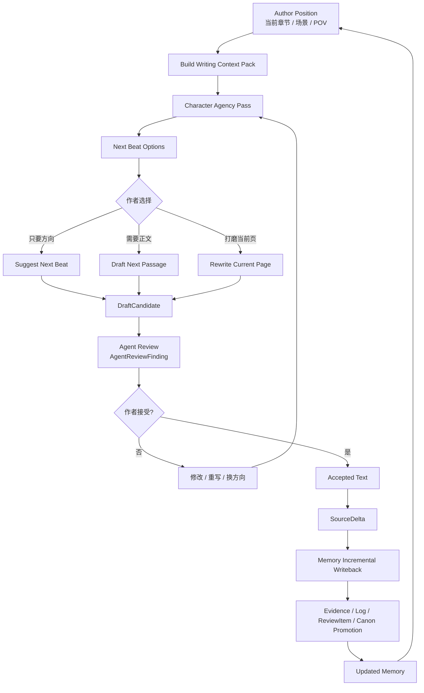
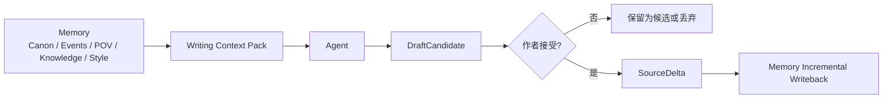

# AGENT_GOAL：Sextant 写作 Agent 宏观设计

> 本文档只讨论 **Agent 与 Memory 的设计关系、写作数据流、角色驱动机制、草稿生命周期**。不讨论技术栈、模型选型、框架、部署或具体实现代码。

## 1. 一句话目标

Sextant Agent 是一个 **基于记忆、由角色驱动、逐页推进的写作副驾驶**。

它不是自动写完整小说的 autopilot，也不是大纲生成器。它的目标是帮助作者在当前场景、当前 POV、当前 canon 和角色状态约束下，继续写出下一小段，并在作者接受后把新文本回写进 Memory。

```text
Agent proposes.
Author accepts.
Memory records.
```

中文表达：

```text
Agent 只提出候选。
作者决定是否接受。
Memory 只记录被接受的文本和证据。
```

## 2. 核心写作思想

Sextant Agent 采用逐页推进、角色驱动、非大纲优先的写法。

| 原则 | 含义 | 详细文档 |
|---|---|---|
| Page-by-page | 一次只推进一小段、一页或一场的局部片段 | [20-agent-overview.md](goals/20-agent-overview.md) |
| Character-driven | 先理解角色欲望、恐惧、边界和认知，再生成下一步 | [22-character-agency-profile.md](goals/22-character-agency-profile.md) |
| Memory-grounded | Agent 写作前必须读取 Memory 生成 Writing Context Pack | [21-writing-context-pack.md](goals/21-writing-context-pack.md) |
| Author-sovereign | Agent 不能自己把候选文本写进 canon，必须作者接受 | [24-draft-candidate-lifecycle.md](goals/24-draft-candidate-lifecycle.md) |
| Evidence-backed | 被接受文本进入 Memory 后，仍走 RawSource / SourceDelta / SourceSpan | [25-agent-memory-writeback.md](goals/25-agent-memory-writeback.md) |
| Review before canon | 草稿候选先产生 AgentReviewFinding；正式 ReviewItem 只由 Memory gate 产生 | [26-agent-review-policy.md](goals/26-agent-review-policy.md) |

## 3. Agent + Memory 总体闭环



## 4. Agent 第一版能力边界

第一版只做四件事：

| 能力 | 说明 | 详细文档 |
|---|---|---|
| Build Writing Context Pack | 为当前写作请求组织 canon、POV、角色、风险、风格上下文 | [21-writing-context-pack.md](goals/21-writing-context-pack.md) |
| Character Agency Pass | 推演角色在当前压力和认知限制下自然会做什么 | [22-character-agency-profile.md](goals/22-character-agency-profile.md) |
| Next Page Agent | 生成下一步方向、下一小段正文、或重写当前页 | [23-next-page-agent.md](goals/23-next-page-agent.md) |
| Draft Candidate Lifecycle | 管理候选文本从生成、检查、修改、接受到回写的生命周期 | [24-draft-candidate-lifecycle.md](goals/24-draft-candidate-lifecycle.md) |

## 5. Agent 不做什么

Sextant Agent 第一阶段不追求：

- 自动生成完整大纲；
- 自动规划整本小说；
- 自动生成整章或整卷；
- 自动替作者决定剧情大方向；
- 自动把模型草稿写入 canon；
- 把 proposed / disputed 记忆当作已确认事实；
- 绕过 Memory 的 Conflict Policy Gate；
- 在没有 SourceDelta / SourceSpan 的情况下创建正式 ReviewItem；
- 用 Agent 自己生成的内容反向证明自己的 canon。

## 6. Agent 与 Memory 的关系

Memory 是 Agent 的工作环境，但不是 Agent 的私有笔记。



核心边界：

| 事情 | 谁负责 |
|---|---|
| 提出下一步可能性 | Agent |
| 生成候选正文 | Agent |
| 交付候选前发现草稿风险 | Agent Review，输出 AgentReviewFinding |
| 判断是否接受为作品文本 | 作者 |
| 保存被接受文本 | Memory ingest |
| 更新 Current Canon | Memory + Conflict Policy Gate |
| 产生正式风险对象 | Memory Conflict Policy，输出 ReviewItem |

## 7. Accepted Text 的 source 语义

作者接受 Agent 文本后，文本的 `source_type/source_scope` 由作者接受意图决定，而不是由“模型生成”决定。

| 作者接受方式 | source_type | source_scope |
|---|---|---|
| 接受为正文草稿 | draft_manuscript | user_draft |
| 接受为已确认正文 | draft_manuscript | user_published |
| 接受为作者笔记 | author_notes | author_note |
| 接受为大纲或未来计划 | outline / author_notes | outline_plan |
| 未接受 | 不生成 SourceDelta | 不生成 SourceDelta |

模型来源只作为 provenance 保留，不能让已接受正文继续使用 `model_suggestion` 的低权重 scope。

## 8. 文档索引

1. [Agent 总览](goals/20-agent-overview.md)
2. [Writing Context Pack](goals/21-writing-context-pack.md)
3. [Character Agency Profile](goals/22-character-agency-profile.md)
4. [Next Page Agent](goals/23-next-page-agent.md)
5. [Draft Candidate 生命周期](goals/24-draft-candidate-lifecycle.md)
6. [Agent 与 Memory 回写](goals/25-agent-memory-writeback.md)
7. [Agent Review Policy](goals/26-agent-review-policy.md)

## 9. 当前方案的收敛判断

Sextant Agent 的第一版应保持克制：

```text
Memory 先组织当前写作上下文
  ↓
Agent 推演角色自然行动
  ↓
Agent 生成下一步候选
  ↓
Agent 自检草稿风险，产生 AgentReviewFinding
  ↓
作者接受或修改
  ↓
接受文本才进入 SourceDelta
  ↓
Memory 增量回写，并由 Conflict Policy Gate 产生正式 ReviewItem
```

这套设计的核心不是让 AI 替作者完成小说，而是让 AI 在长期写作中拥有稳定记忆、角色约束、POV 约束和作者主权。