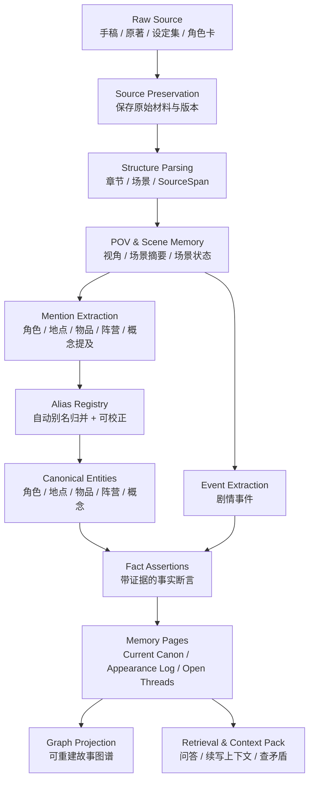

# GOAL：Sextant 小说记忆系统宏观设计

> 本文档只讨论 **数据流、数据结构、记忆系统设计**。不讨论技术栈、框架、数据库、部署、模型选型、具体实现代码。

## 1. 一句话目标

Sextant 是一个面向小说作者的 **外部长期记忆系统**：它把作者自己的手稿、授权原著、设定集、角色卡、章节草稿等材料，转化为可追溯、可检索、可校正、可用于续写上下文的故事记忆。

它不是“自动替作者写完整小说”的系统，而是先解决：

- 角色、地点、物品、事件、伏笔、设定能否被稳定记住；
- 任何回答能否回到原文证据；
- AI 续写时能否只使用当前角色、当前 POV、当前剧情状态下合理知道的信息；
- 作者是否能持续写作，而不用每次重新解释世界观。

## 2. 核心原则

| 原则 | 含义 | 详细文档 |
|---|---|---|
| Evidence-first | 任何记忆必须能追溯到原文 SourceSpan | [03-source-evidence.md](goals/03-source-evidence.md) |
| Mention-first | 先保存“提及”，不要急着合并成最终实体 | [05-mentions-aliases.md](goals/05-mentions-aliases.md) |
| Canon over Truth | 小说里不是客观 truth，而是当前 canon、角色认知、草稿状态 | [07-memory-pages.md](goals/07-memory-pages.md) |
| Non-blocking correction | 用户可以改，但流程不因用户未确认而阻塞 | [05-mentions-aliases.md](goals/05-mentions-aliases.md) |
| Deterministic when possible | 能用规则、已确认别名、结构信息完成的，不交给 LLM 判断 | [00-design-principles.md](goals/00-design-principles.md) |
| Events as first-class memory | 小说是事件驱动的，事件应作为记忆节点 | [06-entities-events-facts.md](goals/06-entities-events-facts.md) |
| POV-aware memory | 续写和检查必须知道当前视角角色能知道什么 | [04-scenes-pov.md](goals/04-scenes-pov.md) |

## 3. 总体数据流

详细说明见：[01-data-flow.md](goals/01-data-flow.md)。

## 4. 顶层对象

| 对象 | 作用 | 是否原文 | 是否可被问答引用 | 详细文档 |
|---|---|---:|---:|---|
| RawSource | 原始材料 | 是 | 间接引用 | [03-source-evidence.md](goals/03-source-evidence.md) |
| Chapter | 章节结构 | 否 | 是 | [04-scenes-pov.md](goals/04-scenes-pov.md) |
| Scene | 场景结构与 POV 容器 | 否 | 是 | [04-scenes-pov.md](goals/04-scenes-pov.md) |
| SourceSpan | 原文证据片段 | 是 | 是 | [03-source-evidence.md](goals/03-source-evidence.md) |
| Mention | 原始提及 | 否 | 是 | [05-mentions-aliases.md](goals/05-mentions-aliases.md) |
| AliasRecord | 别名映射或候选 | 否 | 否 | [05-mentions-aliases.md](goals/05-mentions-aliases.md) |
| CanonicalEntity | 稳定故事实体 | 否 | 是 | [06-entities-events-facts.md](goals/06-entities-events-facts.md) |
| EventEntity | 剧情事件实体 | 否 | 是 | [06-entities-events-facts.md](goals/06-entities-events-facts.md) |
| FactAssertion | 带证据的事实断言 | 否 | 是 | [06-entities-events-facts.md](goals/06-entities-events-facts.md) |
| CharacterKnowledge | 角色认知状态 | 否 | 是 | [04-scenes-pov.md](goals/04-scenes-pov.md) |
| MemoryPage | 面向作者和 AI 的记忆页 | 否 | 是 | [07-memory-pages.md](goals/07-memory-pages.md) |
| GraphProjection | 从实体、事件、事实投影出的故事图谱 | 否 | 是 | [08-graph-projection.md](goals/08-graph-projection.md) |
| ContextPack | 续写或问答时的上下文包 | 否 | 是 | [09-retrieval-context-pack.md](goals/09-retrieval-context-pack.md) |
| ContinuityWarning | 一致性检查结果 | 否 | 是 | [10-continuity-check.md](goals/10-continuity-check.md) |

完整对象关系见：[02-core-data-structures.md](goals/02-core-data-structures.md)。

## 5. 系统不做什么

Sextant 记忆系统第一阶段不追求：

- 自动生成完整大纲；
- 自动替作者决定剧情方向；
- 一步抽出完整知识图谱；
- 把所有普通动词都变成事件；
- 强制用户处理别名确认队列；
- 把模型总结当成不可追溯真相；
- 让关系本身成为页面；
- 让技术选型决定记忆结构。

边界详见：[11-non-goals.md](goals/11-non-goals.md)。

## 6. 文档索引

1. [设计原则](goals/00-design-principles.md)
2. [总体数据流](goals/01-data-flow.md)
3. [核心数据结构](goals/02-core-data-structures.md)
4. [原始材料与证据系统](goals/03-source-evidence.md)
5. [章节、场景与 POV](goals/04-scenes-pov.md)
6. [提及与别名系统](goals/05-mentions-aliases.md)
7. [实体、事件与事实](goals/06-entities-events-facts.md)
8. [记忆页与 Current Canon](goals/07-memory-pages.md)
9. [故事图谱投影](goals/08-graph-projection.md)
10. [检索与续写上下文包](goals/09-retrieval-context-pack.md)
11. [连续性检查](goals/10-continuity-check.md)
12. [非目标与边界](goals/11-non-goals.md)
13. [外部启发与取舍](goals/12-inspirations.md)

