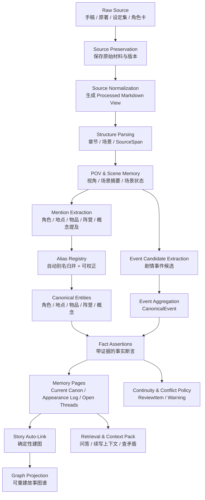

# GOAL：Sextant 小说记忆系统宏观设计

> 本文档只讨论 **数据流、数据结构、记忆系统设计**。不讨论技术栈、框架、数据库、部署、模型选型、具体实现代码。

## 1. 一句话目标

Sextant 是一个面向小说作者的 **外部长期记忆系统**：它把作者自己的手稿、授权原著、设定集、角色卡、章节草稿等材料，转化为可追溯、可检索、可校正、可用于续写上下文的故事记忆。

它不是“自动替作者写完整小说”的系统，而是先解决：

- 角色、地点、物品、事件、伏笔、设定能否被稳定记住；
- 任何回答能否回到原文证据；
- AI 续写时能否只使用当前角色、当前 POV、当前剧情状态下合理知道的信息；
- 作者是否能持续写作，而不用每次重新解释世界观。

## 2. 核心原则

| 原则 | 含义 | 详细文档 |
|---|---|---|
| Evidence-first | 任何记忆必须能追溯到原文 SourceSpan | [03-source-evidence.md](goals/03-source-evidence.md) |
| Mention-first | 先保存“提及”，不要急着合并成最终实体 | [05-mentions-aliases.md](goals/05-mentions-aliases.md) |
| Canon over Truth | 小说里不是客观 truth，而是当前 canon、角色认知、草稿状态 | [07-memory-pages.md](goals/07-memory-pages.md) |
| Non-blocking correction | 用户可以改，但流程不因用户未确认而阻塞 | [05-mentions-aliases.md](goals/05-mentions-aliases.md) |
| Deterministic when possible | 能用规则、已确认别名、结构信息完成的，不交给 LLM 判断 | [00-design-principles.md](goals/00-design-principles.md) |
| Events as first-class memory | 小说是事件驱动的，事件应作为记忆节点 | [06-entities-events-facts.md](goals/06-entities-events-facts.md)、[15-event-aggregation.md](goals/15-event-aggregation.md) |
| POV-aware memory | 续写和检查必须知道当前视角角色能知道什么 | [04-scenes-pov.md](goals/04-scenes-pov.md) |
| Thin harness, fat story skills | 系统保持薄，领域流程沉淀为 Story Skills | [13-skills-and-resolver.md](goals/13-skills-and-resolver.md) |
| Schema-constrained extraction | 通过 Story Schema Pack 限制实体、事件、关系类型 | [14-story-schema-packs.md](goals/14-story-schema-packs.md) |
| Incremental writeback | 新增正文或引用材料应局部回写，而不是全量重抽 | [17-incremental-memory-writeback.md](goals/17-incremental-memory-writeback.md) |
| Review, not hard stop | 冲突不阻断原始材料进入，只阻断高风险自动升格 | [18-conflict-policy.md](goals/18-conflict-policy.md) |

## 3. 总体数据流（Canonical End-to-End Flow）

以下流程是 Sextant 记忆系统的唯一主流程。后续机制文档中的 Mermaid 图只展开其中某个局部片段，不定义第二套全局流程。



详细说明见：[01-data-flow.md](goals/01-data-flow.md)、[16-source-normalization.md](goals/16-source-normalization.md)、[15-event-aggregation.md](goals/15-event-aggregation.md)、[19-story-auto-link.md](goals/19-story-auto-link.md)。

## 4. 机制概览与术语索引

| 概念 | 在主流程中的位置 | 作用 | 详细文档 |
|---|---|---|---|
| Story Skills | 横跨 `Structure Parsing` 到 `Retrieval & Context Pack` | 把导入、抽取、聚合、回写、检查、问答拆成可审计的处理协议 | [13-skills-and-resolver.md](goals/13-skills-and-resolver.md) |
| Resolver | 输入进入 Story Skills 前 | 根据输入类型和作者请求选择具体 Story Skill，不直接做领域判断 | [13-skills-and-resolver.md](goals/13-skills-and-resolver.md) |
| Story Schema Pack | 约束 `Mention Extraction`、`Event Candidate Extraction`、`Fact Assertions`、`Graph Projection` | 限定实体、事件、关系类型，让规则优先和题材扩展可以共存 | [14-story-schema-packs.md](goals/14-story-schema-packs.md) |
| RawSource | 主流程起点 | 保存原始材料、来源和版本，是最终证据根 | [03-source-evidence.md](goals/03-source-evidence.md)、[16-source-normalization.md](goals/16-source-normalization.md) |
| ProcessedMarkdownView | `Source Normalization` 输出 | 从 RawSource 重建出的规范化处理视图，供结构解析和 Story Skills 使用 | [16-source-normalization.md](goals/16-source-normalization.md) |
| SourceSpan | `Structure Parsing` 输出 | 把后续 Mention、Event、Fact 锚回原文证据 | [03-source-evidence.md](goals/03-source-evidence.md) |
| Mention / AliasRegistry | `Mention Extraction` 到 `Canonical Entities` | 先保存不确定提及，再通过别名记录逐步归并到实体 | [05-mentions-aliases.md](goals/05-mentions-aliases.md) |
| EventCandidate | `Event Candidate Extraction` 输出 | 从 Scene 抽出的剧情事件候选，只是待聚合证据，不等于稳定事件 | [15-event-aggregation.md](goals/15-event-aggregation.md) |
| CanonicalEvent | `Event Aggregation` 输出 | 多个 EventCandidate 聚合后的稳定剧情事件，可派生事实和图谱边 | [15-event-aggregation.md](goals/15-event-aggregation.md) |
| FactAssertion | `Fact Assertions` | 带证据、可回写、可检查冲突的事实断言 | [06-entities-events-facts.md](goals/06-entities-events-facts.md) |
| MemoryPage | `Memory Pages` | 面向作者和 AI 的 Current Canon、日志、开放问题与证据汇总 | [07-memory-pages.md](goals/07-memory-pages.md) |
| Story Auto-Link | `Memory Pages` 到 `Graph Projection` | 从结构化记忆页、frontmatter、事件和已确认别名确定性投影图谱 | [19-story-auto-link.md](goals/19-story-auto-link.md) |
| Conflict Policy | `Fact Assertions` 到 `ReviewItem / Warning` | 保存原始材料，阻断高风险自动升格，而不是阻断创作流程 | [18-conflict-policy.md](goals/18-conflict-policy.md) |
| ReviewItem | `Continuity & Conflict Policy` 输出 | 把别名、冲突和 canon promotion 风险变成作者可处理事项 | [18-conflict-policy.md](goals/18-conflict-policy.md) |
| GraphProjection | `Story Auto-Link` 输出 | 可重建的故事图谱投影，不替代 RawSource、FactAssertion 或 MemoryPage | [08-graph-projection.md](goals/08-graph-projection.md)、[19-story-auto-link.md](goals/19-story-auto-link.md) |

读文档时应按主流程理解这些概念：RawSource 先保真，ProcessedMarkdownView 只提供稳定处理视图，SourceSpan 负责证据锚定，Mention 和 EventCandidate 保存不确定性，Schema Pack 限制可生成对象，CanonicalEvent 与 FactAssertion 形成可回写事实，MemoryPage 维护当前 canon，Story Auto-Link 再把结构化结果投影为 GraphProjection，Conflict Policy 只管理风险。

## 5. 顶层对象

| 对象 | 作用 | 是否原文 | 是否可被问答引用 | 详细文档 |
|---|---|---:|---:|---|
| RawSource | 原始材料 | 是 | 间接引用 | [03-source-evidence.md](goals/03-source-evidence.md)、[16-source-normalization.md](goals/16-source-normalization.md) |
| ProcessedMarkdownView | 原始材料的规范化处理视图 | 否 | 间接引用 | [16-source-normalization.md](goals/16-source-normalization.md) |
| Chapter | 章节结构 | 否 | 是 | [04-scenes-pov.md](goals/04-scenes-pov.md) |
| Scene | 场景结构与 POV 容器 | 否 | 是 | [04-scenes-pov.md](goals/04-scenes-pov.md) |
| SourceSpan | 原文证据片段 | 是 | 是 | [03-source-evidence.md](goals/03-source-evidence.md) |
| Mention | 原始提及 | 否 | 是 | [05-mentions-aliases.md](goals/05-mentions-aliases.md) |
| AliasRecord | 别名映射或候选 | 否 | 否 | [05-mentions-aliases.md](goals/05-mentions-aliases.md) |
| CanonicalEntity | 稳定故事实体 | 否 | 是 | [06-entities-events-facts.md](goals/06-entities-events-facts.md) |
| EventCandidate | 从 Scene 抽出的事件候选 | 否 | 是 | [15-event-aggregation.md](goals/15-event-aggregation.md) |
| CanonicalEvent | 聚合后的剧情事件实体 | 否 | 是 | [15-event-aggregation.md](goals/15-event-aggregation.md) |
| FactAssertion | 带证据的事实断言 | 否 | 是 | [06-entities-events-facts.md](goals/06-entities-events-facts.md) |
| CharacterKnowledge | 角色认知状态 | 否 | 是 | [04-scenes-pov.md](goals/04-scenes-pov.md) |
| MemoryPage | 面向作者和 AI 的记忆页 | 否 | 是 | [07-memory-pages.md](goals/07-memory-pages.md) |
| GraphProjection | 从实体、事件、事实投影出的故事图谱 | 否 | 是 | [08-graph-projection.md](goals/08-graph-projection.md)、[19-story-auto-link.md](goals/19-story-auto-link.md) |
| ContextPack | 续写或问答时的上下文包 | 否 | 是 | [09-retrieval-context-pack.md](goals/09-retrieval-context-pack.md) |
| ContinuityWarning | 一致性检查结果 | 否 | 是 | [10-continuity-check.md](goals/10-continuity-check.md)、[18-conflict-policy.md](goals/18-conflict-policy.md) |
| ReviewItem | 冲突、别名、canon promotion 风险提示 | 否 | 是 | [18-conflict-policy.md](goals/18-conflict-policy.md) |

完整对象关系见：[02-core-data-structures.md](goals/02-core-data-structures.md)。

## 6. 系统不做什么

Sextant 记忆系统第一阶段不追求：

- 自动生成完整大纲；
- 自动替作者决定剧情方向；
- 一步抽出完整知识图谱；
- 把所有普通动词都变成事件；
- 强制用户处理别名确认队列；
- 把模型总结当成不可追溯真相；
- 让关系本身成为页面；
- 让技术选型决定记忆结构；
- 因冲突而丢弃新增原始材料；
- 用清洗后的摘要替代原始证据。

边界详见：[11-non-goals.md](goals/11-non-goals.md)。

## 7. 文档索引

### 基础设计

1. [设计原则](goals/00-design-principles.md)
2. [总体数据流](goals/01-data-flow.md)
3. [核心数据结构](goals/02-core-data-structures.md)
4. [原始材料与证据系统](goals/03-source-evidence.md)
5. [章节、场景与 POV](goals/04-scenes-pov.md)
6. [提及与别名系统](goals/05-mentions-aliases.md)
7. [实体、事件与事实](goals/06-entities-events-facts.md)
8. [记忆页与 Current Canon](goals/07-memory-pages.md)
9. [故事图谱投影](goals/08-graph-projection.md)
10. [检索与续写上下文包](goals/09-retrieval-context-pack.md)
11. [连续性检查](goals/10-continuity-check.md)
12. [非目标与边界](goals/11-non-goals.md)
13. [外部启发与取舍](goals/12-inspirations.md)

### 机制补充

14. [Story Skills 与 Resolver](goals/13-skills-and-resolver.md)
15. [Story Schema Pack](goals/14-story-schema-packs.md)
16. [事件聚合机制](goals/15-event-aggregation.md)
17. [原始材料规范化与 Markdown View](goals/16-source-normalization.md)
18. [增量记忆回写](goals/17-incremental-memory-writeback.md)
19. [冲突策略与 Review Policy](goals/18-conflict-policy.md)
20. [Story Auto-Link 与确定性建图](goals/19-story-auto-link.md)

## 8. 当前方案的收敛判断

Sextant 的记忆系统应保持以下形态：

```text
Raw Source 保真
  ↓
Processed Markdown View 规范化
  ↓
SourceSpan 锚定证据
  ↓
Mention-first 保存不确定性
  ↓
Schema Pack 限制实体、事件、关系
  ↓
Event Aggregation 聚合叙事状态变化
  ↓
FactAssertion 带证据派生世界状态
  ↓
MemoryPage 维护 Current Canon
  ↓
Story Auto-Link 确定性投影图谱
  ↓
Conflict Policy 保护 canon，不阻断创作
```

这套设计的重点不是让 AI 自动替作者决定故事，而是让 AI 在长期写作中拥有稳定、可追溯、可校正的外部故事记忆。
