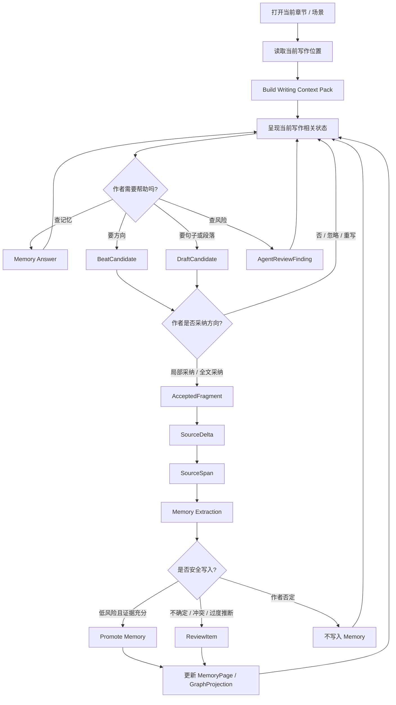

# 01. 写作会话闭环

> 本文档定义一次写作会话从打开章节到 Memory 回写的产品契约。它不定义最终 UI 布局。

## 1. 一句话目标

一次写作会话的目标不是让 Agent 接管创作，而是让作者在当前章节继续写，并让被采纳的变化以可追溯方式进入 Memory。

```text
写作现场 → 结构化请求 → 候选 / 回答 / 风险 → 作者决定 → 正文变化 → 证据锚定 → 分层记忆 → 继续写作
```

## 2. 主闭环



## 3. 用户看见的状态类型

产品不需要暴露内部数据结构，但必须让作者理解当前状态。

| 状态类型 | 面向作者的含义 | 内部来源 |
|---|---|---|
| 当前写作上下文 | 当前 POV、当前场景、相关角色和关键状态 | WritingContextPack |
| 记忆回答 | 带证据的回答，以及系统不知道什么 | Memory Answer / SourceSpan |
| 候选方向 | 下一步可能发生什么，但不是正文 | BeatCandidate |
| 候选文本 | 可采纳的一句、一个动作或一小段 | DraftCandidate |
| 风险提示 | 这里可能穿帮、越权、冲突或过度推断 | AgentReviewFinding / ReviewItem |
| 准备记住 | 被采纳正文可能带来的记忆变化 | MemoryWritebackPreview |

## 4. 系统写入的对象顺序

写作会话里最重要的是写入顺序不能乱。

```text
DraftCandidate
  → AcceptedFragment
  → SourceDelta
  → SourceSpan
  → MemoryExtraction
  → ProposedFact / ProposedKnowledgeState / ProposedThreadUpdate / ProposedReviewItem
  → MemoryPage 或 Review Queue
```

禁止的捷径：

```text
DraftCandidate → MemoryPage
DraftCandidate → Current Canon
AgentReviewFinding → ReviewItem without SourceSpan
模型推断 → CanonFact without evidence
```

## 5. 非阻塞要求

Memory 回写和风险处理不应把写作变成表单审批。

| 情况 | 默认行为 |
|---|---|
| 低风险、证据充分 | 自动写入，提供可撤销提示 |
| 中风险、可能过度推断 | 进入轻量 Review，不阻塞继续写 |
| 高风险、会污染 canon | 不自动 promote，生成 ReviewItem |
| 作者明确否定 | 不写入 Memory，并保留纠错信号 |
| 结构解析失败 | 可以阻塞后续 Memory 抽取，但不能丢失正文 |

## 6. 会话结束时必须可回答的问题

每次写作会话结束后，系统应能回答：

1. 作者采纳了哪些内容？
2. 哪些采纳内容改变了正文？
3. 每个正文变化对应哪些 SourceSpan？
4. 哪些记忆变化被安全写入？
5. 哪些内容进入 Review Queue？
6. 哪些候选被忽略，且没有进入 Memory？

这些问题比最终 UI 长什么样更重要。