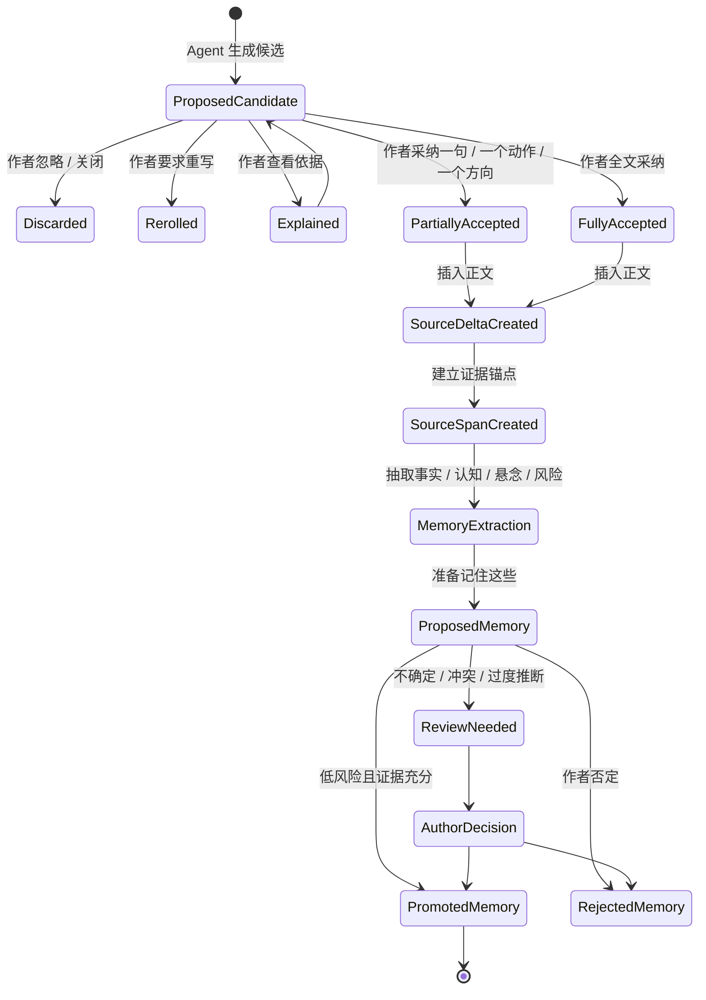

# 03. Candidate 生命周期

> 本文档定义候选文本从 Agent 生成到作者采纳、SourceDelta、Memory 回写的状态边界。它不定义候选卡 UI。

## 1. 核心边界

候选不是正文。

```text
DraftCandidate ≠ Manuscript Text
DraftCandidate ≠ SourceDelta
DraftCandidate ≠ SourceSpan
DraftCandidate ≠ Memory
DraftCandidate ≠ Canon
```

只有作者明确采纳的部分，才会成为 `AcceptedFragment`，随后进入正文变更流程。

## 2. 生命周期总览



## 3. DraftCandidate

`DraftCandidate` 是 Agent 或 Story Skill 生成的写作候选。

```ts
type DraftCandidate = {
  id: string
  action_request_id: string
  target_source_id: string
  target_version_id: string
  affected_range?: { start: number; end: number }
  base_hash: string
  candidate_kind: "sentence" | "action" | "paragraph" | "direction" | "rewrite"
  text: string
  rationale?: CandidateRationale
  memory_refs?: SourceSpanRef[]
  agent_review_findings?: AgentReviewFinding[]
  status: DraftCandidateStatus
}
```

`DraftCandidate` 可以包含解释、证据引用和草稿风险，但这些内容都不能自动进入 Memory。

## 4. 状态枚举

```ts
type DraftCandidateStatus =
  | "proposed"
  | "explained"
  | "rerolled"
  | "discarded"
  | "partially_accepted"
  | "fully_accepted"
```

| 状态 | 是否写入正文 | 是否进入 Memory |
|---|---:|---:|
| proposed | 否 | 否 |
| explained | 否 | 否 |
| rerolled | 否 | 否 |
| discarded | 否 | 否 |
| partially_accepted | 是，仅采纳片段 | 通过 SourceDelta 后才可能 |
| fully_accepted | 是，完整候选 | 通过 SourceDelta 后才可能 |

## 5. AcceptedFragment

`AcceptedFragment` 是作者从候选中采纳的具体片段。

```ts
type AcceptedFragment = {
  id: string
  candidate_id: string
  accepted_text: string
  accept_mode: "partial" | "full"
  target_source_id: string
  target_version_id: string
  insert_or_replace_range: { start: number; end: number }
  author_intent?: string
  provenance: {
    generated_by_agent: true
    accepted_by_author: true
  }
}
```

重要规则：

- `AcceptedFragment` 表示作者接受该文本进入作品草稿。
- 它不表示作者确认文本中所有可推断事实都已经成为 canon。
- 它不表示候选解释中的理由已经成为 Memory。
- 它不表示候选风险已经被处理完。

## 6. SourceDelta

`SourceDelta` 是正文实际变化。

```ts
type SourceDelta = {
  id: string
  source_id: string
  previous_version_id: string
  new_version_id: string
  accepted_fragment_id?: string
  changed_range: { start: number; end: number }
  base_hash: string
  delta_kind: "insert" | "replace" | "delete"
}
```

只有 `SourceDelta` 才能触发 Memory 增量回写。

## 7. SourceSpan

`SourceSpan` 是 Memory 证据锚点。

```ts
type SourceSpanRef = {
  source_id: string
  source_version_id: string
  span_id: string
  range: { start: number; end: number }
}
```

没有 `SourceSpan` 的内容不能成为正式 `FactAssertion`、`CharacterKnowledgeState` 或 `ReviewItem` 的证据。

## 8. 候选解释的边界

候选解释用于帮助作者理解 AI 为什么这样写。

```ts
type CandidateRationale = {
  used_memory_refs: SourceSpanRef[]
  respected_constraints: string[]
  avoided_claims: string[]
  possible_risks: string[]
}
```

候选解释不能：

- 直接写入正文；
- 直接写入 Memory；
- 成为 canon 证据；
- 替代 SourceSpan；
- 用来证明候选里的事实已经成立。

## 9. 产品操作要求

产品层应优先支持：

- 采纳一句；
- 采纳一个动作；
- 借方向重写；
- 查看依据；
- 要求更弱 / 更强 / 更克制；
- 忽略候选。

产品层不应把“全文采纳”设计成唯一或默认主动作。全文采纳可以存在，但不应鼓励作者无筛选地吞下模型输出。

## 10. 与 Memory 的关系

候选生命周期和 Memory 写入之间的关系是：

```text
DraftCandidate only affects UI state
AcceptedFragment affects manuscript text
SourceDelta triggers MemoryExtraction
SourceSpan enables evidence-bound memory
MemoryExtraction creates proposed memory
Promotion / Review decides final memory state
```

这条链条不能被压缩。