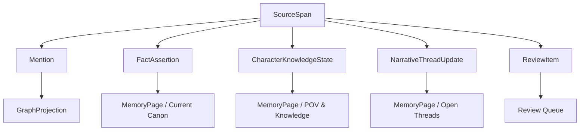

# 04. Memory 回写契约

> 本文档定义被采纳正文如何进入 Memory，以及“准备记住这些”的产品与数据边界。它不定义最终 UI 卡片样式。

## 1. 目标

Memory 回写的目标不是把 AI 候选全部存起来，而是把作者已经采纳并写入正文的变化，转成可追溯、可校正、可审核的故事记忆。

```text
AcceptedFragment
  ↓
SourceDelta
  ↓
SourceSpan
  ↓
MemoryExtraction
  ↓
ProposedFact / ProposedKnowledgeState / ProposedThreadUpdate / ProposedReviewItem
  ↓
Promote 或 Review
```

## 2. MemoryWritebackPreview

`MemoryWritebackPreview` 是系统在正文变化后给出的“准备记住这些”。

它不是强制弹窗，也不是数据库编辑器。它是一层安全阀：让作者知道系统准备怎样理解刚刚写入的文本，并允许作者纠正。

```ts
type MemoryWritebackPreview = {
  id: string
  source_delta_id: string
  source_span_refs: SourceSpanRef[]
  items: ProposedMemoryItem[]
  default_policy: "auto_promote_low_risk" | "ask_author" | "send_to_review"
}
```

## 3. ProposedMemoryItem

```ts
type ProposedMemoryItem =
  | ProposedFact
  | ProposedKnowledgeState
  | ProposedThreadUpdate
  | ProposedReviewItem
```

### 3.1 ProposedFact

```ts
type ProposedFact = {
  kind: "proposed_fact"
  statement: string
  source_span_refs: SourceSpanRef[]
  confidence: "low" | "medium" | "high"
  risk: "low" | "medium" | "high"
  promotion_target: "current_canon" | "appearance_log" | "event_log"
}
```

用于表达故事世界中已经成立、且有证据支持的事实。

例子：

```text
Mira 注意到 Kestrel 的迟疑。
```

不能把模糊暗示直接提升为确定事实。

### 3.2 ProposedKnowledgeState

```ts
type ProposedKnowledgeState = {
  kind: "proposed_knowledge_state"
  character_id: string
  knowledge_type: "knows" | "suspects" | "misunderstands" | "does_not_know"
  content: string
  source_span_refs: SourceSpanRef[]
  risk: "low" | "medium" | "high"
}
```

用于表达角色在当前剧情中知道、怀疑、误解或明确不知道什么。

例子：

```text
Mira 开始怀疑 Kestrel 隐瞒了钥匙来源。
```

这不等于：

```text
Kestrel 背叛了 Mira。
```

### 3.3 ProposedThreadUpdate

```ts
type ProposedThreadUpdate = {
  kind: "proposed_thread_update"
  thread_id?: string
  update_type: "opens" | "keeps_open" | "narrows" | "pays_off" | "closes"
  description: string
  source_span_refs: SourceSpanRef[]
  risk: "low" | "medium" | "high"
}
```

用于表达伏笔、悬念、未偿还问题或当前压力点的变化。

例子：

```text
钥匙来源仍保持开放。
```

### 3.4 ProposedReviewItem

```ts
type ProposedReviewItem = {
  kind: "proposed_review_item"
  review_type: "continuity_warning" | "canon_conflict" | "pov_leak" | "over_inference" | "alias_risk"
  description: string
  source_span_refs: SourceSpanRef[]
  severity: "low" | "medium" | "high"
  default_action: "defer" | "ask_author" | "block_promotion"
}
```

用于承接不确定、冲突、过度推断和可能穿帮的内容。

`ProposedReviewItem` 不等于正式 `ReviewItem`；正式 `ReviewItem` 仍由 Memory 的 conflict policy / review policy 产生。

## 4. 分层写入

不要把所有抽取结果写进同一张关系表。Memory 回写应分层处理：



## 5. 自动写入策略

| 情况 | 默认策略 |
|---|---|
| 结构性 Mention / appears_in | 可自动写入，可撤销 |
| 明确事实且 SourceSpan 充分 | 可 promote，保留证据 |
| 角色观察或怀疑 | 写入 KnowledgeState，不写成世界事实 |
| 伏笔保持开放 | 更新 Open Threads，不关闭悬念 |
| 可能冲突或过度推断 | 进入 Review，不自动 promote |
| 作者否定抽取结果 | 不写入，并保留纠错信号 |

## 6. 产品展示原则

系统可以展示“准备记住这些”，但默认应克制。

| 风险 | 展示方式 |
|---|---|
| low | 轻提示：已记住，可撤销 |
| medium | 显示可展开的小卡，允许改弱或稍后处理 |
| high | 进入 Review Queue，并明确不自动写入 canon |

不应每次采纳一句都强制弹出确认流程。

## 7. 禁止行为

- 禁止把 DraftCandidate 直接写入 Memory。
- 禁止把作者意图当成已发生事实。
- 禁止把角色怀疑写成世界事实。
- 禁止把候选解释写成证据。
- 禁止没有 SourceSpan 的 canon promotion。
- 禁止把 Review Queue 当成写作阻塞器。

## 8. 示例

作者采纳正文：

```text
她只把那一点迟疑记下来，像把一枚针藏进袖口。
```

可以产生：

```text
ProposedFact: Mira 注意到 Kestrel 的迟疑。
ProposedKnowledgeState: Mira 开始怀疑 Kestrel 隐瞒了什么。
ProposedThreadUpdate: 钥匙来源仍保持开放。
```

不能自动产生：

```text
CanonFact: Kestrel 背叛了 Mira。
CanonFact: 钥匙来自敌人。
```

这些内容没有被正文证明，只能作为悬念、猜测或 Review。