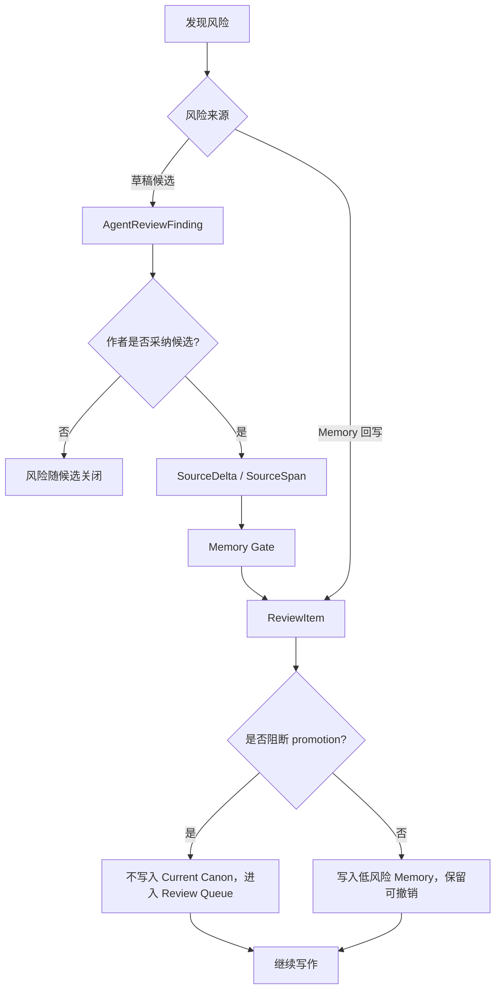

# 05. Review 与风险契约

> 本文档定义风险提示、AgentReviewFinding、ReviewItem 和非阻塞处理策略。它不定义最终 Review 面板 UI。

## 1. 核心原则

风险提示的目标是保护作者的 canon，而不是打断作者。

```text
Risk informs.
Review protects.
Writing continues.
```

Sextant 必须区分两类风险对象：

| 对象 | 来源 | 是否正式 Memory 对象 | 作用 |
|---|---|---:|---|
| AgentReviewFinding | Agent / Story Skill 在候选或当前段落中发现 | 否 | 草稿层风险提示，帮助作者选择或修改候选 |
| ReviewItem | Memory Conflict Policy / Review Policy 产生 | 是 | 正式风险、冲突或 canon promotion 阻断事项 |

## 2. AgentReviewFinding

`AgentReviewFinding` 属于草稿层。它可以附在候选、改写、风险检查结果或解释上，但不能直接成为正式 `ReviewItem`。

```ts
type AgentReviewFinding = {
  id: string
  action_request_id: string
  candidate_id?: string
  risk_type:
    | "pov_leak"
    | "canon_conflict_possible"
    | "over_inference"
    | "unearned_reveal"
    | "thread_closure_risk"
    | "style_or_tone_mismatch"
    | "character_agency_mismatch"
  severity: "low" | "medium" | "high"
  description: string
  suggested_fix?: string
  memory_refs?: SourceSpanRef[]
}
```

边界：

- 可以影响候选排序和展示；
- 可以解释为什么某个候选风险更高；
- 可以帮助作者要求重写；
- 不能自动写入 Memory；
- 不能替代 SourceSpan；
- 不能直接阻塞作者采纳，除非产品明确要求二次确认；
- 不能在没有 SourceDelta / SourceSpan 的情况下升级为正式 `ReviewItem`。

## 3. ReviewItem

`ReviewItem` 是 Memory 层正式风险对象，由 Memory 的 conflict policy / review policy 产生。

```ts
type ReviewItem = {
  id: string
  source_span_refs: SourceSpanRef[]
  review_type:
    | "canon_conflict"
    | "continuity_warning"
    | "pov_leak"
    | "alias_risk"
    | "over_inference"
    | "thread_state_conflict"
    | "knowledge_state_conflict"
  severity: "low" | "medium" | "high"
  status: "open" | "accepted" | "dismissed" | "resolved" | "superseded"
  blocks_promotion: boolean
  description: string
  proposed_resolution?: string
}
```

只有在 Memory 回写阶段，且存在可追溯 `SourceSpan` 时，才应该生成正式 `ReviewItem`。

## 4. 风险等级

| 等级 | 含义 | 默认处理 |
|---|---|---|
| low | 不太可能污染 canon，主要是提醒 | 轻提示，可自动继续 |
| medium | 可能影响角色认知、悬念状态或局部 canon | 进入可展开 Review，不阻塞写作 |
| high | 可能把未证实内容写成 canon，或造成严重连续性冲突 | 阻断 promotion，但不阻断正文继续写 |

## 5. 风险类型

### 5.1 POV 泄漏

当前 POV 角色知道了不该知道的信息，或叙述越过当前视角。

例子：

```text
Mira 尚不知道钥匙来自敌人，但叙述直接写出“那把敌人给他的钥匙”。
```

### 5.2 过度推断

正文只提供暗示，但系统准备写成确定事实。

例子：

```text
正文：Kestrel 回避钥匙来源。
错误写入：Kestrel 背叛了 Mira。
```

### 5.3 悬念误关闭

正文保持悬念开放，但系统准备把线索结论化或关闭伏笔。

### 5.4 角色动机不一致

候选行为不符合当前角色欲望、恐惧、边界、压力或认知状态。

### 5.5 Canon 冲突

新正文与已确认 MemoryPage / Current Canon 冲突。

### 5.6 Alias 风险

提及、别名或身份映射不确定，可能把两个角色、物品或身份错误合并。

## 6. 非阻塞策略

风险处理不能让写作变成审批队列。



## 7. 产品行为要求

| 场景 | 产品行为 |
|---|---|
| 候选有低风险 | 在候选上轻提示，不打断选择 |
| 候选有中风险 | 展示原因和改写建议，允许继续采纳 |
| 候选有高风险 | 明确说明风险；允许作者 override，但 Memory 不自动 promote |
| Memory 回写有冲突 | 进入 Review Queue，不污染 Current Canon |
| 作者忽略风险 | 继续写作，风险保留为未处理状态 |
| 作者否定风险 | 标记 dismissed，并作为后续抽取纠错信号 |

## 8. 禁止行为

- 禁止把所有风险都弹窗化。
- 禁止因 ReviewItem 阻断正文保存。
- 禁止把 AgentReviewFinding 当作正式 Memory ReviewItem。
- 禁止把 high risk 候选采纳后直接 promote 到 Current Canon。
- 禁止把用户未处理风险视为用户确认。
- 禁止把 Review Queue 做成主界面默认负担。

## 9. 与用户心智的关系

面向作者的表达应尽量使用写作语言：

| 内部风险 | 面向作者表达 |
|---|---|
| pov_leak | 这里可能让角色知道了她不该知道的事 |
| over_inference | 这里可能把暗示写得太实 |
| thread_closure_risk | 这里可能提前关闭一个悬念 |
| canon_conflict | 这里和之前确认的设定冲突 |
| alias_risk | 这里可能把两个身份误认为同一个人 |
| character_agency_mismatch | 这个行动可能不像该角色自然会做的事 |

产品默认应该帮助作者继续写，而不是迫使作者理解风险枚举。