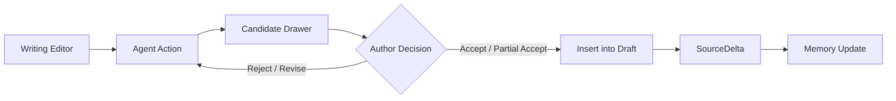

# UX_GOAL：Sextant 写作体验设计

> 本目录只讨论 **UI/UX、用户旅程、交互骨架**。不讨论后端、数据库、模型选型或具体实现细节。

## 1. 一句话目标

Sextant 是一个 **写作工作台**，不是聊天机器人。

它应该帮助作者在不中断创作流的前提下完成：

- 查前文；
- 查设定；
- 检查矛盾；
- 改写当前段；
- 渲染当前 beat；
- 获取下一步候选；
- 局部接受 AI 输出；
- 将接受内容回写到 Memory。

## 2. UX 原则

| 原则 | 含义 |
|---|---|
| Editor first | 正文编辑器永远是中心 |
| Author control | Agent 给候选，作者决定是否接受 |
| Partial accept | 默认支持局部采纳，而不是全收/全拒 |
| Non-blocking risk | 风险提示默认不打断写作 |
| Memory on demand | Memory 在需要时出现，不做后台管理面板 |
| Explainable candidate | 候选可展开查看 why / memory / risk |
| Small steps | 默认一小段、一页、一处改写，不默认整章生成 |

## 3. 最小体验闭环

## 4. 第一版只验证什么

| 要验证 | 不验证 |
|---|---|
| 作者是否愿意在这个界面里写 | 完整后端架构 |
| 候选是否容易局部采纳 | 完整图谱可视化 |
| 风险提示是否不打断创作 | 完整 MCP App |
| Memory 是否在关键时刻有用 | 完整多项目管理 |
| Agent Panel 是否比聊天框更好用 | 完整数据库实现 |

## 5. 文档索引

| 文档 | 内容 |
|---|---|
| [作者写作闭环](journeys/01-author-writing-loop.md) | 从继续写到接受候选的主流程 |
| [Agent 动作](journeys/02-agent-actions.md) | 第一版可用的核心动作 |
| [写作工作台](screens/01-writing-workbench.md) | 主界面区域 |
| [HTML 线框](screens/writing-workbench-wireframe.html) | 可渲染低保真界面 |
| [候选采纳](interaction-patterns/01-candidate-acceptance.md) | 接受、局部接受、拒绝 |
| [风险与记忆](interaction-patterns/02-risk-and-memory.md) | 非阻塞风险和按需 Memory |
