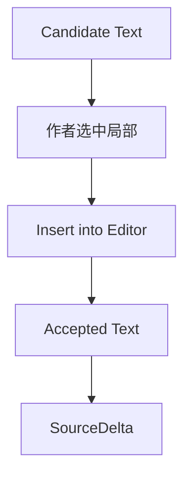

# 01. Candidate Acceptance

## 原则

```text
Agent proposes.
Author accepts.
Memory records.
```

候选文本不等于正文。作者接受后才进入正文；正文进入后才成为 SourceDelta。

## 操作

| 操作 | 含义 |
|---|---|
| Accept | 接受完整候选 |
| Partial Accept | 只采纳候选中的一句、动作或段落 |
| Revise | 要求按方向重写 |
| Reject | 放弃候选 |
| Why this? | 展开理由、Memory、风险 |

## Partial Accept 流程



## UX 要求

- 局部接受应比完整接受更显眼；
- 候选不应自动覆盖正文；
- 被拒绝候选不参与 Memory；
- 被接受文本仍走 Memory canonical flow。
