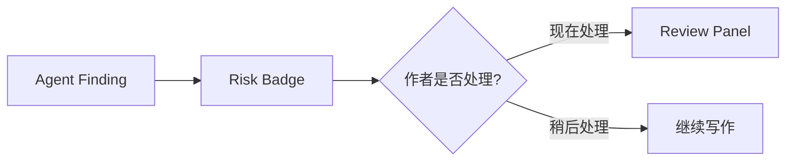

# 02. Risk 与 Memory 交互

## 风险提示原则

风险提示要帮助作者，不要打断作者。

| 风险等级 | 展示方式 |
|---|---|
| low | 候选卡小徽标 |
| medium | 候选卡提示 + Review Panel |
| high | 明确警示，但仍允许作者 override |

## 非阻塞设计

## Memory 展示原则

Memory Panel 只展示当前写作有关的信息：

- 当前 POV；
- 在场角色；
- 关键物品状态；
- 相关 SourceSpan；
- Open Threads；
- unresolved risks。

不要展示原始实体表、关系表或数据库结构。
