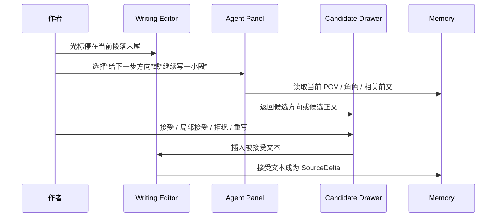

# 01. 作者写作闭环

## 目标

让作者在当前章节中继续写下一小段，同时保持作者控制权。

## 主流程

## 体验要求

| 要求 | 说明 |
|---|---|
| 不抢正文焦点 | Agent 输出默认进入候选区，不直接覆盖正文 |
| 默认小步 | 候选默认是一小段，不是整章 |
| 支持局部接受 | 作者可以只采纳一句、一个动作、一个方向 |
| 风险轻提示 | 风险显示在候选卡或侧栏，不弹窗打断 |
| 可解释 | 候选可展开查看使用的 Memory 和风险 |
