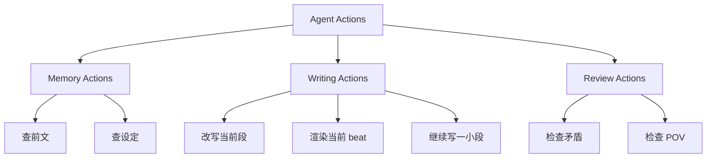

# 02. Agent 动作

## 第一版动作清单

| 动作 | 输入 | 输出 | 说明 |
|---|---|---|---|
| 查前文 | 选中文本 / 角色 / 物品 | SourceSpan + Memory 摘要 | 用于找证据 |
| 检查矛盾 | 当前段落 / 当前页 | 风险提示 | 不阻断写作 |
| 改写当前段 | 选中文本 + 目标语气 | 候选改写 | 不新增 canon |
| 渲染当前 beat | 已确定 beat | 1-3 个 prose 候选 | 服务具体情节 |
| 给下一步方向 | 当前场景 + POV | 2-4 个 next beat | 先给方向，不直接写正文 |
| 继续写一小段 | 当前光标位置 | DraftCandidate | 需要候选区确认 |

## 动作分组

## 交互原则

- 查前文和检查类动作可以直接返回结果；
- 写作类动作必须进入 Candidate Drawer；
- Agent 不直接写入正文；
- 作者接受后才进入 SourceDelta。
