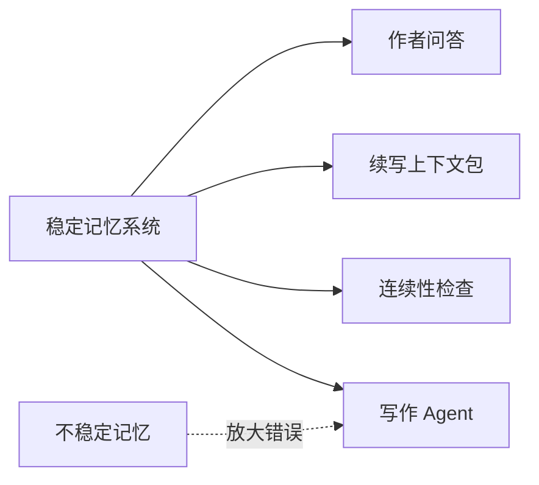
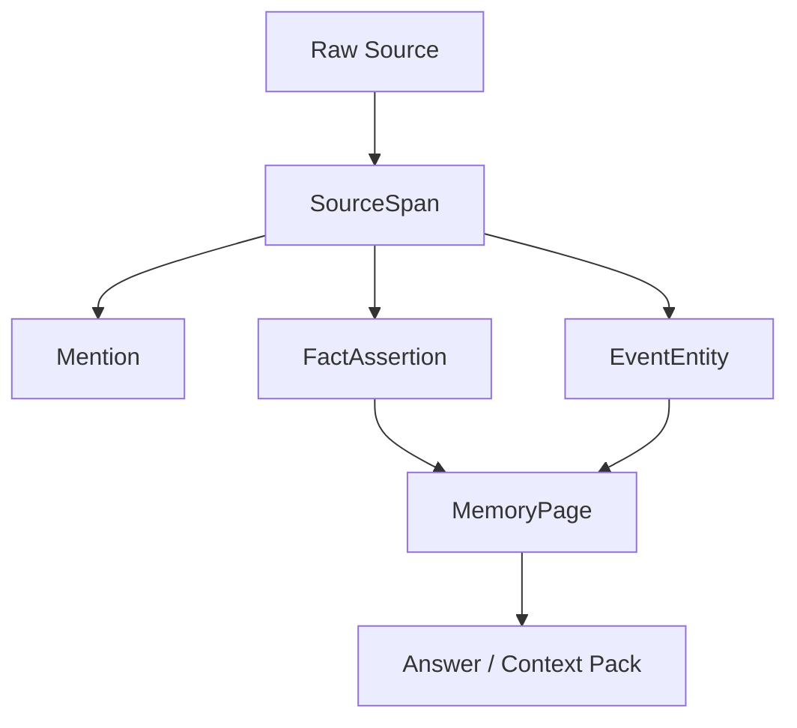
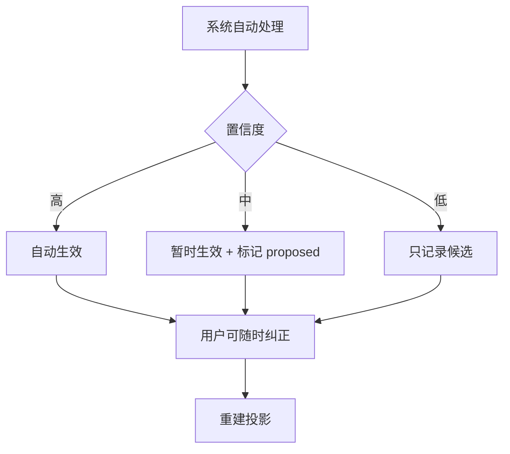
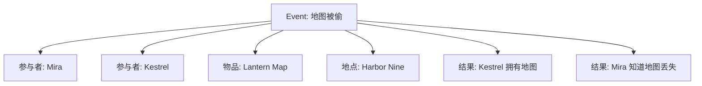

# 00. 设计原则

> 本文档只讨论记忆系统的设计原则，不讨论实现方式。

## 1. 记忆系统优先于写作 Agent

Sextant 的第一目标不是“让 AI 直接写出完整小说”，而是建立一个稳定的外部记忆层。

先做记忆，再做 Agent 的理由：

| 判断 | 原因 |
|---|---|
| 写作 Agent 依赖记忆 | 如果角色、事件、伏笔、POV 不稳定，Agent 会持续胡编 |
| 记忆本身可独立产生价值 | 查设定、查出场、查矛盾、查原文证据，不需要完整 Agent |
| 作者需要控制权 | 小说创作中，AI 应辅助作者，而不是替作者决定 canon |
| 证据优先 | 没有 SourceSpan 的“记忆”只是模型印象 |

## 2. Evidence-first

任何系统生成的事实、关系、角色状态、事件描述，都必须能回到一个或多个 SourceSpan。

没有证据的内容只能被标记为：

- 推测；
- 作者笔记；
- 用户手动设定；
- 待确认；
- 风格建议。

它不能冒充 canon。

## 3. Mention-first

不要把原文里的名字、代词、称号，立即合并成最终实体。

错误流程：

推荐流程：

这样可以保留不确定性，也方便用户后续纠正。

## 4. Canon over Truth

现实世界记忆里可以说 compiled truth；小说系统里应说 current canon。

原因：

| 小说中的信息类型 | 例子 | 是否等于客观真相 |
|---|---|---:|
| 作者确定设定 | 女主真实身份是公主 | 是 |
| 角色认知 | 男主以为女主是平民 | 否 |
| 读者当前认知 | 读者还不知道公主身份 | 否 |
| 草稿设定 | 第 2 版里男主有姐姐 | 可能过期 |
| 原著 canon | 同人作品要遵守的设定 | 是，但取决于授权和版本 |
| 模型推测 | “银面人可能是萧寒” | 否 |

因此记忆页不叫 Truth Page，而叫 MemoryPage / Current Canon。

## 5. 用户可校正，但流程不阻塞

用户应该可以：

- 合并实体；
- 拆分别名；
- 修改角色关系；
- 标记事实过期；
- 指定某段是作者设定；
- 删除错误推测。

但系统不应该要求用户每一步都确认。

## 6. 规则优先，模型辅助

能确定性完成的事情，不交给模型判断。

| 任务 | 推荐方式 |
|---|---|
| 章节标题识别 | 规则优先 |
| 场景分隔符识别 | 规则优先 |
| SourceSpan 生成 | 确定性 |
| 已确认别名匹配 | 确定性 |
| appears_in | 确定性 |
| 简单 frontmatter / wikilink 解析 | 确定性 |
| 模糊代词归属 | 模型辅助 |
| 事件重要性判断 | 模型辅助 |
| Current Canon 重写 | 模型辅助 |
| 视角漂移判断 | 模型辅助 |

## 7. 事件是一等记忆

小说不是静态百科，而是事件驱动的状态变化。

事件不是普通关系；事件是多个实体、地点、时间、后果的聚合点。

## 8. POV-aware

写作时最重要的问题之一不是“世界里真实发生了什么”，而是：

> 当前 POV 角色知道什么、看见什么、误解什么、不能知道什么？

因此，Scene 必须记录 POV，角色必须有 Knowledge State。

