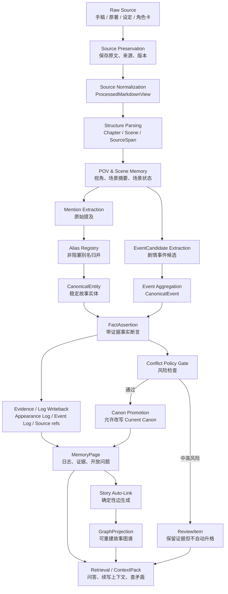
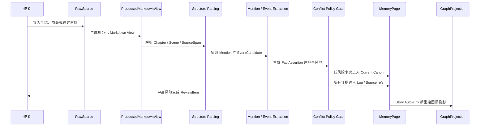
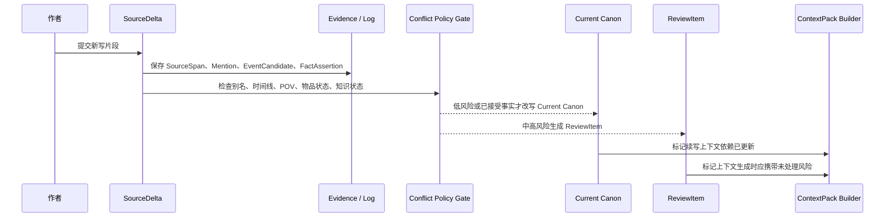
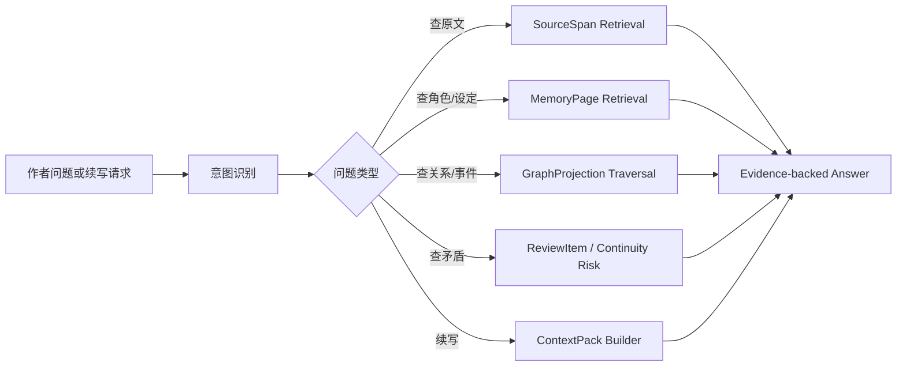
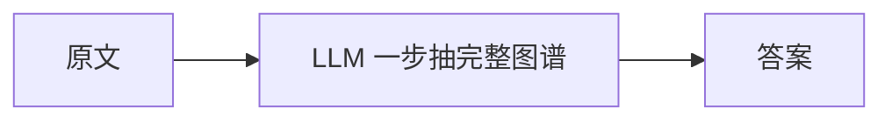

# 01. 总体数据流

> 本文档描述 Sextant 记忆系统从输入到输出的 **唯一主流程**。它与 [GOAL.md](../GOAL.md) 中的 canonical end-to-end flow 同构。本文不讨论技术栈和实现细节。

## 1. 输入类型

| 输入 | 说明 | 主要进入路径 |
|---|---|---|
| 未完成手稿 | 作者自己的章节草稿、片段、续写 | RawSource -> ProcessedMarkdownView -> Memory |
| 授权原著 | 同人写作需要遵守的 canon source | RawSource -> external canon memory |
| 设定集 | 世界观、历史、阵营、规则 | RawSource -> Lore / Faction / Location Memory |
| 角色卡 | 角色设定、关系、动机 | RawSource -> Character Memory |
| 作者笔记 | 灵感、未来计划、伏笔 | RawSource -> Author Note / OpenThread |
| 新写片段 | 作者刚写的一页或一场 | SourceDelta -> 增量回写 |
| 模型建议 | AI 给出的候选文本或建议 | 低权重材料，不自动进入 canon |

## 2. Canonical End-to-End Flow

关键约束：

| 约束 | 含义 |
|---|---|
| Raw Source 先保存 | 冲突、低置信、格式问题都不能阻断原始材料保存 |
| Evidence / Log 可先写 | 新证据可以先进入日志，不等于 Current Canon 被改写 |
| Current Canon 有 gate | 任何高风险事实、别名、状态变化必须经过 Conflict Policy Gate |
| GraphProjection 可重建 | 图谱不是事实源，只是投影 |
| ContextPack 按需生成 | 增量回写只更新它的依赖，不默认每次生成完整 ContextPack |

## 3. 标准 ingest 流程

## 4. 增量写作流程

作者不是一次性导入完整小说，而是一页一页写。增量流程仍沿用 canonical flow，只是局部执行。

注意：新增正文后不默认生成完整 ContextPack。系统只更新 ContextPack 所依赖的 MemoryPage、GraphProjection、ReviewItem。用户请求续写或问答时，才按需生成 ContextPack。

## 5. 查询与 ContextPack 流程

## 6. 输出类型

| 输出 | 用途 | 是否必须带证据 | 默认生成时机 |
|---|---|---:|---|
| Evidence-backed Answer | 回答作者问题 | 是 | 用户查询时 |
| ContextPack | 给续写模型或作者使用的上下文 | 是 | 用户请求续写时按需生成 |
| MemoryPage | 角色、地点、事件等记忆页 | 是 | ingest / 增量回写后更新 |
| ReviewItem | 冲突、别名、连续性风险 | 是 | Conflict Policy Gate 产生 |
| OpenThread | 未解决伏笔、悬念、未来计划 | 建议 | 回写或检查时产生 |
| AuthorNote | 作者手动设定或意图 | 是，来源为用户输入 | 用户输入时 |

## 7. 核心数据流判断

Sextant 不是：

Sextant 是：

