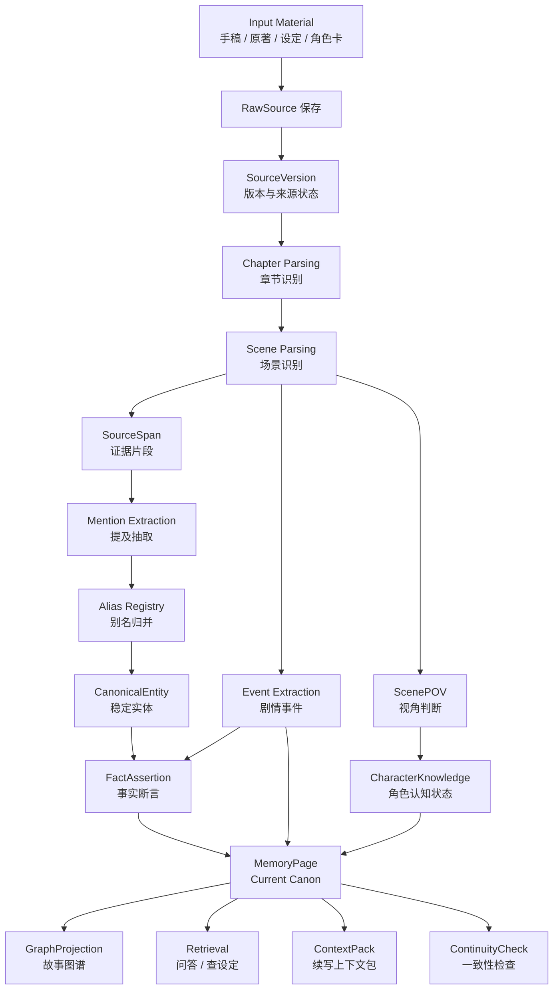
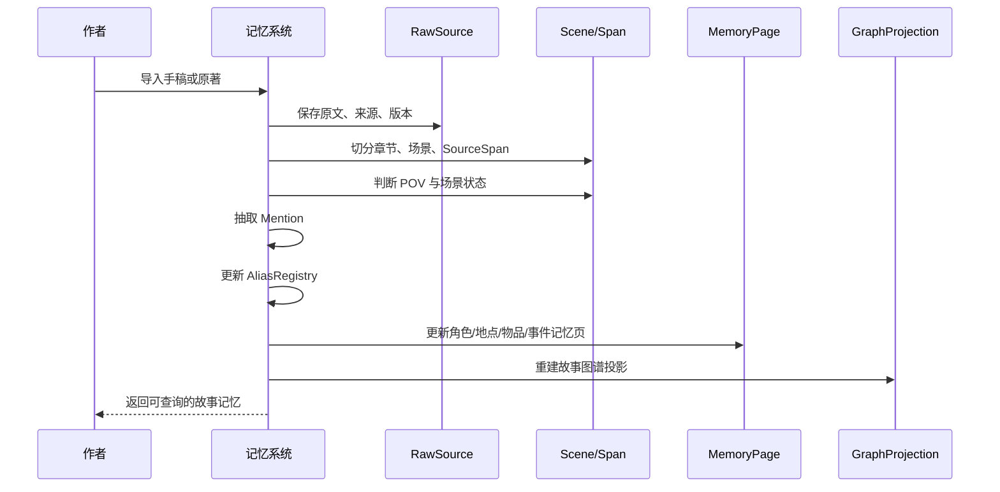
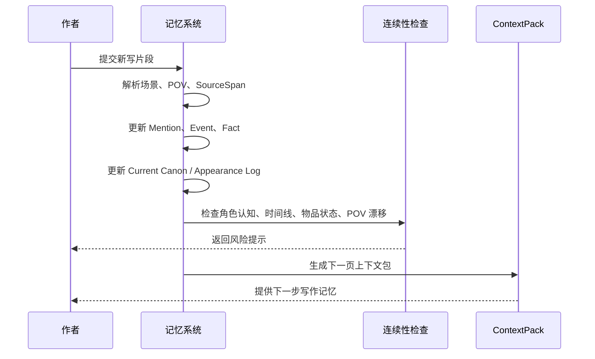
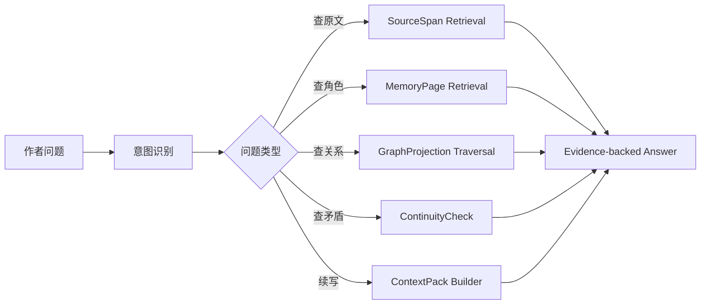

# 01. 总体数据流

> 本文档描述 Sextant 记忆系统从输入到输出的完整逻辑流。不讨论技术栈和实现细节。

## 1. 输入类型

| 输入 | 说明 | 主要输出 |
|---|---|---|
| 未完成手稿 | 作者自己的章节草稿、片段、续写 | RawSource、Chapter、Scene、MemoryPage |
| 授权原著 | 同人写作需要遵守的 canon source | Canon Memory、实体、事件、证据 |
| 设定集 | 世界观、历史、阵营、规则 | Lore、Location、Faction、Object |
| 角色卡 | 角色设定、关系、动机 | Character Memory |
| 作者笔记 | 灵感、未来计划、伏笔 | AuthorNote、OpenThread |
| 新写片段 | 作者刚写的一页或一场 | 增量更新、连续性检查、ContextPack |

## 2. 总体流程

## 3. 标准 ingest 流程

## 4. 增量写作流程

作者不是一次性导入完整小说，而是一页一页写。

## 5. 查询流程

## 6. 输出类型

| 输出 | 用途 | 是否必须带证据 |
|---|---|---:|
| Evidence-backed Answer | 回答作者问题 | 是 |
| ContextPack | 给续写模型或作者使用的上下文 | 是 |
| MemoryPage | 角色、地点、事件等记忆页 | 是 |
| ContinuityWarning | 矛盾、视角漂移、角色认知错误 | 是 |
| OpenThread | 未解决伏笔、悬念、未来计划 | 建议 |
| AuthorNote | 作者手动设定或意图 | 是，来源为用户输入 |

## 7. 核心数据流判断

Sextant 不是：

Sextant 是：

