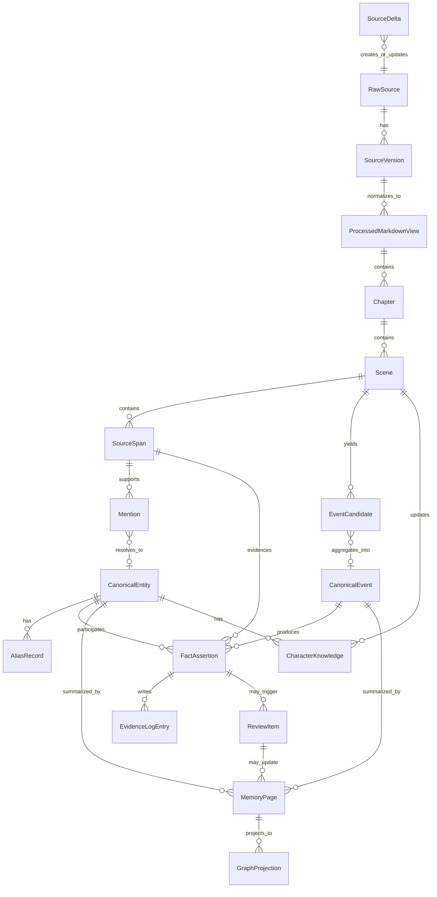

# 02. 核心数据结构

> 本文档定义 Sextant 记忆系统的 **source-of-truth 逻辑对象模型**。它不是数据库设计，不指定任何实现方式。

## 1. 总体对象关系



> 旧文档中的 `EventEntity` 在当前模型中拆成两层：`EventCandidate` 与 `CanonicalEvent`。后续文档应使用这两个名称，不再把 `EventEntity` 作为核心对象名。

## 2. Source 枚举

### 2.1 source_type

`source_type` 描述材料格式或来源形态，主要影响 normalization profile。

| 枚举 | 含义 |
|---|---|
| draft_manuscript | 作者当前或历史手稿 |
| canon_source | 授权原著或参考 canon |
| web_serial | 网页连载文本 |
| pdf_book | PDF 书籍或文档 |
| ocr_text | OCR 文本 |
| author_notes | 作者笔记 |
| outline | 大纲或计划 |
| character_sheet | 角色卡 |
| worldbuilding | 世界观设定集 |
| model_output | 模型生成候选内容 |
| other | 其他 |

### 2.2 source_scope

`source_scope` 描述材料在作品记忆中的语义地位，主要影响 canon promotion 权重。

| 枚举 | 含义 |
|---|---|
| user_draft | 作者当前正文草稿 |
| user_published | 作者已确认发布或定稿内容 |
| external_canon | 原著或同人参考 canon |
| author_note | 作者明确设定或说明 |
| outline_plan | 大纲、计划、未来剧情意图 |
| reference_only | 仅供参考，不自动覆盖正文 canon |
| discarded_draft | 旧稿、废稿、已废弃版本 |
| experimental | 试写、实验性材料 |
| model_suggestion | 模型建议，不能自动成为 canon |

## 3. SourceDelta

SourceDelta 是一次增量 ingest 的输入 envelope，不是长期事实源，也不是 SourceSpan 的替代品。它最终会落到 `RawSource + SourceVersion + ProcessedMarkdownView`。

| 字段 | 含义 |
|---|---|
| delta_id | 增量输入 ID |
| change_type | new_source / new_version / append / replace / metadata_update |
| source_id | 目标 RawSource，可为空 |
| version_id | 目标 SourceVersion，可为空 |
| submitted_text_ref | 本次提交的文本或材料引用 |
| source_type | 见 `source_type` 枚举 |
| source_scope | 见 `source_scope` 枚举 |
| affected_range | 被追加或替换的范围，可为空 |
| submitted_by | 作者 / 系统 / 导入来源 |
| created_at | 提交时间 |

处理关系：

```text
SourceDelta -> RawSource / SourceVersion -> ProcessedMarkdownView -> SourceSpan
```

## 4. RawSource

原始材料本身。RawSource 不应被 ProcessedMarkdownView 或 MemoryPage 替代。

| 字段 | 含义 |
|---|---|
| source_id | 原始材料 ID |
| source_type | 见 `source_type` 枚举 |
| source_scope | 见 `source_scope` 枚举 |
| title | 材料标题 |
| ownership_status | owned / authorized / user_provided / unknown |
| raw_text_ref | 原文位置或引用 |
| created_by | 作者 / 系统 / 导入来源 |

## 5. SourceVersion

RawSource 的版本记录。

| 字段 | 含义 |
|---|---|
| version_id | 版本 ID |
| source_id | 所属 RawSource |
| version_label | 版本标记 |
| raw_hash | 原文指纹 |
| created_at | 版本产生时间 |
| supersedes_version_id | 被替代的旧版本，可为空 |

## 6. ProcessedMarkdownView

RawSource 的规范化处理视图。它可重建，不是最终证据源。

| 字段 | 含义 |
|---|---|
| view_id | Markdown View ID |
| version_id | 对应 SourceVersion |
| cleaning_profile | 使用的 Format Profile |
| markdown_ref | 规范化 Markdown 内容引用 |
| raw_offset_map_ref | processed span 到 raw offset 的映射 |
| view_status | current / stale / rebuilt / deprecated |

约束：同一个 `SourceVersion` 同时最多只有一个 `ProcessedMarkdownView.view_status = current`。其他视图只能用于审计、比较或重建，不能参与默认抽取流程。

## 7. Chapter

章节级结构。

| 字段 | 含义 |
|---|---|
| chapter_id | 章节 ID |
| view_id | 所属 ProcessedMarkdownView |
| chapter_index | 章节顺序 |
| title | 章节标题 |
| start_span | 起始位置 |
| end_span | 结束位置 |
| summary | 可选章节摘要 |

## 8. Scene

场景是小说记忆的核心结构单元。

| 字段 | 含义 |
|---|---|
| scene_id | 场景 ID |
| chapter_id | 所属章节 |
| scene_index | 场景顺序 |
| location_entity_id | 主要地点，可为空 |
| pov_character_id | 当前 POV 角色，可为空 |
| pov_mode | first_person / third_limited / omniscient / multiple / unknown |
| story_time | 故事内时间，可为空 |
| emotional_tone | 情绪基调 |
| scene_summary | 场景摘要 |
| scene_function | reveal / conflict / transition / setup / payoff / other |

## 9. SourceSpan

证据片段。任何事实、事件、关系、警告都应能回到 SourceSpan。

| 字段 | 含义 |
|---|---|
| span_id | 证据 ID |
| source_id | 所属 RawSource |
| version_id | 所属 SourceVersion |
| view_id | 所属 ProcessedMarkdownView |
| chapter_id | 所属章节 |
| scene_id | 所属场景 |
| start_offset | 处理视图中的起始位置 |
| end_offset | 处理视图中的结束位置 |
| raw_start_offset | RawSource 中的起始位置 |
| raw_end_offset | RawSource 中的结束位置 |
| text_preview | 短摘录 |
| speaker_entity_id | 说话人，可为空 |
| narration_layer | narrator / dialogue / inner_thought / author_note |

## 10. Mention

原文里的“提及”，不是最终实体。

| 字段 | 含义 |
|---|---|
| mention_id | 提及 ID |
| raw_text | 原文字符串 |
| mention_type | character / location / object / faction / lore / event / unknown |
| span_id | 证据片段 |
| local_context | 局部上下文 |
| resolved_entity_id | 可能解析到的实体 |
| resolution_status | unresolved / auto_resolved / proposed / user_confirmed / rejected |
| confidence | 置信度 |

## 11. AliasRecord

别名记录，不是用户确认队列。

| 字段 | 含义 |
|---|---|
| alias_text | 别名文本 |
| entity_id | 指向实体 |
| alias_type | name / title / nickname / disguise / pronoun / relation_name / spelling_variant |
| status | auto_accepted / proposed / rejected / user_confirmed / user_corrected |
| scope | global / scene_local / chapter_local / character_specific |
| evidence_span_ids | 支持证据 |
| confidence | 置信度 |

## 12. CanonicalEntity

稳定故事实体。

| 字段 | 含义 |
|---|---|
| entity_id | 实体 ID |
| entity_type | character / location / object / faction / lore / plotline / other |
| display_name | 展示名 |
| canonical_status | canon / draft / provisional / discarded / contradicted |
| cast_tier | local_extra / minor_supporting / recurring / major / unknown；仅适用于 character |
| first_seen_scene_id | 首次出现 |
| description | 简述 |

`cast_tier` 表示角色在当前作品 cast 中的叙事重要性，不是 canon 状态。它不能替代 `canonical_status`。

| cast_tier | 含义 | Memory 落点 |
|---|---|---|
| local_extra | 一次性场景人物 | 可只保留 Mention / SourceSpan，不一定建 MemoryPage |
| minor_supporting | 小配角或可能再出现的人物 | 可建轻量 MemoryPage |
| recurring | 反复出现并影响局部情节 | Character MemoryPage + 简版 Agency Profile |
| major | 影响主线、主题、长期关系或核心秘密 | Character MemoryPage + 完整 Agency Profile，通常需作者确认 |
| unknown | 暂未判断 | 默认状态 |

## 13. EventCandidate

从 Scene 中抽出的剧情事件候选，保留不确定性。

| 字段 | 含义 |
|---|---|
| event_candidate_id | 候选事件 ID |
| event_type | 事件类型，受 Story Schema Pack 限制 |
| summary | 候选事件摘要 |
| scene_id | 来源场景 |
| participants | 参与角色或阵营候选 |
| objects | 涉及物品候选 |
| location_entity_id | 发生地点候选 |
| state_change | 可能造成的状态变化 |
| evidence_span_ids | 支持证据 |
| confidence | 置信度 |
| aggregation_status | new / merged / related / conflict_version / rejected |

## 14. CanonicalEvent

聚合后的稳定剧情事件。CanonicalEvent 是事件层的核心对象。

| 字段 | 含义 |
|---|---|
| canonical_event_id | 稳定事件 ID |
| event_type | 事件类型 |
| title | 事件标题 |
| event_status | canon / proposed / disputed / deprecated / external_canon / author_note |
| primary_scene_id | 主要发生场景 |
| event_candidate_ids | 聚合进来的候选事件 |
| participants | 参与实体 |
| objects | 涉及物品 |
| location_entity_id | 发生地点 |
| story_time | 故事内时间 |
| summary | 事件摘要 |
| consequence_summary | 后果摘要 |
| evidence_span_ids | 支持证据 |

## 15. FactAssertion

带证据的事实断言。FactAssertion 可以先进入 evidence/log，但不一定直接进入 Current Canon。

| 字段 | 含义 |
|---|---|
| fact_id | 事实 ID |
| subject_ref | 主体实体、事件或场景 |
| predicate | 关系或属性，受 relation whitelist 限制 |
| object_ref | 客体实体 / 事件 / 字面值 |
| fact_status | canon / inferred / proposed / disputed / contradicted / outdated / user_note |
| valid_from_scene_id | 从哪个场景开始有效 |
| valid_until_scene_id | 到哪个场景前有效，可为空 |
| evidence_span_ids | 证据 |
| confidence | 置信度 |
| source_scope | 继承或引用来源语义地位 |

## 16. EvidenceLogEntry

可以先写入的证据日志，不等于 Current Canon 改写。

| 字段 | 含义 |
|---|---|
| log_id | 日志 ID |
| log_type | appearance / event / source_ref / state_observation / note |
| target_ref | 关联 MemoryPage、实体、事件或剧情线 |
| fact_id | 关联 FactAssertion，可为空 |
| event_id | 关联 CanonicalEvent，可为空 |
| source_span_ids | 证据 |
| log_status | active / proposed / disputed / deprecated |

## 17. CharacterKnowledge

角色认知状态。

| 字段 | 含义 |
|---|---|
| character_id | 角色 |
| knows_ref | 知道的事实、事件、秘密或信息 |
| learned_in_scene_id | 何时知道 |
| evidence_span_id | 证据 |
| certainty | knows / suspects / misunderstands / false_belief |
| hidden_from | 对哪些角色仍然隐藏 |

## 18. MemoryPage

面向作者和续写系统的记忆页。

| 字段 | 含义 |
|---|---|
| page_id | 页面 ID |
| page_type | character / location / object / faction / event / lore / plotline |
| title | 标题 |
| current_canon | 当前 canon 摘要 |
| appearance_log | 出场记录 |
| event_log | 事件记录 |
| relationships | 关系摘要 |
| open_threads | 未解决伏笔 |
| contradictions | 已知矛盾 |
| source_refs | 证据引用 |
| canon_status | current / proposed / disputed / deprecated |
| memory_depth | none / light / standard / full；用于控制角色页维护深度 |

`memory_depth` 是页面维护深度，不是 canon 状态。典型映射：

| cast_tier | memory_depth |
|---|---|
| local_extra | none 或 light |
| minor_supporting | light |
| recurring | standard |
| major | full |

## 19. ReviewItem

统一风险对象。连续性警告、别名冲突、canon promotion 风险都应表达为 ReviewItem。

| 字段 | 含义 |
|---|---|
| review_id | ReviewItem ID |
| review_type | alias_conflict / event_merge_conflict / state_conflict / object_state_conflict / knowledge_conflict / pov_conflict / timeline_conflict / relationship_conflict / canon_conflict / version_conflict / source_scope_conflict / continuity_warning |
| severity | low / medium / high |
| status | open / dismissed / resolved / superseded |
| summary | 风险摘要 |
| affected_refs | 相关角色、地点、物品、事件、MemoryPage |
| new_evidence | 新 SourceSpan |
| existing_evidence | 旧 SourceSpan |
| suggested_actions | accept / reject / split / merge / mark_intentional / supersede / needs_memory_update |
| default_action | 系统默认处理 |
| resolution | 最终处理动作，可为空 |
| resolved_by | 处理者，可为空 |
| resolved_at | 处理时间，可为空 |
| side_effects | 对 MemoryPage / GraphProjection / ContextPack 的影响说明 |

## 20. GraphProjection

可重建故事图谱投影。

| 字段 | 含义 |
|---|---|
| projection_id | 投影 ID |
| node_refs | 图谱节点引用 |
| edge_refs | 图谱边引用 |
| relation_whitelist_version | 使用的关系白名单版本 |
| projection_status | current / stale / rebuilt |

## 21. ContextPack

续写或问答时按需生成的上下文包。ContextPack 不在每次 ingest 后自动生成。

| 字段 | 含义 |
|---|---|
| context_pack_id | 上下文包 ID |
| request_type | answer / continuation / continuity_check |
| scope | 当前章节、场景、POV、实体范围 |
| included_memory_refs | 引用的 MemoryPage、GraphProjection、ReviewItem |
| evidence_span_ids | 证据来源 |
| generated_for | 作者问题或续写请求 |

## 22. Source-of-truth 顺序

```text
RawSource / SourceSpan
  > Mention / AliasRecord / EventCandidate
  > CanonicalEntity / CanonicalEvent / FactAssertion
  > EvidenceLogEntry / ReviewItem
  > MemoryPage
  > GraphProjection / ContextPack
```

GraphProjection 与 ContextPack 都是 read model，不是事实源。MemoryPage 的 Current Canon 也不能覆盖底层证据链。