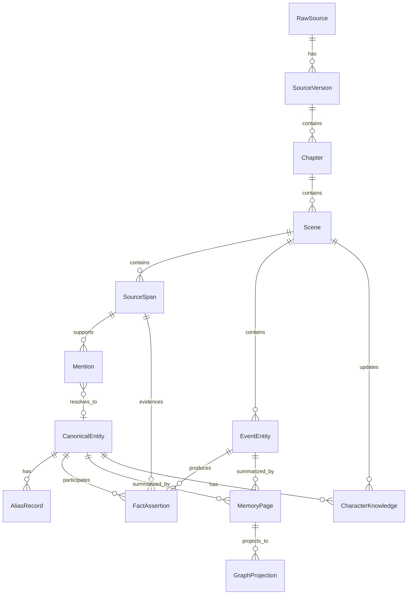

# 02. 核心数据结构

> 本文档定义逻辑数据结构。它不是数据库设计，不指定任何实现方式。

## 1. 总体对象关系

## 2. RawSource

原始材料本身。

| 字段 | 含义 |
|---|---|
| source_id | 原始材料 ID |
| source_type | manuscript / canon / note / character_sheet / worldbuilding / other |
| title | 材料标题 |
| ownership_status | owned / authorized / user_provided / unknown |
| version_label | 版本标记 |
| source_scope | draft / canon / note / discarded / experimental |
| raw_text_ref | 原文位置或引用 |
| created_by | 作者 / 系统 / 导入来源 |

## 3. Chapter

章节级结构。

| 字段 | 含义 |
|---|---|
| chapter_id | 章节 ID |
| source_id | 所属 RawSource |
| chapter_index | 章节顺序 |
| title | 章节标题 |
| start_span | 起始位置 |
| end_span | 结束位置 |
| summary | 可选章节摘要 |

## 4. Scene

场景是小说记忆的核心结构单元。

| 字段 | 含义 |
|---|---|
| scene_id | 场景 ID |
| chapter_id | 所属章节 |
| scene_index | 场景顺序 |
| location_entity_id | 主要地点，可为空 |
| pov_character_id | 当前 POV 角色，可为空 |
| pov_mode | first_person / third_limited / omniscient / multiple / unknown |
| story_time | 故事内时间，可为空 |
| emotional_tone | 情绪基调 |
| scene_summary | 场景摘要 |
| scene_function | reveal / conflict / transition / setup / payoff / other |

## 5. SourceSpan

证据片段。

| 字段 | 含义 |
|---|---|
| span_id | 证据 ID |
| source_id | 所属原始材料 |
| chapter_id | 所属章节 |
| scene_id | 所属场景 |
| start_offset | 起始位置 |
| end_offset | 结束位置 |
| text_preview | 短摘录 |
| speaker_entity_id | 说话人，可为空 |
| narration_layer | narrator / dialogue / inner_thought / author_note |

## 6. Mention

原文里的“提及”，不是最终实体。

| 字段 | 含义 |
|---|---|
| mention_id | 提及 ID |
| raw_text | 原文字符串 |
| mention_type | character / location / object / faction / lore / event / unknown |
| span_id | 证据片段 |
| local_context | 局部上下文 |
| resolved_entity_id | 可能解析到的实体 |
| resolution_status | unresolved / auto_resolved / proposed / user_confirmed / rejected |
| confidence | 置信度 |

## 7. AliasRecord

别名记录，不是用户确认队列。

| 字段 | 含义 |
|---|---|
| alias_text | 别名文本 |
| entity_id | 指向实体 |
| alias_type | name / title / nickname / disguise / pronoun / relation_name / spelling_variant |
| status | auto_accepted / proposed / rejected / user_confirmed / user_corrected |
| scope | global / scene_local / chapter_local / character_specific |
| evidence_span_ids | 支持证据 |
| confidence | 置信度 |

## 8. CanonicalEntity

稳定故事实体。

| 字段 | 含义 |
|---|---|
| entity_id | 实体 ID |
| entity_type | character / location / object / faction / lore / plotline / other |
| display_name | 展示名 |
| canonical_status | canon / draft / provisional / discarded / contradicted |
| first_seen_scene_id | 首次出现 |
| description | 简述 |

## 9. EventEntity

剧情事件，作为一等实体。

| 字段 | 含义 |
|---|---|
| event_id | 事件 ID |
| event_type | meeting / revelation / betrayal / travel / conflict / discovery / death / promise / other |
| title | 事件标题 |
| scene_id | 所属场景 |
| participants | 参与实体 |
| location_entity_id | 发生地点 |
| story_time | 故事内时间 |
| summary | 事件摘要 |
| consequence_summary | 后果摘要 |
| evidence_span_ids | 支持证据 |

## 10. FactAssertion

带证据的事实断言。

| 字段 | 含义 |
|---|---|
| fact_id | 事实 ID |
| subject_entity_id | 主体 |
| predicate | 关系或属性 |
| object_ref | 客体实体 / 事件 / 字面值 |
| fact_status | canon / inferred / proposed / contradicted / outdated / user_note |
| valid_from_scene_id | 从哪个场景开始有效 |
| valid_until_scene_id | 到哪个场景前有效，可为空 |
| evidence_span_ids | 证据 |
| confidence | 置信度 |

## 11. CharacterKnowledge

角色认知状态。

| 字段 | 含义 |
|---|---|
| character_id | 角色 |
| knows_ref | 知道的事实、事件、秘密或信息 |
| learned_in_scene_id | 何时知道 |
| evidence_span_id | 证据 |
| certainty | knows / suspects / misunderstands / false_belief |
| hidden_from | 对哪些角色仍然隐藏 |

## 12. MemoryPage

面向作者和续写系统的记忆页。

| 字段 | 含义 |
|---|---|
| page_id | 页面 ID |
| page_type | character / location / object / faction / event / lore / plotline |
| title | 标题 |
| current_canon | 当前 canon 摘要 |
| appearance_log | 出场记录 |
| relationships | 关系摘要 |
| open_threads | 未解决伏笔 |
| contradictions | 已知矛盾 |
| source_refs | 证据引用 |

## 13. ContextPack

续写或问答时使用的上下文包。

| 字段 | 含义 |
|---|---|
| pack_id | 上下文包 ID |
| purpose | answer / continue_scene / revise_scene / check_continuity |
| current_scene_id | 当前场景 |
| pov_character_id | 当前 POV |
| included_entities | 纳入的实体 |
| included_events | 纳入的事件 |
| included_facts | 纳入的事实 |
| forbidden_knowledge | 当前 POV 不应知道的信息 |
| evidence_refs | 证据 |

