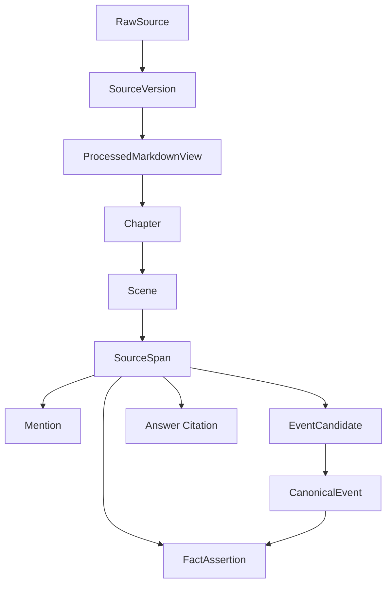
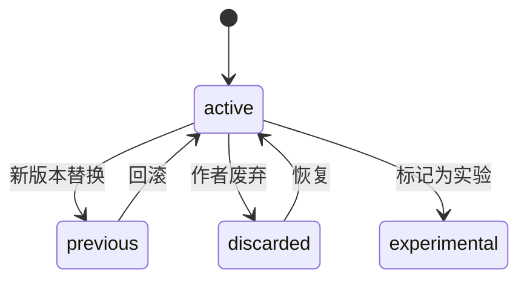
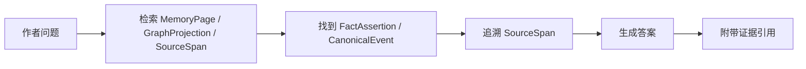

# 03. 原始材料与证据系统

> 原始材料和证据系统是 Sextant 的根。所有记忆、回答、续写上下文都必须能回到原文。

## 1. RawSource 的角色

RawSource 是输入材料本身，不是系统总结。

RawSource 的 `source_type` 和 `source_scope` 使用 [02-core-data-structures.md](02-core-data-structures.md) 中的统一枚举。

| source_type | 常见 source_scope | 主要用途 |
|---|---|---|
| draft_manuscript | user_draft / user_published / discarded_draft | 建立或更新当前作品 canon |
| canon_source | external_canon / reference_only | 建立外部 canon 或同人参考 |
| character_sheet | author_note / reference_only | 角色基础设定 |
| worldbuilding | author_note / reference_only | 地点、阵营、规则、历史 |
| author_notes | author_note / outline_plan | 未来意图、伏笔、修改计划 |
| model_output | model_suggestion | 作为建议，不自动进入 canon |

## 2. SourceVersion

小说写作中，同一章会反复修改。记忆系统必须区分版本。

| 状态 | 含义 |
|---|---|
| active | 当前有效版本 |
| previous | 历史版本 |
| discarded | 废弃版本 |
| experimental | 实验性片段 |
| canon_reference | 原著或授权 canon 来源 |

版本变化不应直接删除旧证据，而应改变其 canon 状态。

## 3. SourceSpan

SourceSpan 是最小证据单位。

一个 SourceSpan 应该足够短，能精准指向原文；又要足够长，能让人理解上下文。

| 用途 | SourceSpan 的作用 |
|---|---|
| 回答作者问题 | 提供引用依据 |
| 抽取 Mention | 标记提及出现位置 |
| 抽取 EventCandidate | 标记事件候选发生位置 |
| 聚合 CanonicalEvent | 提供事件聚合证据 |
| 事实断言 | 证明这个事实来自哪里 |
| ReviewItem | 说明风险来自哪些段落 |
| 续写上下文 | 给模型必要证据而不是整章全文 |

## 4. 证据链

任何回答都应形成证据链。

## 5. 原文、摘要和记忆的区别

| 层级 | 是否原文 | 是否可修改 | 用途 |
|---|---:|---:|---|
| RawSource | 是 | 不建议直接修改 | 原始证据 |
| ProcessedMarkdownView | 否 | 可重建 | 规范化处理视图 |
| SourceSpan | 是 | 不建议直接修改 | 精准引用 |
| Scene Summary | 否 | 可重写 | 便于理解场景 |
| EventCandidate | 否 | 可拒绝或聚合 | 保存事件候选 |
| CanonicalEvent | 否 | 可合并、拆分、废弃 | 稳定剧情事件 |
| FactAssertion | 否 | 可更正 | 事实记忆 |
| EvidenceLogEntry | 否 | 可标记状态 | 证据日志 |
| MemoryPage | 否 | 可重写 | 当前 canon 综合 |
| ContextPack | 否 | 临时生成 | 续写/问答 |

## 6. 证据状态

| 状态 | 含义 |
|---|---|
| current_canon | 当前有效 canon 的证据 |
| prior_version | 历史版本证据 |
| discarded | 已废弃设定，仅作历史 |
| author_intent | 作者笔记，代表意图而非成稿事实 |
| external_canon | 外部原著或参考 canon |
| model_inferred | 模型推断，必须可被作者覆盖 |
| proposed | 有证据但未通过 canon promotion gate |
| disputed | 存在冲突或多版本解释 |

## 7. 证据系统的边界

不允许：

- 模型总结替代原文证据；
- 无 SourceSpan 的事实直接进入 canon；
- 废弃草稿继续影响续写上下文；
- 把角色误解当成世界真实事实；
- 把同人外部 canon 和作者当前作品 canon 混成一层；
- 把 EventCandidate 直接当成 CanonicalEvent；
- 把 proposed / disputed 事实当成 Current Canon。

