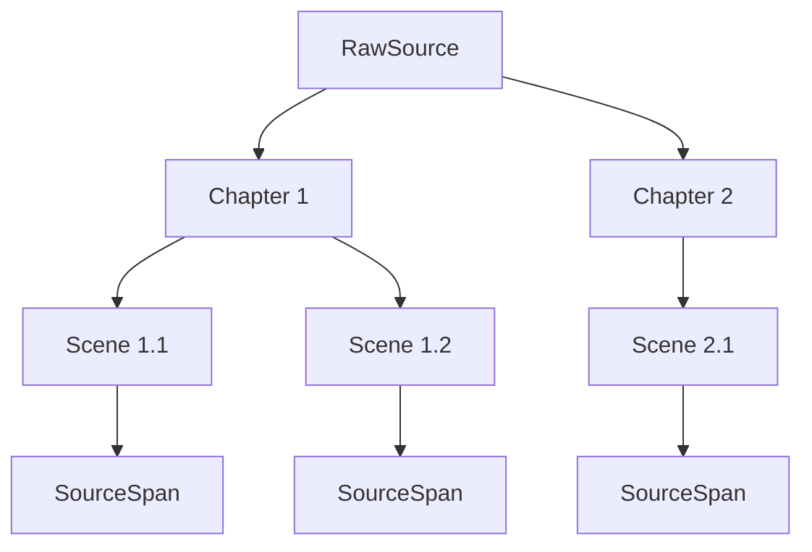
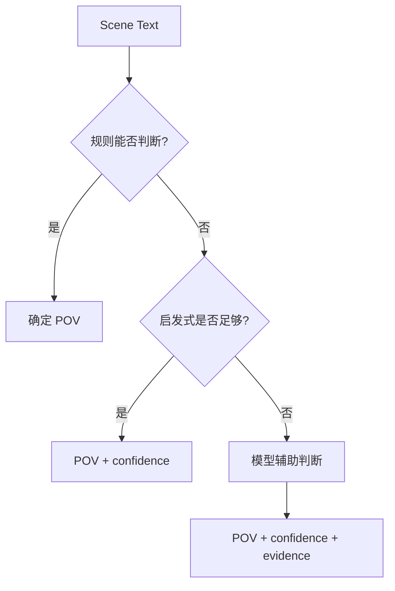
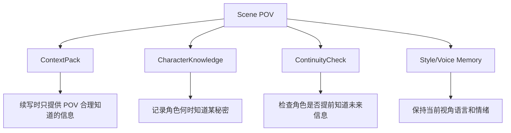
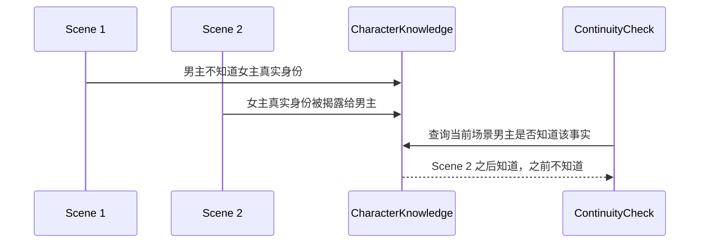

# 04. 章节、场景与 POV

> 场景是小说记忆的核心切分单位；POV 是续写和一致性检查的核心约束。

## 1. 为什么 Scene 比 Chunk 更重要

普通 RAG 会把文本切成 chunk。但小说写作的基本单位不是 chunk，而是 scene。

| Chunk | Scene |
|---|---|
| 为检索方便切分 | 为叙事理解切分 |
| 可能跨越场景边界 | 有相对完整的时间、地点、人物、冲突 |
| 不天然包含 POV | 应包含 POV |
| 不天然表示剧情功能 | 可表示 reveal / conflict / setup / payoff |

## 2. Chapter / Scene 层级

## 3. Scene 字段

| 字段 | 作用 |
|---|---|
| scene_id | 场景身份 |
| chapter_id | 所属章节 |
| scene_index | 顺序 |
| location_entity_id | 主要地点 |
| pov_character_id | 当前视角角色 |
| pov_mode | 第一人称 / 第三人称限知 / 全知 / 多视角 / 未知 |
| story_time | 故事内时间 |
| active_characters | 场上角色 |
| mentioned_entities | 提到但不在场的实体 |
| scene_function | 这场戏的叙事功能 |
| emotional_tone | 情绪基调 |
| open_threads_touched | 触及的伏笔或问题 |

## 4. POV 判断

POV 判断分三层，不强求一次完美。

### 4.1 规则判断

| 线索 | 例子 |
|---|---|
| 章节标题 | “Mira” “萧寒” “阿青” |
| 第一人称 | “我看见……” |
| 明确视角提示 | “从 Mira 的角度看……” |
| 日记/信件格式 | “Mira 的日记” |

### 4.2 启发式判断

| 线索 | 含义 |
|---|---|
| 内心描写最多的人 | 可能是 POV |
| 感官描写聚焦的人 | 可能是 POV |
| 叙述知道谁的想法 | 限知视角判断 |
| 谁的误解被叙述 | 角色认知判断 |

### 4.3 模型辅助判断

模型只在不确定时介入，输出：

| 输出 | 含义 |
|---|---|
| pov_character | 视角角色 |
| pov_mode | 视角类型 |
| confidence | 置信度 |
| evidence_span_ids | 判断依据 |
| uncertainty_reason | 为什么不确定 |

## 5. POV 对记忆系统的影响

## 6. CharacterKnowledge

角色认知不是世界事实。

| 类型 | 例子 |
|---|---|
| knows | Mira 知道地图被偷 |
| suspects | Mira 怀疑 Kestrel 偷了地图 |
| misunderstands | Mira 误以为 Orrin 背叛了她 |
| false_belief | 男主相信女主已经死亡 |
| does_not_know | 女主不知道男主真实身份 |

## 7. 角色认知时序

## 8. POV 相关连续性风险

| 风险 | 例子 |
|---|---|
| 视角漂移 | 第三人称限知突然进入另一个角色内心 |
| 提前知道 | 角色引用了他尚未得知的秘密 |
| 读者信息泄漏 | 叙述提前揭示了隐藏身份 |
| 错误感官范围 | 角色看到不在场的信息 |
| 情绪断裂 | 上一场恐惧未消化，下一场突然轻松 |

