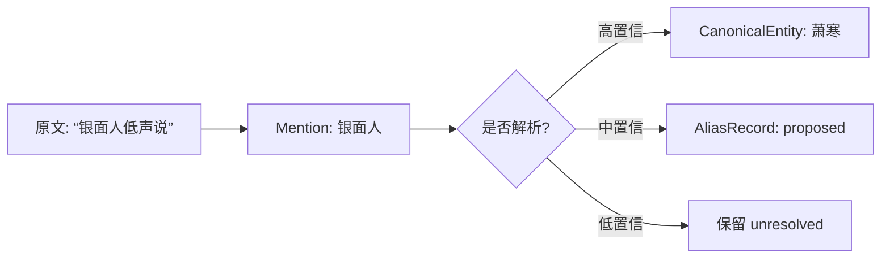
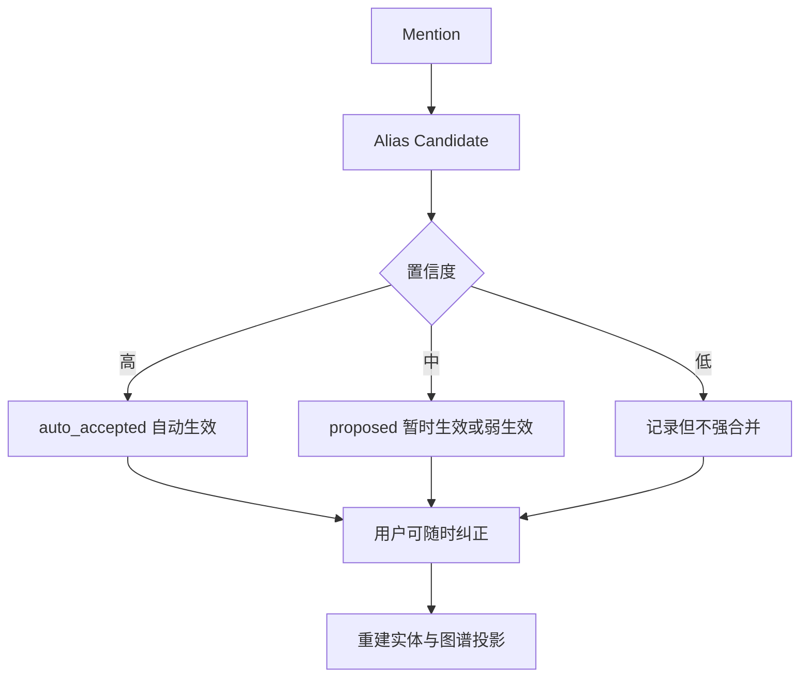
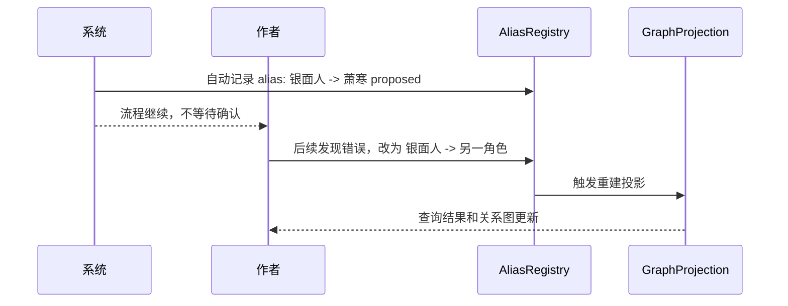

# 05. 提及与别名系统

> 小说别名复杂，必须做；但不能让用户确认成为流程阻塞点。

## 1. Mention 是什么

Mention 是原文里的一个称呼、名字、代词、称号、地点名、物品名或概念提及。

Mention 不等于实体。它只是原文证据中的一个信号。

## 2. 小说别名为什么必要

| 别名类型 | 例子 |
|---|---|
| 真名 | 萧寒 |
| 假名 | 林客 |
| 称号 | 银面人 |
| 尊称 | 少主、师父、王爷 |
| 亲昵称呼 | 阿寒、姐姐 |
| 伪装身份 | 商队护卫 |
| 他人视角称呼 | 那个疯子、旧王的狗 |
| 代词 | 他、她、那人 |
| 拼写变体 | Mira / Myra |

没有别名系统，角色会被拆成几十个重复实体。

## 3. 但别名不能全靠 LLM

LLM-only 别名处理容易出现：

| 问题 | 后果 |
|---|---|
| 识别不出来 | 同一角色被拆成多个实体 |
| 过度识别 | 几十个弱称呼都被合并 |
| 全局合并错误 | “少主”在不同场景指不同人 |
| 代词误合并 | “他”被错误绑定到最近角色 |
| 伏笔泄露 | 提前把隐藏身份合并到真名 |

## 4. Alias Registry，而不是 Alias Inbox

不设置阻塞式确认队列。

## 5. AliasRecord 状态

| 状态 | 含义 | 是否影响检索 | 是否影响图谱 |
|---|---|---:|---:|
| auto_accepted | 系统高置信自动接受 | 是 | 是 |
| proposed | 中置信候选 | 是，但降权 | 可弱连接 |
| low_confidence | 低置信候选 | 弱影响 | 否 |
| user_confirmed | 用户确认 | 是 | 是 |
| user_corrected | 用户修正 | 是 | 是 |
| rejected | 用户拒绝或系统排除 | 否 | 否 |

## 6. Alias 作用域

别名不一定全局有效。

| 作用域 | 例子 |
|---|---|
| global | “Starling” 全书都指 Mira |
| chapter_local | 本章“少主”指某角色 |
| scene_local | 这一场“他”指 Orrin |
| character_specific | “哥哥”只在女主话语中指男主 |
| disguise_arc | 某段剧情中假名有效 |

## 7. 默认归并规则

| 情况 | 默认行为 |
|---|---|
| 完全相同名字 | 自动归并 |
| 大小写/空格/标点差异 | 自动归并 |
| 明确括号解释：“萧寒（银面人）” | 自动或高置信 proposed |
| 明确句式：“他本名 X，人称 Y” | 高置信归并 |
| 尊称 + 姓名：“沈师父” | 中置信 |
| 单独“师父”“少主” | 作用域内 proposed |
| 代词“他/她” | 只做 scene-local，不全局归并 |
| “那个人”“黑影” | 默认低置信 |

## 8. 用户纠错流

## 9. 别名系统的设计目标

| 目标 | 说明 |
|---|---|
| 不阻塞 | ingest 不因用户未确认而停住 |
| 可回滚 | 错误合并可以撤销 |
| 保留 mention | 不删除原始提及 |
| 支持隐藏身份 | 不提前破坏伏笔 |
| 支持局部称呼 | “少主”“师父”不全局滥用 |
| 支持作者修正 | 用户修正高于系统判断 |

