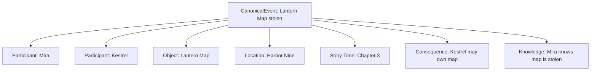
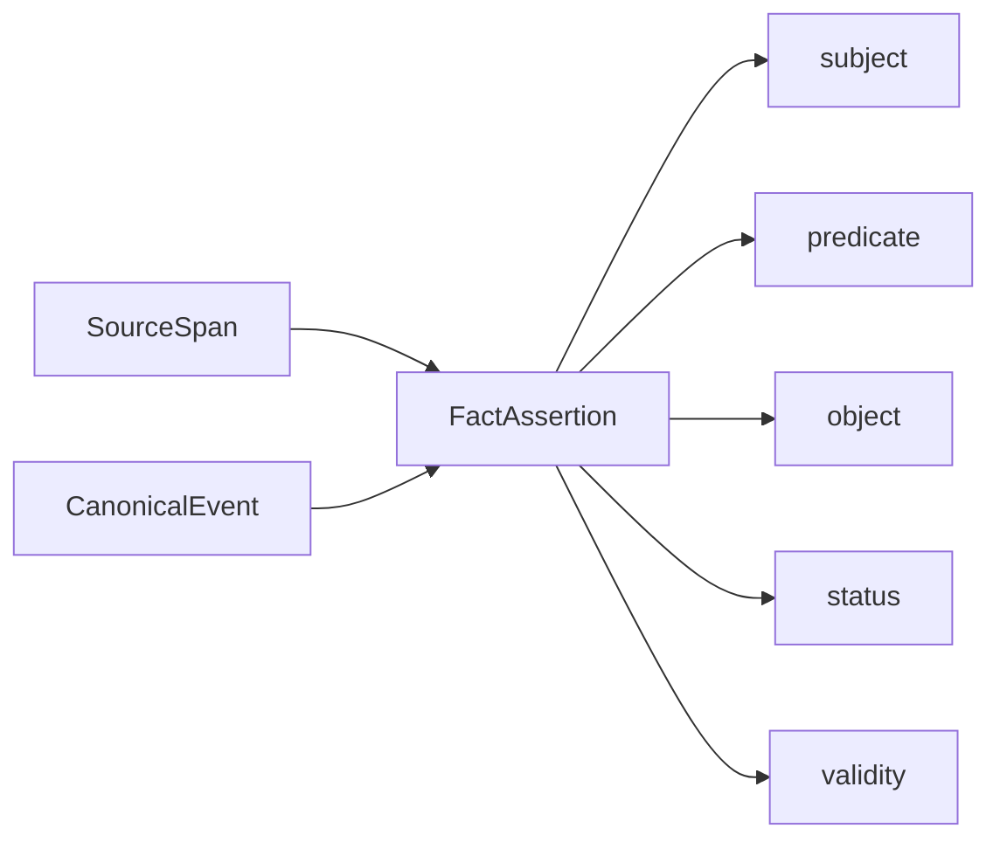
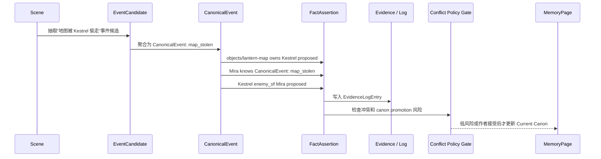

# 06. 实体、事件与事实

> 小说记忆中，实体是故事对象；事件是剧情变化；事实是带证据的状态断言。

## 1. 三者区别

| 类型 | 问题 | 例子 |
|---|---|---|
| Entity | 谁 / 什么东西 / 哪里 / 哪个组织 | Mira、Harbor Nine、Lantern Map |
| EventCandidate | 场景里可能发生了什么 | “地图似乎被 Kestrel 拿走” |
| CanonicalEvent | 聚合后的稳定剧情事件 | 地图被偷、Mira 初遇 Orrin |
| FactAssertion | 现在或某段时间内什么为真 | Kestrel 持有地图、Mira 知道地图丢失 |

## 2. 实体类型

实体类型以 [14-story-schema-packs.md](14-story-schema-packs.md) 为 source-of-truth。第一阶段的基础实体包括：

| 类型 | 说明 |
|---|---|
| character | 角色 |
| location | 地点 |
| object | 重要物品 / 道具 |
| faction | 组织 / 家族 / 阵营 |
| lore | 世界观概念 / 规则 / 传说 |
| plotline | 伏笔线 / 情节线 |
| event | 剧情事件 |

## 3. Event 为什么算实体

事件不是一条简单关系。事件会连接多个角色、地点、物品、时间、后果。

把事件作为实体，可以支持：

- 查某事件发生在哪一章；
- 查谁参与了事件；
- 查事件造成了什么状态变化；
- 查某角色是否知道这个事件；
- 查事件是否被后文回收或矛盾。

## 4. 事件类型

事件类型以 [14-story-schema-packs.md](14-story-schema-packs.md) 的 Canonical Event Type Whitelist 为 source-of-truth。本文只列常用示例。

| 类型 | 说明 |
|---|---|
| first_meeting | 角色首次相遇 |
| revelation | 真相揭示 |
| betrayal | 背叛 |
| promise | 承诺 / 誓言 |
| conflict | 冲突 / 战斗 / 争吵 |
| discovery | 发现线索 |
| travel | 位置变化 |
| object_transfer | 物品归属变化 |
| death | 死亡 |
| relationship_change | 关系状态变化 |
| decision | 关键决定 |
| other | 无法归类但确有叙事后果的事件 |

## 5. FactAssertion

事实必须有证据，也必须有状态。

| 字段 | 说明 |
|---|---|
| subject | 主体实体、事件或场景 |
| predicate | 谓词，使用 Story Schema Pack relation whitelist |
| object | 客体实体、事件或字面值 |
| status | canon / inferred / proposed / disputed / contradicted / outdated / user_note |
| valid_from | 从哪个场景开始有效 |
| valid_until | 到哪个场景失效 |
| evidence | SourceSpan |

## 6. 推荐 predicate 初始集合

predicate 以 [14-story-schema-packs.md](14-story-schema-packs.md) 的 relation whitelist 为 source-of-truth。常用基础关系包括：

| Predicate | 用途 |
|---|---|
| appears_in | 实体出现在场景中 |
| present_at | 角色或阵营在事件中在场、参与或受影响 |
| occurred_at | 事件发生地 |
| involves_object | 事件涉及某物品 |
| located_in | 实体位于某地点 |
| owns | 角色持有物品 |
| member_of | 角色属于组织 |
| family_of | 家庭关系 |
| ally_of | 盟友关系 |
| enemy_of | 敌对关系 |
| knows | 角色知道某事实或事件 |
| does_not_know | 角色明确不知道某事实或事件 |
| reveals | 事件揭示某事实 |
| causes | 事件导致另一事实或事件 |
| belongs_to_plotline | 事件、事实或场景属于剧情线 |
| related_to | 临时弱关系 |

## 7. 事件到事实的派生

一个 CanonicalEvent 会派生多个 FactAssertion，但派生事实不能直接改写 Current Canon。

## 8. 状态变化与有效期

小说记忆中很多事实不是永久有效。

| 事实 | 有效期 |
|---|---|
| Mira 持有地图 | 第 1 场到第 3 场前 |
| Kestrel 持有地图 | 第 3 场之后，但需通过 gate 才进入 canon |
| 男主不知道女主身份 | 揭示事件之前 |
| 两人是敌人 | 和解事件之前 |

事实必须允许失效、替换、矛盾和版本化。

## 9. 不要过度事件化

不要把所有动作都抽成事件。

不建议抽：

- 普通走路；
- 普通看一眼；
- 普通说话；
- 无后果的细节动作；
- 纯修辞描写。

建议抽：

- 造成状态变化；
- 改变角色认知；
- 推动关系变化；
- 引出伏笔；
- 后文可能查询；
- 作者可能需要保持一致性。
