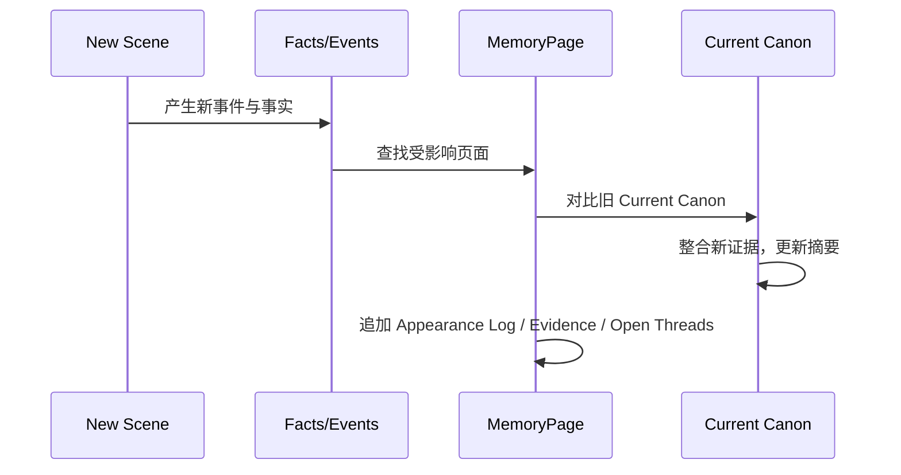

# 07. 记忆页与 Current Canon

> MemoryPage 是给作者和 AI 使用的综合记忆，不是原文，也不是不可修改真相。

## 1. 为什么不叫 Compiled Truth

小说不是现实世界事实数据库。小说里存在：

- 作者确定的 canon；
- 角色误解；
- 读者尚未知情；
- 草稿版本；
- 废弃设定；
- 原著 canon；
- 同人改写 canon；
- 模型推测。

因此，Sextant 使用 **Current Canon** 表达当前有效故事设定。

## 2. MemoryPage 类型

| 页面类型 | 用途 |
|---|---|
| Character Memory | 角色当前设定、出场、关系、认知 |
| Location Memory | 地点设定、发生过的事件、氛围 |
| Object Memory | 物品状态、持有者、用途、伏笔 |
| Faction Memory | 阵营、组织、成员、目标 |
| Event Memory | 事件经过、参与者、后果 |
| Lore Memory | 世界规则、传说、历史 |
| Plotline Memory | 伏笔线、悬念、回收状态 |

## 3. Character MemoryPage 模板

```text
# Mira Vale

## Current Canon
当前稳定设定。

## Appearance Log
- Chapter 1 / Scene 2：首次出现。证据：span_001
- Chapter 2 / Scene 1：到达 Harbor Nine。证据：span_023

## Relationships
- Orrin：导师式关系，存在隐瞒。证据：span_045
- Kestrel：当前敌对。证据：span_072

## Knowledge State
- 知道地图被偷：Chapter 3 / Scene 1 后。
- 不知道 Orrin 的真实身份：截至 Chapter 4。

## Wants / Fears / Pressure
角色当前欲望、恐惧、外部压力。

## Open Threads
- “Starling” 称号来源未解释。
- 她是否记得童年火灾仍未明确。

## Contradictions / Risks
- Chapter 2 称她不会游泳，Chapter 5 写她熟练潜水。

## Evidence
关键 SourceSpan 引用。
```

## 4. Event MemoryPage 模板

```text
# Lantern Map Stolen

## Event Summary
事件摘要。

## Participants
- Mira
- Kestrel

## Location
Harbor Nine

## Cause
事件发生原因。

## Consequences
- Lantern Map 持有者变为 Kestrel。
- Mira 得知地图丢失。
- Mira 与 Kestrel 敌对升级。

## Related Facts
带证据事实列表。

## Open Threads
- Kestrel 为什么偷地图尚未解释。

## Evidence
SourceSpan。
```

## 5. MemoryPage 更新流程



## 6. Current Canon 与 Timeline / Appearance Log

| 区域 | 作用 | 是否可重写 |
|---|---|---:|
| Current Canon | 当前可用综合设定 | 是 |
| Appearance Log | 出场证据记录 | 不建议删除，可标记过期 |
| Relationship Log | 关系变化记录 | 可追加，可标记失效 |
| Knowledge State | 角色认知状态 | 可更新 |
| Open Threads | 未解决问题 | 可关闭 |
| Contradictions | 风险和冲突 | 可解决 |

## 7. MemoryPage 不应该做什么

MemoryPage 不应该：

- 覆盖原文；
- 删除证据；
- 把模型推测伪装成 canon；
- 把角色误解写成世界真实设定；
- 把不同版本的设定混在一起；
- 为了简洁牺牲可追溯性。

