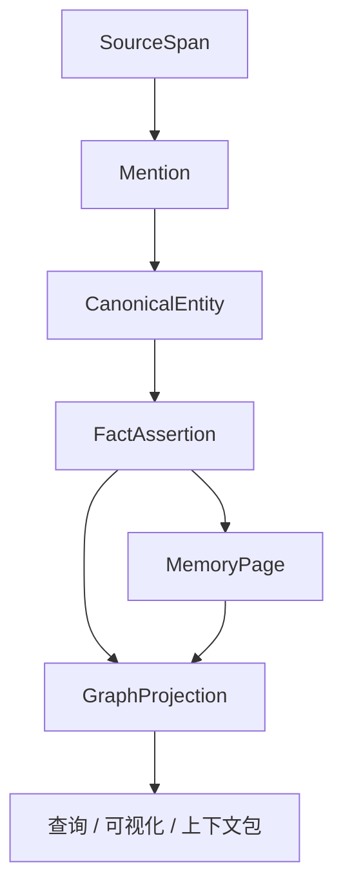
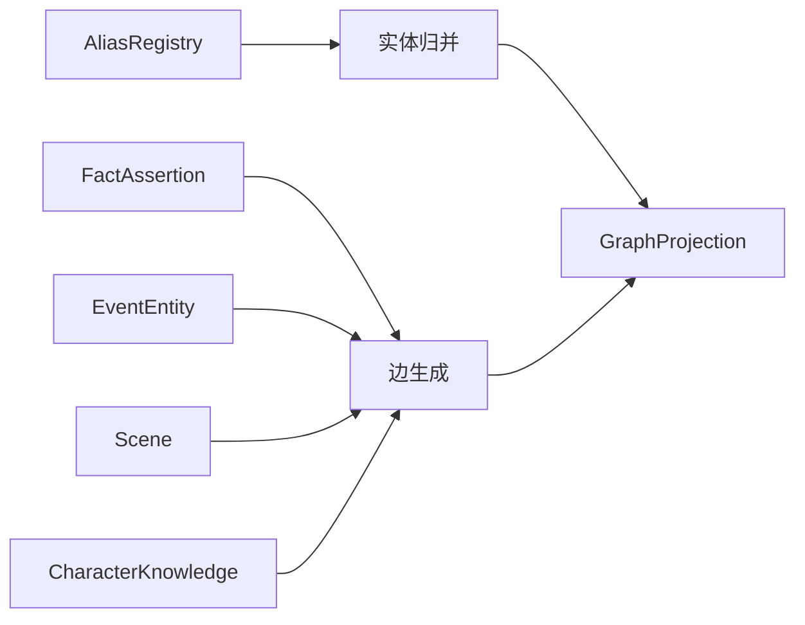
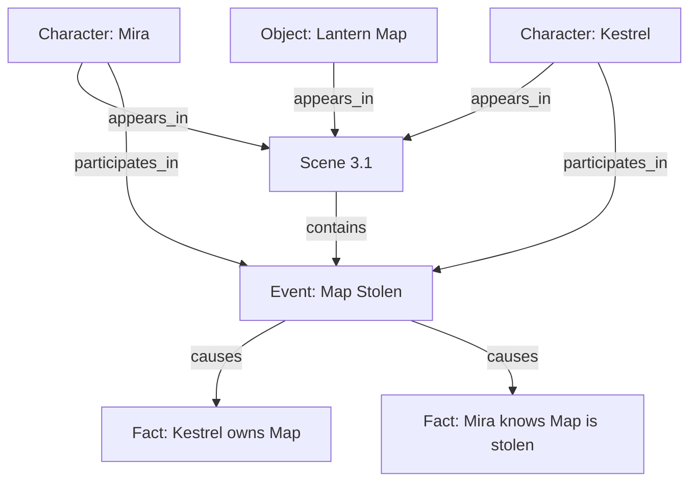

# 08. 故事图谱投影

> GraphProjection 是从实体、事件、事实、别名、场景中投影出的可查询故事图谱。它是 read model，不是原始真相层。

## 1. GraphProjection 的定位



GraphProjection 可以被重建。它不应是唯一事实来源。

事实来源顺序：

```text
RawSource / SourceSpan > FactAssertion / EventEntity > MemoryPage > GraphProjection
```

## 2. 图谱节点

| 节点类型 | 说明 |
|---|---|
| Character | 角色 |
| Location | 地点 |
| Object | 重要物品 |
| Faction | 组织/阵营 |
| Lore | 世界观概念 |
| Event | 剧情事件 |
| Scene | 场景 |
| Plotline | 伏笔线 |

## 3. 图谱边

| 边 | 含义 | 来源 |
|---|---|---|
| appears_in | 实体出现在场景 | Mention / Scene |
| participates_in | 实体参与事件 | EventEntity |
| located_in | 实体位于地点 | FactAssertion |
| owns | 角色持有物品 | FactAssertion |
| member_of | 成员关系 | FactAssertion |
| family_of | 家庭关系 | FactAssertion |
| ally_of | 盟友关系 | FactAssertion |
| enemy_of | 敌对关系 | FactAssertion |
| knows | 角色知道事实/事件 | CharacterKnowledge |
| causes | 事件导致事件/事实 | EventEntity / FactAssertion |
| reveals | 事件揭示事实 | EventEntity |
| touches_thread | 事件触及伏笔线 | Plotline Memory |

## 4. 图谱构建流程



## 5. 图谱状态

图谱边应保留状态。

| 状态 | 含义 |
|---|---|
| canon | 当前有效 |
| proposed | 系统推测，未确认 |
| inferred | 由事件或上下文推导 |
| contradicted | 存在矛盾 |
| outdated | 曾经有效，现已失效 |
| discarded | 废弃版本 |

## 6. 可视化用途

GraphProjection 不是为了炫酷，而是为了帮助作者理解：

- 角色网络；
- 地点与事件分布；
- 物品流转；
- 阵营关系；
- 伏笔线状态；
- 谁知道什么；
- 某事件造成哪些后果。

## 7. 示例图



## 8. 为什么关系不是页面

关系本身一般不是 MemoryPage。

```text
Character 是 page。
Location 是 page。
Object 是 page。
Event 是 page。
Relationship 是 edge。
```

但是，如果一个关系本身有复杂发展，例如“男主和女主的关系线”，它可以上升为 Plotline Memory。

