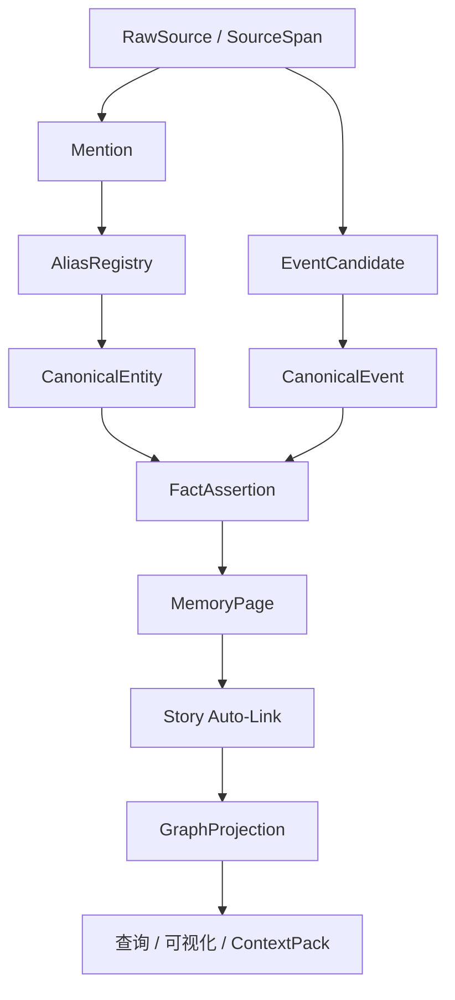
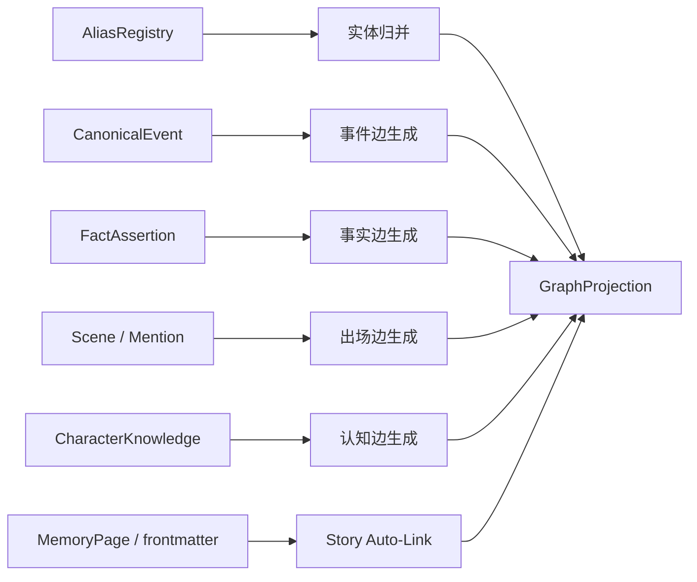
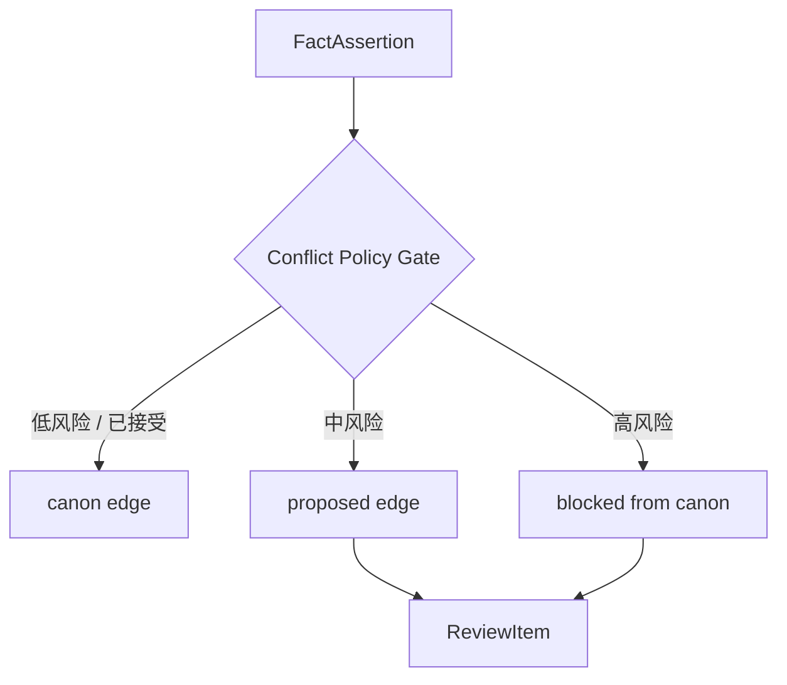
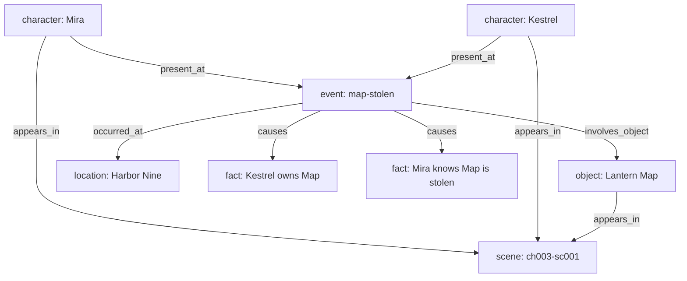

# 08. 故事图谱投影

> GraphProjection 是从实体、事件、事实、别名、场景中投影出的可查询故事图谱。它是 read model，不是原始真相层。

## 1. GraphProjection 的定位

GraphProjection 不保存真相，只保存从底层记忆对象投影出的可查询边。



事实来源顺序：

```text
RawSource / SourceSpan
  > Mention / AliasRecord / EventCandidate
  > CanonicalEntity / CanonicalEvent / FactAssertion
  > EvidenceLogEntry / ReviewItem
  > MemoryPage
  > GraphProjection / ContextPack
```

GraphProjection 可以删除后重建，不能反向覆盖 FactAssertion 或 Current Canon。

## 2. 图谱节点

| 节点类型 | 说明 | 来源 |
|---|---|---|
| character | 角色 | CanonicalEntity |
| location | 地点 | CanonicalEntity |
| object | 重要物品 | CanonicalEntity |
| faction | 组织/阵营 | CanonicalEntity |
| lore | 世界观概念 | CanonicalEntity |
| event | 剧情事件 | CanonicalEvent |
| scene | 场景 | Scene |
| chapter | 章节 | Chapter |
| plotline | 伏笔线或剧情线 | CanonicalEntity / MemoryPage |
| source | 原始材料 | RawSource |

## 3. 图谱边

GraphProjection 必须使用 [14-story-schema-packs.md](14-story-schema-packs.md) 中定义的 canonical relation whitelist。本文不维护第二套关系词汇。

常见示例：

| 边 | 含义 | 来源 |
|---|---|---|
| appears_in | 实体出现在场景或章节 | Mention / Scene |
| present_at | 角色或阵营在事件中在场、参与或受影响 | CanonicalEvent participants |
| occurred_at | 事件发生地 | CanonicalEvent location |
| involves_object | 事件涉及某物品 | CanonicalEvent objects |
| owns | 角色或阵营持有物品 | FactAssertion / object state |
| knows | 角色知道事实、事件或秘密 | CharacterKnowledge |
| contradicts | 冲突关系 | ReviewItem / Conflict Policy |
| belongs_to_plotline | 事件、事实或场景属于剧情线 | Plotline Memory |
| related_to | 弱关联 | MemoryPage / manual / fallback |

完整关系白名单见 [14-story-schema-packs.md](14-story-schema-packs.md) 第 5 节。

## 4. 图谱构建流程



## 5. 图谱边状态

图谱边应保留状态，不同状态参与检索和可视化的权重不同。

| 状态 | 含义 |
|---|---|
| canon | 当前有效 |
| proposed | 系统推测，未确认 |
| inferred | 由事件或上下文推导 |
| disputed | 存在多版本或冲突证据 |
| contradicted | 已被冲突策略标记为矛盾 |
| outdated | 曾经有效，现已失效 |
| discarded | 废弃版本 |

## 6. Canon edge 与 proposed edge

不是所有边都应被当成 canon。



- `appears_in` 通常可以直接成为 canon edge，因为它来自 SourceSpan。
- `owns`、`knows`、`family_of`、`death` 等高风险状态边必须经过 gate。
- `proposed` 边可以用于提醒和检索，但不能污染 Current Canon。

## 7. 可视化用途

GraphProjection 不是为了炫酷，而是为了帮助作者理解：

- 角色网络；
- 地点与事件分布；
- 物品流转；
- 阵营关系；
- 伏笔线状态；
- 谁知道什么；
- 某事件造成哪些后果；
- 哪些边仍是 proposed 或 disputed。

## 8. 示例图



## 9. 为什么关系不是页面

关系本身一般不是 MemoryPage。关系是 GraphProjection 中的边，来源于 FactAssertion、CanonicalEvent、CharacterKnowledge 或 Story Auto-Link。

例外：如果一个关系本身成为长期叙事对象，例如“地图线”“女主身世线”“师徒线”，它应该被建模为 `plotline`，而不是把普通关系变成页面。

## 10. 结论

GraphProjection 是从稳定记忆对象投影出的查询层：

```text
底层证据和事实负责可信度；GraphProjection 负责连接、检索、可视化和 ContextPack 召回。
```

所有边必须使用 Story Schema Pack 的唯一 relation whitelist，避免 schema、auto-link、图谱三处关系词汇不一致。
