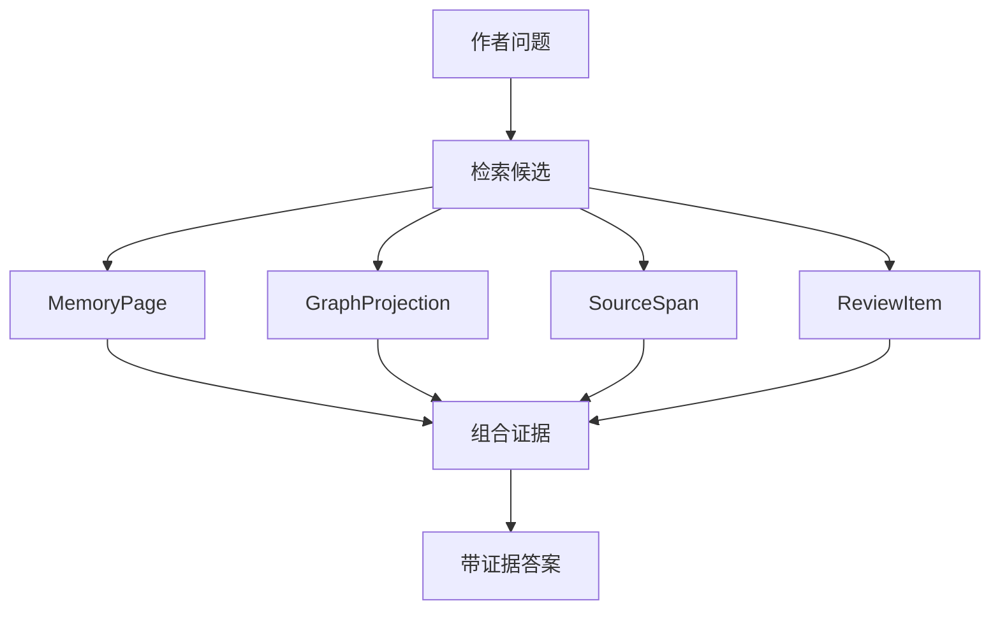
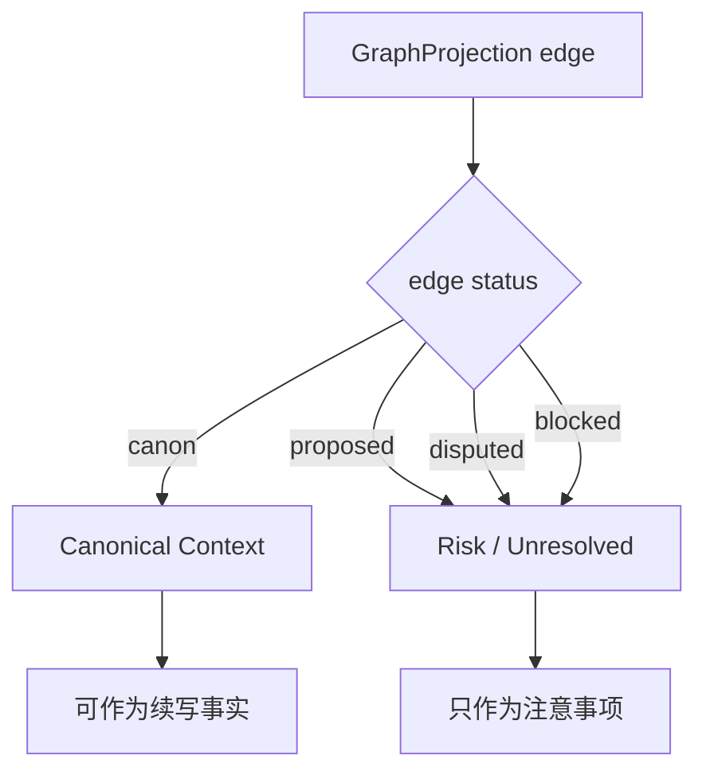
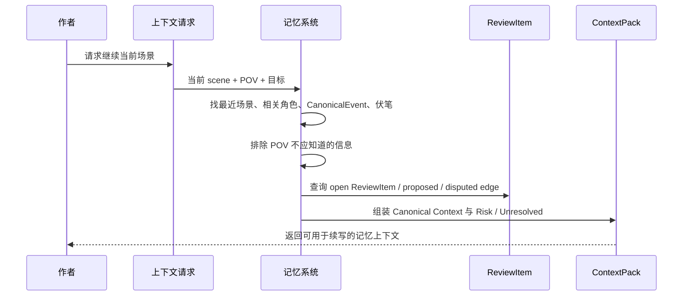

# 09. 检索与续写上下文包

> Sextant 的检索目标不是只找到相似文本，而是为作者问答和续写提供正确、受约束、带证据的上下文。

## 1. 查询类型

| 查询类型 | 例子 | 主要数据源 |
|---|---|---|
| 原文查找 | “银面人第一次出现在哪？” | SourceSpan / Mention |
| 角色设定 | “Mira 现在知道哪些秘密？” | Character Memory / CharacterKnowledge |
| 事件查找 | “地图被偷之后发生了什么？” | CanonicalEvent / FactAssertion / MemoryPage |
| 关系查询 | “Kestrel 和 Mira 为什么敌对？” | GraphProjection / CanonicalEvent / FactAssertion |
| 连续性检查 | “这一章有没有和前文矛盾？” | ReviewItem / CharacterKnowledge / GraphProjection |
| 续写准备 | “下一页应该给模型什么上下文？” | ContextPack |

## 2. Evidence-backed Answer

所有面向作者的事实性回答，都应返回：

| 部分 | 说明 |
|---|---|
| answer | 简洁回答 |
| confidence | 置信度 |
| evidence | SourceSpan 列表 |
| affected_entities | 相关角色/地点/物品/事件 |
| caveats | 不确定性、版本差异、open ReviewItem |



## 3. ContextPack 的目标

ContextPack 是给续写模型或作者使用的上下文包。它不是摘要越多越好，而是：

- 当前场景需要什么；
- 当前 POV 合理知道什么；
- 哪些信息必须避免泄露；
- 哪些开放伏笔可能影响下一页；
- 角色当前欲望、压力、误解是什么；
- 最近语言节奏和风格是什么；
- 哪些事实仍是 proposed / disputed，不能当作 canon 使用。

## 4. ContextPack 结构

| 区域 | 内容 | 是否可当作 canon |
|---|---|---:|
| Current Position | 当前章节、场景、地点、时间 | 是 |
| Canonical Context | 已通过 gate 的 Current Canon、canon facts、canon edges | 是 |
| POV Constraint | 当前视角角色、视角模式、禁止信息 | 是 |
| Active Characters | 在场角色及已确认状态 | 是 |
| Recent Events | 最近 CanonicalEvent，按状态标注 canon/proposed/disputed | 仅 canon 部分 |
| Character Knowledge | 当前角色知道/误解/不知道什么 | 是，若状态为 canon |
| Open Threads | 当前相关伏笔 | 视状态而定 |
| Object State | 关键物品位置和持有者 | 是，若通过 gate |
| Location State | 当前地点状态 | 是，若通过 gate |
| Risk / Unresolved | open ReviewItem、proposed edge、disputed edge、低置信 alias | 否 |
| Style Memory | 近期语言节奏、情绪、意象 | 辅助，不是事实 |
| Evidence Refs | 证据引用 | 是 |

## 5. proposed / disputed 边策略

ContextPack 可以携带 proposed / disputed 信息，但必须放入 `Risk / Unresolved` 区域。



续写模型或作者应看到这些风险，但不能把它们当作已经成立的世界事实继续推进剧情。

## 6. 续写上下文包流程



## 7. Koontz 式逐页写作的 ContextPack

如果采用“非大纲、逐页打磨、角色自由意志”的写作方式，ContextPack 不应告诉模型“剧情必须去哪里”，而应告诉模型：

| 应提供 | 不应提供 |
|---|---|
| 当前角色想要什么 | 固定大纲结论 |
| 当前角色害怕什么 | 未来剧透 |
| 当前角色知道什么 | 作者还没决定的真相 |
| 当前情绪压力 | 硬性剧情推进 |
| 当前地点限制 | 全局百科式资料 |
| 未解决伏笔 | 模型自由编造的新设定 |
| Risk / Unresolved | 把 proposed 当 canon |

## 8. Forbidden Knowledge

续写中必须显式列出当前 POV 不应知道的信息。

```text
Forbidden Knowledge:
- Mira 不知道 Orrin 的真实身份。
- Mira 不知道地图已被 Kestrel 转交给旧王。
- 读者尚未知道 “Starling” 称号来源。
```

这能防止模型提前泄露秘密。

## 9. ContextPack 生成时机

ContextPack 按需生成，不在每次 ingest 或增量回写后自动生成。

增量回写只更新：

- MemoryPage；
- GraphProjection；
- ReviewItem；
- ContextPackReadiness / stale 状态。

当作者请求问答或续写时，系统再根据最新记忆状态生成 ContextPack。
