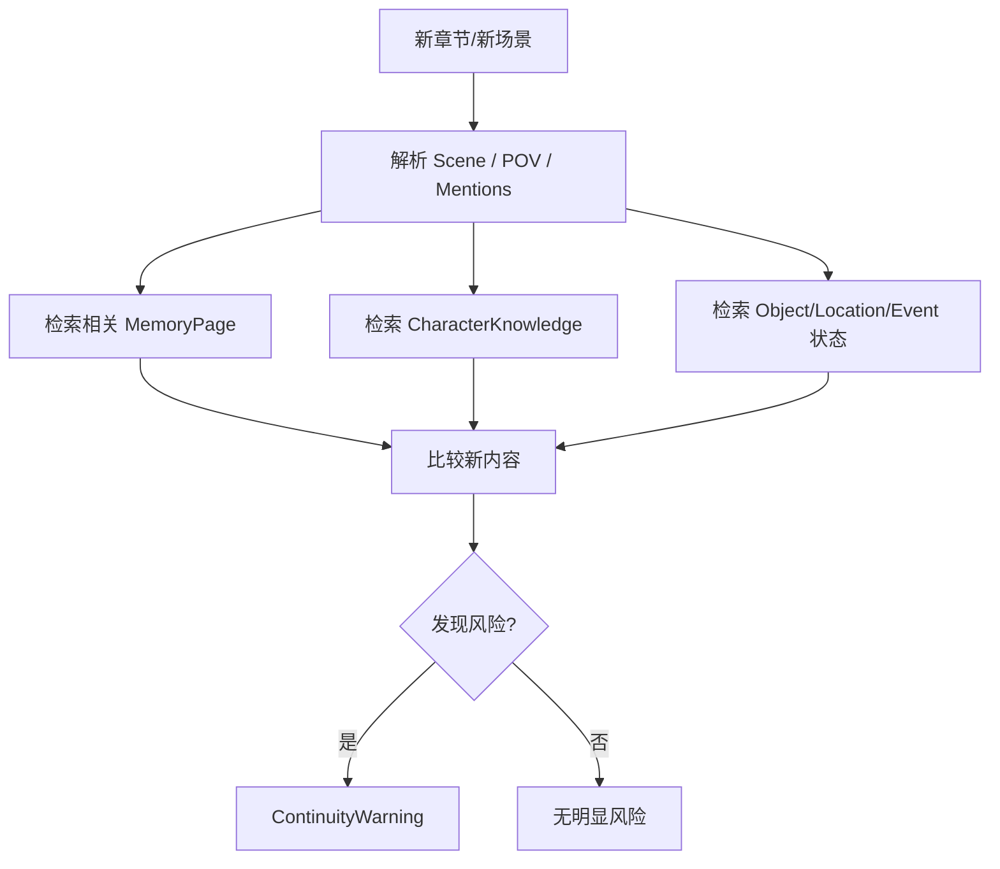
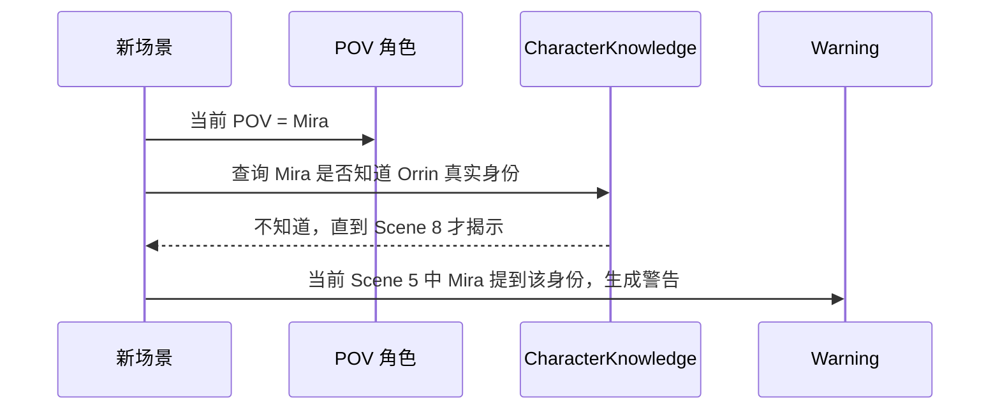

# 10. 连续性检查

> 连续性检查不是挑错工具，而是帮助作者保持 canon、角色认知、时间线、物品状态和 POV 一致。

## 1. 检查对象

| 类型 | 例子 |
|---|---|
| 角色认知 | 角色是否知道他还不该知道的信息 |
| 时间线 | 某事件是否发生在另一个事件之前 |
| 物品状态 | 某物当前由谁持有 |
| 地点状态 | 某角色是否在合理地点出现 |
| 关系状态 | 两人是否已经和解或仍敌对 |
| POV | 是否进入了非 POV 角色内心 |
| 设定 | 世界规则是否被违反 |
| 伏笔 | 伏笔是否被遗忘或错误回收 |
| 版本 | 废弃设定是否重新污染当前稿 |

## 2. 检查流程

## 3. Warning 结构

| 字段 | 含义 |
|---|---|
| warning_id | 警告 ID |
| warning_type | knowledge / timeline / object_state / pov / relationship / lore / version |
| severity | low / medium / high |
| summary | 简要说明 |
| new_text_span | 新文本中的问题位置 |
| conflicting_evidence | 冲突证据 |
| suggested_resolution | 建议处理方式 |
| status | open / dismissed / fixed / accepted_as_change |

## 4. 角色认知检查

## 5. 物品状态检查

| 例子 | 检查 |
|---|---|
| 第 3 章地图被偷 | 后文 Mira 不能直接使用地图，除非有取回事件 |
| 剑已断裂 | 后文不能被描述为完整使用 |
| 信件被烧毁 | 后文不能再次被角色阅读，除非有副本 |

## 6. 时间线检查

| 风险 | 例子 |
|---|---|
| 事件顺序错乱 | 角色回忆了尚未发生的事件 |
| 年龄不一致 | 十年前八岁，现在却只有十五岁 |
| 旅行时间不合理 | 一夜跨越数千里但世界规则不支持 |
| 并发冲突 | 同一时间角色出现在两个地点 |

## 7. POV 检查

| 风险 | 说明 |
|---|---|
| Head-hopping | 限知视角中突然进入另一个角色内心 |
| Forbidden Knowledge | POV 角色知道不该知道的信息 |
| Sensory Overreach | POV 角色看到/听到不可能感知的信息 |
| Reader Leakage | 叙述提前泄露隐藏真相 |

## 8. Warning 不等于错误

连续性检查只给风险，不直接改文。

状态设计：

| 状态 | 含义 |
|---|---|
| open | 待处理 |
| dismissed | 作者认为不是问题 |
| fixed | 作者已修复 |
| accepted_as_change | 作者决定改 canon |
| needs_memory_update | 文本没错，记忆需要更新 |

## 9. 检查的设计边界

连续性检查不应该：

- 替作者决定剧情；
- 把风格差异都判定为错误；
- 强迫遵守旧设定；
- 把角色故意撒谎当成矛盾；
- 把读者不知道和世界不存在混为一谈。

