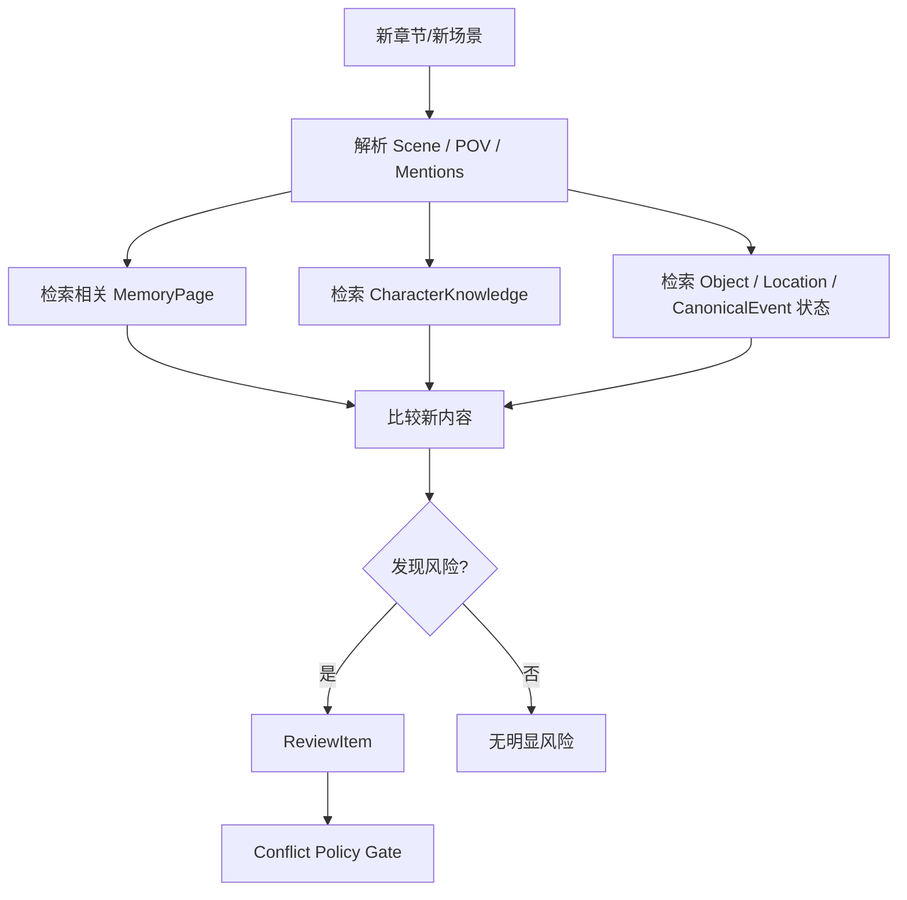
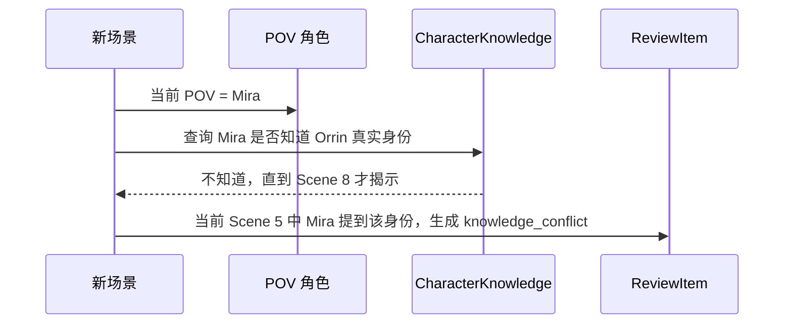

# 10. 连续性检查

> 连续性检查不是挑错工具，而是帮助作者保持 canon、角色认知、时间线、物品状态和 POV 一致。连续性检查的输出统一为 `ReviewItem`，不再维护单独的 `ContinuityWarning` 生命周期。

## 1. 检查对象

| 类型 | 例子 | ReviewItem 类型 |
|---|---|---|
| 角色认知 | 角色是否知道他还不该知道的信息 | knowledge_conflict |
| 时间线 | 某事件是否发生在另一个事件之前 | timeline_conflict |
| 物品状态 | 某物当前由谁持有 | object_state_conflict |
| 地点状态 | 某角色是否在合理地点出现 | state_conflict |
| 关系状态 | 两人是否已经和解或仍敌对 | relationship_conflict |
| POV | 是否进入了非 POV 角色内心 | pov_conflict |
| 设定 | 世界规则是否被违反 | canon_conflict |
| 伏笔 | 伏笔是否被遗忘或错误回收 | continuity_warning |
| 版本 | 废弃设定是否重新污染当前稿 | version_conflict |

## 2. 检查流程

## 3. ReviewItem 结构

连续性检查不直接产生独立 Warning 对象，而是产生统一的 ReviewItem。

| 字段 | 含义 |
|---|---|
| review_id | ReviewItem ID |
| review_type | knowledge_conflict / timeline_conflict / object_state_conflict / pov_conflict / relationship_conflict / canon_conflict / version_conflict / continuity_warning |
| severity | low / medium / high |
| status | open / dismissed / resolved / superseded |
| summary | 风险摘要 |
| affected_refs | 相关角色、地点、物品、事件、MemoryPage |
| new_evidence | 新文本中的 SourceSpan |
| existing_evidence | 旧证据 SourceSpan |
| suggested_actions | accept / reject / mark_intentional / supersede / needs_memory_update / fixed_by_text_edit |
| default_action | 系统默认处理 |
| resolution | 最终处理动作，可为空 |
| side_effects | 对 MemoryPage / GraphProjection / ContextPack 的影响说明 |

完整生命周期见：[18-conflict-policy.md](18-conflict-policy.md)。

## 4. 角色认知检查

## 5. 物品状态检查

| 例子 | 检查 | 输出 |
|---|---|---|
| 第 3 章地图被偷 | 后文 Mira 不能直接使用地图，除非有取回事件 | object_state_conflict |
| 剑已断裂 | 后文不能被描述为完整使用 | object_state_conflict |
| 信件被烧毁 | 后文不能再次被角色阅读，除非有副本 | object_state_conflict |

## 6. 时间线检查

| 风险 | 例子 | 输出 |
|---|---|---|
| 事件顺序错乱 | 角色回忆了尚未发生的事件 | timeline_conflict |
| 年龄不一致 | 十年前八岁，现在却只有十五岁 | timeline_conflict |
| 旅行时间不合理 | 一夜跨越数千里但世界规则不支持 | timeline_conflict |
| 并发冲突 | 同一时间角色出现在两个地点 | timeline_conflict |

## 7. POV 检查

| 风险 | 说明 | 输出 |
|---|---|---|
| Head-hopping | 限知视角中突然进入另一个角色内心 | pov_conflict |
| Forbidden Knowledge | POV 角色知道不该知道的信息 | knowledge_conflict / pov_conflict |
| Sensory Overreach | POV 角色看到/听到不可能感知的信息 | pov_conflict |
| Reader Leakage | 叙述提前泄露隐藏真相 | pov_conflict / canon_conflict |

## 8. ReviewItem 不等于错误

连续性检查只给风险，不直接改文。

状态由 ReviewItem 统一管理：

| 状态 | 含义 |
|---|---|
| open | 待处理 |
| dismissed | 作者认为不是问题 |
| resolved | 已处理并产生 resolution |
| superseded | 被后续材料或新的 ReviewItem 替代 |

常见 resolution：

| resolution | 含义 |
|---|---|
| mark_intentional | 作者确认这是伏笔、误导、角色谎言或有意矛盾 |
| fixed_by_text_edit | 作者已经改正文，等待新 SourceDelta 进入系统 |
| accepted_as_change | 作者决定改变 canon，旧事实变 outdated |
| needs_memory_update | 文本没错，记忆需要更新 |
| reject | 系统推断错误，拒绝该风险 |

## 9. 对 MemoryPage / GraphProjection / ContextPack 的影响

| 操作 | 影响 |
|---|---|
| dismissed | 不改 Current Canon，可降低后续同类提醒权重 |
| mark_intentional | 相关边可标记为 intentional / disputed，不再作为错误 |
| fixed_by_text_edit | 等待新 SourceDelta，旧 ReviewItem 可 superseded |
| accepted_as_change | 旧事实变 outdated，Current Canon 可重写 |
| needs_memory_update | 文本不变，MemoryPage 或 FactAssertion 状态更新 |

ContextPack 生成时应携带未解决的高风险 ReviewItem，避免续写时继续扩大矛盾。

## 10. 检查的设计边界

连续性检查不应该：

- 替作者决定剧情；
- 把风格差异都判定为错误；
- 强迫遵守旧设定；
- 把角色故意撒谎当成矛盾；
- 把读者不知道和世界不存在混为一谈。
