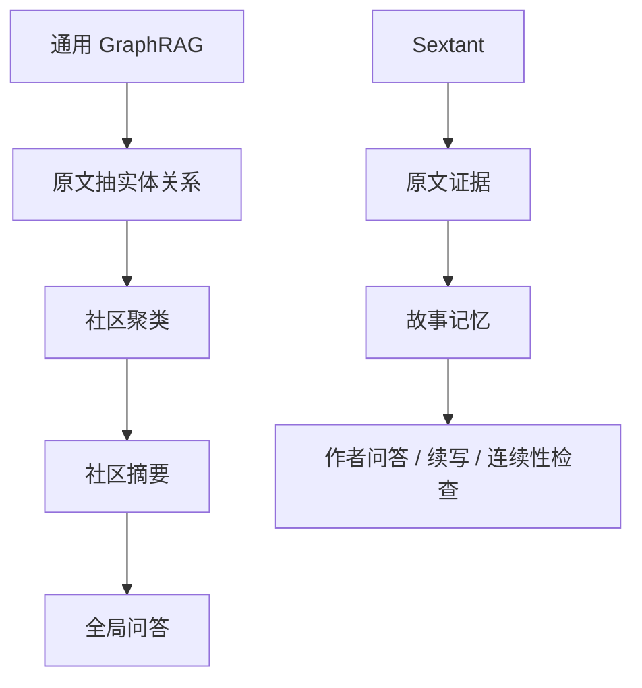
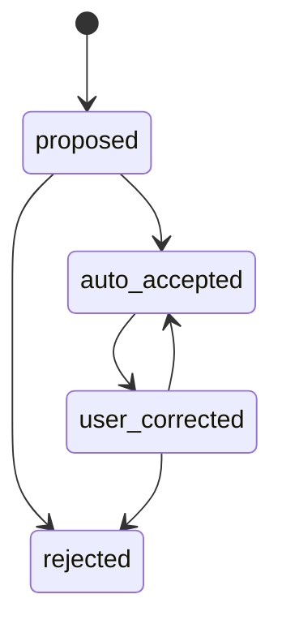

# 11. 非目标与边界

> 明确不做什么，比定义做什么同样重要。

## 1. 第一阶段非目标

| 非目标 | 原因 |
|---|---|
| 自动生成完整大纲 | 与逐页打磨、角色驱动的写作方式冲突 |
| 一步抽完整知识图谱 | 容易产生不可追溯错误 |
| 强制用户确认别名 | 会阻塞写作流程 |
| 把所有动作都抽成事件 | 噪声过大 |
| 把关系做成页面 | 关系通常是 edge，事件和 plotline 才需要 page |
| 把模型总结当成 canon | 必须有证据和状态 |
| 自动替作者决定剧情 | 系统应辅助，不应接管创作意志 |
| 技术架构优先 | 本阶段只讨论记忆设计 |

## 2. 不做通用 GraphRAG

Sextant 可以借鉴 GraphRAG 的“图谱辅助检索”思想，但不照搬完整流程。

小说写作更需要：

- SourceSpan；
- POV；
- 角色认知；
- 状态变化；
- 伏笔；
- 版本；
- 作者修正。

## 3. 不做纯向量记忆

纯向量检索能找到相似文本，但难以稳定回答：

- 谁知道某个秘密；
- 某物现在在谁手里；
- 某角色第一次出现在哪；
- 这个称号指的是谁；
- 这一章是否提前泄露信息；
- 某事件导致哪些后果。

因此需要结构化记忆。

## 4. 不做全自动不可逆归并

任何实体合并、别名归并、事实状态变化，都应可回滚。

## 5. 不阻塞作者

系统应默认向前推进：

- 有高置信就自动生效；
- 有中置信就弱生效或 proposed；
- 有低置信就保留，不强合并；
- 用户随时可改；
- 用户不改，系统仍能工作。

## 6. 不把 AI 输出当权威

AI 输出应分为：

| 类型 | 是否权威 |
|---|---:|
| 原文证据 | 是 |
| 作者手动设定 | 是 |
| Current Canon 摘要 | 有条件，是证据综合 |
| 模型推测 | 否 |
| ReviewItem / continuity_warning | 否，是风险提示 |
| ContextPack | 否，是写作辅助上下文 |

ReviewItem 可以帮助作者发现风险，但它不是事实本身。只有作者接受或证据通过 Conflict Policy Gate 后，相关内容才可能影响 Current Canon。

