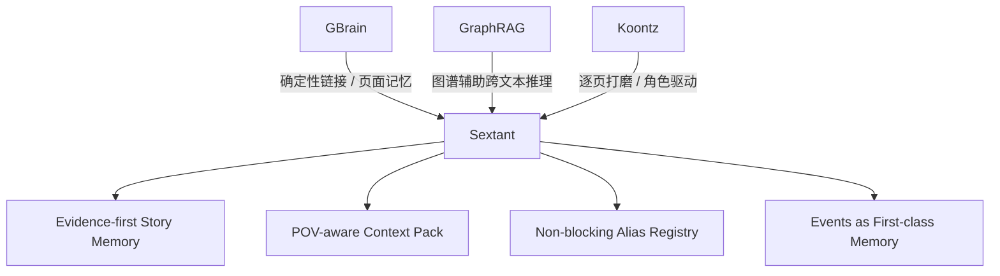

# 12. 外部启发与取舍

> 本文档记录设计灵感，不要求照搬任何项目。

## 1. 从 GBrain 借鉴什么

GBrain 的一个关键思想是：让 agent 写结构化页面，core 再用确定性规则建立链接。它的 README 明确描述：每次 page write 会抽取 entity references，并以 zero LLM calls 创建 typed links。

Sextant 借鉴：

| GBrain 思路 | Sextant 对应设计 |
|---|---|
| page write 后 auto-link | MemoryPage 更新后重建 GraphProjection |
| typed links | 小说 predicate / event / fact |
| structured timeline | Appearance Log / Event Log |
| source citation | SourceSpan evidence |
| skills/harness 分工 | 记忆任务分层，不做超级抽取器 |

Sextant 不照搬：

| 不照搬 | 原因 |
|---|---|
| people / companies 目录 | 小说需要 character / location / object / event 等领域类型 |
| 现实世界 compiled truth | 小说应使用 Current Canon |
| 会议/公司/投资关系 | 小说需要 POV、角色认知、伏笔、事件状态 |

## 2. 从 GraphRAG 借鉴什么

GraphRAG 的核心是从原始文本中抽取知识图谱，并使用图结构和社区摘要增强查询。这个思路说明：纯向量检索不足以回答需要跨文本连接的问题。

Sextant 借鉴：

- 原文不是只做向量索引；
- 实体和关系能帮助连接分散信息；
- 图谱适合回答跨章节、跨角色的问题；
- 输出应带 fine-grained references。

Sextant 不照搬：

- 不做开放式全自动抽图；
- 不以社区摘要为核心；
- 不把模型抽取结果直接当 canon；
- 不追求通用企业文档问答。

## 3. 从 Dean Koontz 写作方式借鉴什么

Dean Koontz 的访谈中强调：角色要有自由意志，不应被大纲过度束缚；他也描述了逐页打磨的写作方式，即写好当前页再进入下一页。

Sextant 对应设计：

| Koontz 式写作 | Sextant 设计 |
|---|---|
| 不强依赖大纲 | 系统不以 outline generator 为核心 |
| 角色自由意志 | 记忆重点记录角色欲望、恐惧、认知和压力 |
| 一页一页打磨 | 增量 ingest + ContextPack |
| 每页成为新的 canon | 新片段进入记忆后更新 Current Canon |
| 单一视角原则 | Scene.pov_character_id + POV 检查 |

## 4. 最终取舍

## 5. 参考链接

- GBrain: https://github.com/garrytan/gbrain
- Microsoft GraphRAG: https://microsoft.github.io/graphrag/
- Dean Koontz / How I Write interview: https://howiwrite.substack.com/p/meet-the-author-who-sold-500-million
- Dean Koontz page-by-page writing note: https://www.deankoontz.com/ive-read-that-you-will-rewrite-a-page-until-its-right-before-moving-on-sometimes-redoing-a-draft-thirty-or-forty-times-this-must-make-for-a-slow-process-approximately-how-long-does-it-take-you/

