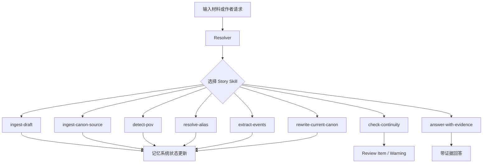
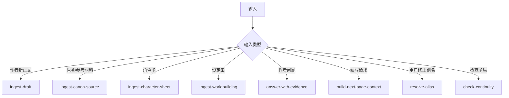
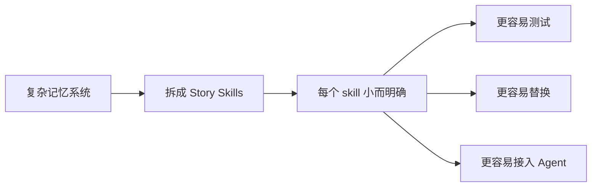

# 13. Story Skills 与 Resolver

> 本文档定义 Sextant 记忆系统中的 **thin harness + fat story skills** 思路。这里不讨论技术实现，只讨论数据流、职责边界和记忆系统中的处理协议。

本文对应 [GOAL.md](../GOAL.md) 中 canonical end-to-end flow 的流程编排层：Resolver 负责把输入路由到 Story Skills，Story Skills 再分别覆盖 `Source Normalization` 之后的结构解析、提及抽取、事件聚合、事实派生、记忆回写、冲突检查和证据问答。本文中的流程图是主流程的调度视角，不是另一套数据流。

## 1. 目标

Sextant 的记忆系统不应该依赖一个巨大的单体流程来处理所有输入。不同输入和任务需要不同的处理协议：手稿导入、原著导入、POV 判断、事件提取、别名归并、Current Canon 重写、连续性检查，都应该拆成可审计的 Story Skill。

## 2. 核心分工

| 层 | 负责什么 | 不负责什么 |
|---|---|---|
| Harness | 装载输入、选择 skill、保存输出、维护可追溯状态 | 不做领域判断，不决定 canon |
| Resolver | 根据输入类型和任务目标选择 Story Skill | 不直接处理材料 |
| Story Skill | 定义某类记忆任务的数据流、判断标准、输出形态 | 不绑定技术实现 |
| Memory Objects | RawSource、Scene、Mention、Event、Fact、MemoryPage 等 | 不负责流程调度 |

## 3. 为什么需要 Story Skills

| 问题 | 如果没有 skill | 使用 skill 后 |
|---|---|---|
| 输入类型不同 | 所有材料走同一套流程，容易误判 | 不同材料走不同处理协议 |
| 小说题材不同 | 单一 prompt 很快膨胀 | schema pack + skill 分工 |
| 事件和实体混杂 | LLM 一步抽图，难以调试 | 先 Mention，再 Event，再 Fact |
| 用户新增片段 | 不知道该更新哪些记忆页 | skill 明确回写规则 |
| 连续性检查 | 变成自由问答 | skill 明确检查哪些冲突 |

## 4. 推荐 Story Skills

| Skill | 输入 | 主要输出 | 是否阻塞主流程 |
|---|---|---|---:|
| ingest-draft | 作者新手稿、章节、片段 | RawSource、Scene、Mention、Event、MemoryPage 更新 | 否 |
| ingest-canon-source | 授权原著、同人参考、设定集 | Canon Source、实体、事件、证据 | 否 |
| split-structure | 原始文本 | Chapter、Scene、SourceSpan | 是，结构解析是后续基础 |
| detect-pov | Scene | ScenePOV、CharacterKnowledge 候选 | 否 |
| extract-mentions | Scene / SourceSpan | Mention | 否 |
| resolve-alias | Mention、AliasRegistry | AliasRecord、CanonicalEntity 连接 | 否 |
| extract-events | Scene、Mention、Entity | EventCandidate | 否 |
| aggregate-events | EventCandidate、已有事件 | CanonicalEvent、RelatedEvent | 否 |
| derive-facts | CanonicalEvent、Entity | FactAssertion | 否 |
| rewrite-current-canon | 新证据、旧 MemoryPage | 更新后的 Current Canon | 否 |
| check-continuity | 新事实、旧状态、POV、时间线 | ContinuityWarning / ReviewItem | 否，除高风险 canon promotion |
| answer-with-evidence | 作者问题 | Evidence-backed Answer | 不适用 |
| build-next-page-context | 当前场景、POV、记忆状态 | ContextPack | 不适用 |

## 5. Resolver 规则

Resolver 的职责是选择处理协议，而不是做材料理解。

## 6. Skill 输出必须满足的约束

| 约束 | 说明 |
|---|---|
| Evidence-bound | 事实、事件、关系必须绑定 SourceSpan 或用户明确输入 |
| Non-blocking | 除结构解析失败外，用户未确认不应阻塞流程 |
| Rebuildable | 任何投影结果都应能从 SourceSpan、Mention、Alias、Event、Fact 重建 |
| Canon-aware | 区分 Current Canon、草稿、原著 canon、作者笔记、模型推测 |
| POV-aware | 涉及角色认知时，必须记录谁知道、何时知道、如何知道 |
| Reviewable | 高风险判断必须形成 ReviewItem，而不是静默覆盖 |

## 7. Story Skill 的文档形态

每个 Skill 文档应该回答：

| 字段 | 内容 |
|---|---|
| Trigger | 什么输入会触发这个 skill |
| Inputs | 需要哪些数据对象 |
| Transform | 处理步骤是什么 |
| Outputs | 产生哪些对象 |
| Deterministic Rules | 哪些部分必须规则优先 |
| Model Judgment | 哪些部分允许模型判断 |
| Review Policy | 哪些结果需要提示作者 |
| Writeback Policy | 更新哪些 MemoryPage 或图谱投影 |

## 8. 设计原则

Sextant 的 Story Skills 不是为了增加流程复杂度，而是为了避免所有复杂判断都堆进一个不可调试的大 prompt。

## 9. 结论

Sextant 应采用 **thin harness + fat story skills**：核心系统保持薄，只维护证据、状态、投影和回写；领域判断写在 Story Skills 里。这样既能支持未来 Agent，又不会让第一阶段的记忆系统变成不可控的全自动写作系统。
