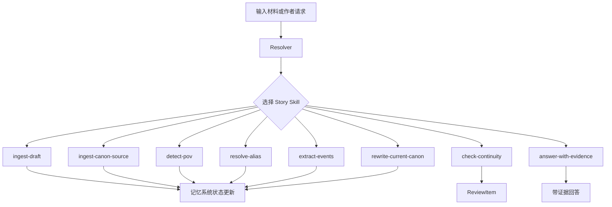
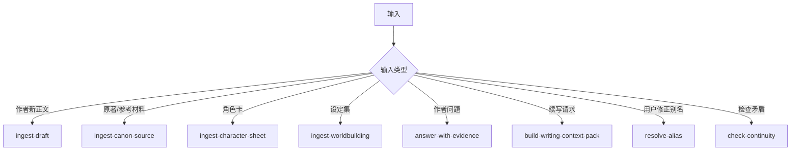
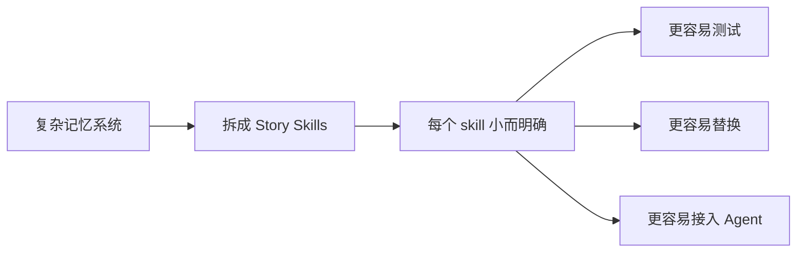

# 13. Story Skills 与 Resolver

> 本文档定义 Sextant 记忆系统中的 **thin harness + rich story skills** 目标架构。Harness 只负责装载输入、选择 skill、保存输出、维护证据链和状态转移；创作语义判断沉淀在可审计的 Story Skill 协议和 provider 候选中，并由确定性 validator 裁决是否进入 review/writeback/canon gate。

本文对应 [GOAL.md](../GOAL.md) 中 canonical end-to-end flow 的流程编排层：Resolver 负责把输入路由到 Story Skills，Story Skills 再分别覆盖 `Source Normalization` 之后的结构解析、提及抽取、事件聚合、事实派生、记忆回写、冲突检查和证据问答。本文中的流程图是主流程的调度视角，不是另一套数据流。

## 1. 目标

Sextant 的记忆系统不应该依赖一个巨大的单体流程来处理所有输入。不同输入和任务需要不同的处理协议：手稿导入、原著导入、POV 判断、事件提取、别名归并、Current Canon 重写、连续性检查，都应该拆成可审计的 Story Skill。


```mermaid
flowchart TD
    A[输入材料或作者请求] --> B[Resolver]
    B --> C{选择 Story Skill}
    C --> D[ingest-draft]
    C --> E[ingest-canon-source]
    C --> F[detect-pov]
    C --> G[resolve-alias]
    C --> H[extract-events]
    C --> I[rewrite-current-canon]
    C --> J[check-continuity]
    C --> K[answer-with-evidence]
    D --> L[记忆系统状态更新]
    E --> L
    F --> L
    G --> L
    H --> L
    I --> L
    J --> M[ReviewItem]
    K --> N[带证据回答]
```

## 2. 核心分工

| 层 | 负责什么 | 不负责什么 |
|---|---|---|
| Harness | 装载输入、选择 skill、保存输出、维护可追溯状态 | 不做领域判断，不决定 canon |
| Resolver | 根据输入类型和任务目标选择 Story Skill | 不直接处理材料 |
| Story Skill | 定义某类记忆任务的数据流、判断标准、输出形态 | 不绑定技术实现 |
| Memory Objects | RawSource、Scene、Mention、EventCandidate、CanonicalEvent、FactAssertion、MemoryPage 等 | 不负责流程调度 |

## 2.1 不可混淆的边界

| 对象 | 是什么 | 不是什么 |
|---|---|---|
| SkillRegistry | 可执行 skill metadata、版本、输入/输出 schema、review/writeback policy、eval contract 的注册表 | prompt 文件目录 |
| Prompt Registry | provider prompt 的加载、metadata 校验和 hash lock | Story Skill 注册机制 |
| Provider Adapter | 调用模型并返回结构化候选 | 生产事实、memory、canon 或 graph 写入者 |
| Deterministic Validator | 检查 schema、SourceSpan、source ancestry、review policy、canon policy | prose 语义解释器 |
| Codex Subagent Judge | eval 阶段的语义复核者 | 生产系统裁决者 |

Story Skill 可以使用 LLM/provider 处理自然语言和创作判断，但最终落库只接受结构化候选通过确定性 gate。不得把中文或英文 cue 词表扩展成“小说语义理解层”。

## 3. 为什么需要 Story Skills

| 问题 | 如果没有 skill | 使用 skill 后 |
|---|---|---|
| 输入类型不同 | 所有材料走同一套流程，容易误判 | 不同材料走不同处理协议 |
| 小说题材不同 | 单一 prompt 很快膨胀 | schema pack + skill 分工 |
| 事件和实体混杂 | LLM 一步抽图，难以调试 | 先 Mention，再 EventCandidate，再 CanonicalEvent，再 FactAssertion |
| 用户新增片段 | 不知道该更新哪些记忆页 | skill 明确回写规则 |
| 连续性检查 | 变成自由问答 | skill 明确检查哪些冲突 |

## 4. 初始 Story Skill 目标集合

| Skill | 输入 | 主要输出 | 模型判断 | 是否阻塞主流程 |
|---|---|---|---|---:|
| source-normalization | RawSource / SourceVersion | ProcessedMarkdownView、offset map、cleaning profile | 否 | 是 |
| split-structure | ProcessedMarkdownView | Chapter、Scene、SourceSpan | 可辅助，但结构边界必须可验证 | 是 |
| detect-pov | Scene、mentions、candidate entities | ScenePOV 候选、uncertainty reason | 是 | 否 |
| extract-mentions | SourceSpan、schema pack | Mention | 可辅助 | 否 |
| resolve-alias | Mention、AliasRecord、CanonicalEntity | AliasRecord 候选、ReviewItem 候选 | 可辅助 | 否 |
| extract-events | Scene、mentions、schema pack | EventCandidate | 是 | 否 |
| aggregate-events | EventCandidate、CanonicalEvent | aggregation decision | 是 | 否 |
| derive-facts | CanonicalEvent、accepted evidence | FactAssertion 候选 | 可辅助，但 predicate/type 必须受 schema 约束 | 否 |
| check-continuity | 新候选、canon、POV、timeline | AgentReviewFinding 或 ReviewItem 候选 | 是 | 否 |
| rewrite-current-canon | accepted facts、old MemoryPage | MemoryPage rewrite proposal | 是 | 否 |
| build-writing-context-pack | current position、memory、graph、review | WritingContextPack | 否，排序可使用检索信号 | 不适用 |
| answer-with-evidence | author question、context pack | Evidence-backed answer | 是 | 不适用 |
| character-agency-pass | current pressure、POV、memory | CharacterAgencyState | 是 | 不适用 |
| storytelling-control | agency state、scene mode、author intent | RoleSlot、SceneSequelMode、ProseRenderingContract | 是 | 不适用 |
| next-page-agent | context pack、control objects | BeatCandidate、DraftCandidate | 是 | 不适用 |
| agent-review | draft candidate、contract、risk context | AgentReviewFinding | 是 | 不适用 |

## 5. Resolver 规则

Resolver 的职责是选择处理协议，而不是做材料理解。


```mermaid
flowchart TD
    A[输入] --> B{输入类型}
    B -->|作者新正文| C[ingest-draft]
    B -->|原著/参考材料| D[ingest-canon-source]
    B -->|角色卡| E[ingest-character-sheet]
    B -->|设定集| F[ingest-worldbuilding]
    B -->|作者问题| G[answer-with-evidence]
    B -->|续写请求| H[build-writing-context-pack]
    B -->|用户修正别名| I[resolve-alias]
    B -->|检查矛盾| J[check-continuity]
```

## 6. Skill 输出必须满足的约束

| 约束 | 说明 |
|---|---|
| Evidence-bound | 事实、事件、关系必须绑定 SourceSpan 或用户明确输入 |
| Non-blocking | 除结构解析失败外，用户未确认不应阻塞流程 |
| Rebuildable | 任何投影结果都应能从 SourceSpan、Mention、Alias、Event、Fact 重建 |
| Canon-aware | 区分 Current Canon、草稿、原著 canon、作者笔记、模型推测 |
| POV-aware | 涉及角色认知时，必须记录谁知道、何时知道、如何知道 |
| Reviewable | 高风险判断必须形成 ReviewItem，而不是静默覆盖 |

## 7. Story Skill 的文档形态

每个 Skill 文档应该回答：

| 字段 | 内容 |
|---|---|
| Trigger | 什么输入会触发这个 skill |
| Inputs | 需要哪些数据对象 |
| Transform | 处理步骤是什么 |
| Outputs | 产生哪些对象 |
| Deterministic Rules | 哪些部分必须规则优先 |
| Model Judgment | 哪些部分允许模型判断 |
| Review Policy | 哪些结果需要提示作者 |
| Writeback Policy | 更新哪些 MemoryPage 或图谱投影 |

每个 Story Skill 的文档必须能被实现为 registry metadata。最小字段为：

```text
name
version
trigger
input_schema
output_schema
deterministic_validator
model_judgment_allowed
provider_prompt_ref
review_policy
writeback_policy
eval_cases
negative_cases
judge_rubric
```

`provider_prompt_ref` 可以为空；`deterministic_validator`、`review_policy`、`writeback_policy` 和 `negative_cases` 不可为空。

## 8. 设计原则

Sextant 的 Story Skills 不是为了增加流程复杂度，而是为了避免所有复杂判断都堆进一个不可调试的大 prompt。


```mermaid
flowchart LR
    A[复杂记忆系统] --> B[拆成 Story Skills]
    B --> C[每个 skill 小而明确]
    C --> D[更容易测试]
    C --> E[更容易替换]
    C --> F[更容易接入 Agent]
```

## 9. 结论

Sextant 应采用 **thin harness + rich story skills**：核心系统保持薄，只维护证据、状态、投影和回写；创作判断沉淀在可审计的 Story Skill 协议和结构化 provider 候选中，并由确定性 gate 控制进入 review、writeback 和 canon。这样既能支持未来 Agent，又不会让第一阶段的记忆系统变成不可控的全自动写作系统。
