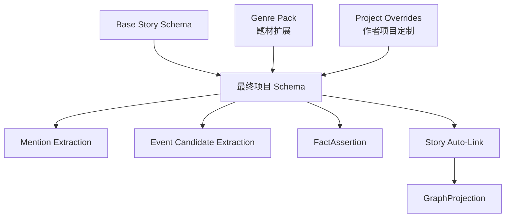
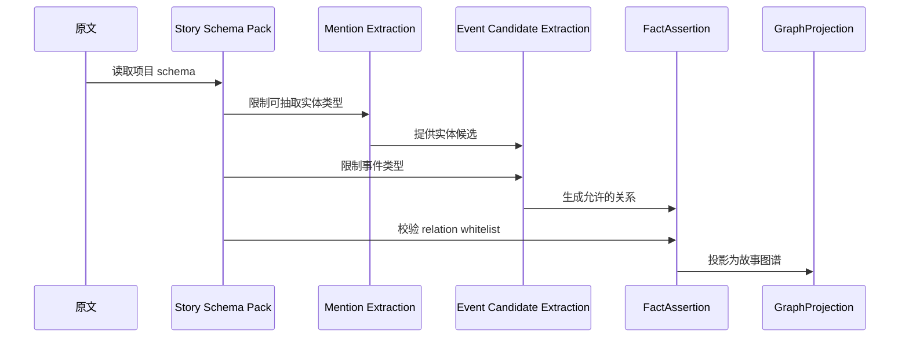

# 14. Story Schema Pack

> 本文档定义小说记忆系统如何通过 **Base Story Schema + Genre Pack + Project Overrides** 泛化到不同题材。这里不讨论实现方式，只讨论实体类型、事件类型、关系类型和领域适配机制。

## 1. 为什么需要 Schema Pack

小说题材差异很大。仙侠、推理、科幻、都市、同人、历史架空需要关注的实体和关系不同。如果只写死一套通用关系，系统会过度泛化；如果完全交给模型自由抽取，图谱会不稳定。

Schema Pack 的目标是：

- 限制实体类型、事件类型和关系类型；
- 让确定性规则可以建图；
- 让模型只在允许的 schema 内提出候选；
- 支持不同题材扩展；
- 避免每个项目都重新设计记忆结构。

## 2. 三层结构

| 层级 | 作用 | 是否必须 |
|---|---|---:|
| Base Story Schema | 所有小说都共用的最小实体、事件和关系 | 是 |
| Genre Pack | 题材特定扩展，如仙侠、推理、科幻 | 否 |
| Project Overrides | 单个作品自己的称谓、术语、规则 | 否 |

## 3. Canonical Entity Type Whitelist

### 3.1 Base entity types

| 类型 | 说明 | 例子 |
|---|---|---|
| character | 角色 | Mira、萧寒、银面人 |
| location | 地点 | Harbor Nine、王都、青云峰 |
| faction | 阵营、组织、家族 | Cartographers Guild、沈家、魔教 |
| object | 关键物品 | Lantern Map、玉佩、旧剑 |
| event | 剧情事件 | 地图被偷、初次相遇、身份揭露 |
| scene | 场景 | ch003-sc002 |
| chapter | 章节 | 第三章 |
| plotline | 剧情线 | 女主身世线、地图线 |
| lore | 世界观概念 | 禁术、旧王朝、星门协议 |
| source | 原始材料 | 手稿、原著、设定集 |

### 3.2 Genre extension rule

Genre Pack 只能扩展 entity types，不能删除 Base entity types。Project Overrides 可以给某些类型添加别名、显示名、抽取提示和风险规则，但不应该让同一概念在不同文档里出现多个名字。

## 4. Canonical Event Type Whitelist

第一阶段只保留对写作记忆真正有用的事件类型。

| 事件类型 | 说明 |
|---|---|
| first_meeting | 角色第一次相遇 |
| discovery | 发现某物、某地、某线索 |
| revelation | 秘密或身份揭示 |
| knowledge_change | 某角色知道、误解、怀疑某事 |
| object_transfer | 物品获得、丢失、转移 |
| conflict | 冲突、战斗、争吵 |
| promise | 承诺、誓言、交易 |
| betrayal | 背叛、出卖 |
| death | 死亡或重伤 |
| travel | 重要移动、抵达、离开 |
| relationship_change | 关系变化 |
| foreshadowing | 伏笔出现 |
| payoff | 伏笔回收 |
| decision | 关键决定 |
| other | 无法归类但确有叙事后果的事件 |

## 5. Canonical Relation Whitelist

以下是 Base Story Schema 的唯一基础关系词汇。`08-graph-projection.md` 和 `19-story-auto-link.md` 必须引用这张表，不再维护第二套关系名。

| 关系 | 方向 | 含义 | 常见来源 |
|---|---|---|---|
| appears_in | entity -> scene/chapter | 实体出现在场景或章节 | Mention / Scene |
| present_at | character/faction -> event | 角色或阵营在事件中在场、参与或受影响 | CanonicalEvent participants |
| occurred_at | event -> location | 事件发生地 | CanonicalEvent location |
| involves_object | event -> object | 事件涉及某物品 | CanonicalEvent objects |
| located_in | entity -> location | 实体当前或通常位于某地 | FactAssertion |
| owns | character/faction -> object | 持有、拥有、控制某物 | FactAssertion / object state |
| member_of | character -> faction | 属于某组织或阵营 | FactAssertion |
| family_of | character -> character | 亲属关系 | FactAssertion |
| ally_of | character/faction -> character/faction | 同盟、合作关系 | FactAssertion |
| enemy_of | character/faction -> character/faction | 敌对关系 | FactAssertion |
| knows | character -> fact/event/secret | 知道某事实、事件或秘密 | CharacterKnowledge |
| does_not_know | character -> fact/event/secret | 明确不知道某事实、事件或秘密 | CharacterKnowledge |
| reveals | event/scene -> fact/secret | 揭示事实或秘密 | CanonicalEvent / Scene |
| causes | event -> event/fact | 导致另一事件或事实变化 | CanonicalEvent / FactAssertion |
| follows | event/scene -> event/scene | 叙事顺序或因果后续 | Event aggregation |
| foreshadows | scene/event/object -> event/plotline | 伏笔指向未来事件或剧情线 | Plotline memory |
| contradicts | fact/event/review -> fact/event | 冲突关系 | Conflict Policy |
| belongs_to_plotline | event/fact/scene -> plotline | 属于某剧情线或伏笔线 | Plotline memory |
| related_to | entity/event/fact -> entity/event/fact | 弱关联 | MemoryPage / manual / fallback |

### 5.1 命名决策

基础关系使用 `present_at`，不使用 `participates_in`。原因是小说事件里角色可能只是目击、在场、被影响或被提及，并不总是主动参与。需要更强语义时，应由 Genre Pack 扩展更具体关系。

## 6. Genre Pack 示例

### 6.1 仙侠 / 玄幻

| 扩展实体 | 说明 |
|---|---|
| sect | 宗门 |
| artifact | 法器 |
| realm | 境界 |
| cultivation_method | 功法 |
| bloodline | 血脉 |

| 扩展关系 | 说明 |
|---|---|
| master_of | 师徒关系 |
| disciple_of | 师徒关系 |
| reached_realm | 达到某境界 |
| uses_method | 修炼某功法 |
| owns_artifact | 持有法器 |

### 6.2 推理 / 悬疑

| 扩展实体 | 说明 |
|---|---|
| clue | 线索 |
| suspect | 嫌疑人 |
| alibi | 不在场证明 |
| evidence_item | 证物 |
| crime_scene | 案发现场 |

| 扩展关系 | 说明 |
|---|---|
| has_alibi | 拥有不在场证明 |
| contradicts_alibi | 反驳不在场证明 |
| discovered_by | 被谁发现 |
| points_to | 指向某嫌疑人或事实 |

### 6.3 科幻

| 扩展实体 | 说明 |
|---|---|
| planet | 星球 |
| ship | 舰船 |
| species | 物种 |
| technology | 技术 |
| protocol | 协议 |

| 扩展关系 | 说明 |
|---|---|
| commands | 指挥舰船或组织 |
| invented | 发明技术 |
| travels_to | 前往星球或地点 |
| violates_protocol | 违反协议 |

## 7. Project Overrides

项目级配置不应该改变基础系统，只应补充或约束。

| 类型 | 例子 |
|---|---|
| 固定角色称谓 | “少主”在本书中高概率指向沈砚 |
| 章节格式 | “第〇〇回”作为 chapter pattern |
| 场景分隔 | “——” 表示 scene break |
| 特殊实体 | “星痕”既是 object 也是 lore 概念 |
| 禁止合并 | “银面人”在前 20 章不能自动合并到真名 |
| canon 优先级 | 作者笔记高于旧草稿，低于已发布正文 |

## 8. Schema Pack 如何参与数据流

## 9. 关系规则的确定性优先

| 场景 | 是否需要模型 | 说明 |
|---|---:|---|
| Mention 出现在 Scene 中 | 否 | 可确定生成 appears_in |
| Event 有 participants | 否 | 可确定生成 present_at |
| Event 有 location | 否 | 可确定生成 occurred_at |
| Event 有 objects | 否 | 可确定生成 involves_object |
| Object state 写明 current_owner | 否 | 可确定生成 owns，但需有效期 |
| 明确句式“X 是 Y 的师父” | 可规则优先 | 对应 Genre Pack 扩展关系 |
| “他可能就是银面人” | 是 | 只能 proposed，不能强合并 |
| 复杂心理误解 | 是 | 需要模型判断，但必须带证据 |

## 10. 与固定硬编码的区别

| 固定硬编码 | Schema Pack |
|---|---|
| 所有题材共用一套类型 | 基础类型共用，题材扩展 |
| 修改规则要改系统本体 | 修改 project/genre schema 即可 |
| 容易把特殊题材塞进 related_to | 特定题材有自己的实体和关系 |
| 稳定但泛化差 | 兼顾稳定和泛化 |

## 11. 结论

Sextant 应采用 **schema-constrained memory extraction**：实体类型、事件类型、关系类型不完全自由生成，而由 Base Story Schema、Genre Pack 和 Project Overrides 共同限定。

这能继承确定性建图的稳定性，同时避免一套死规则无法适配不同小说题材。
