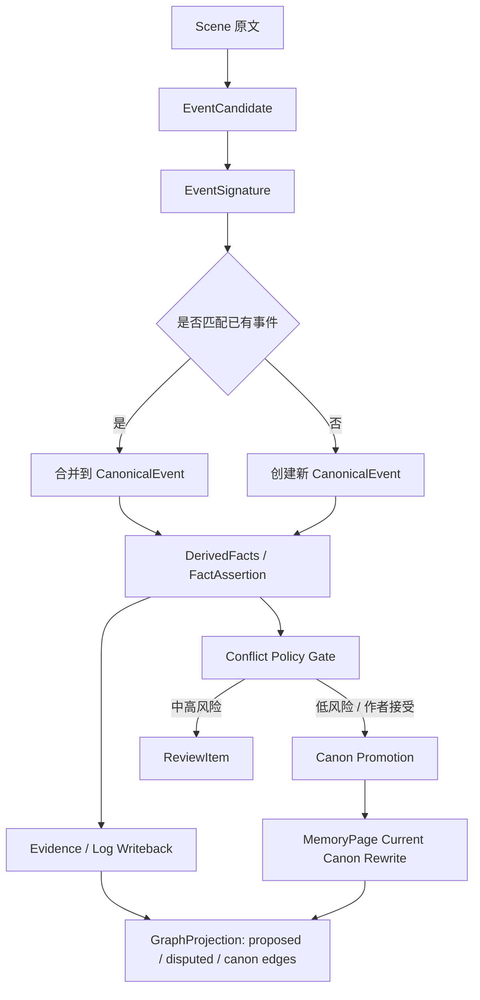
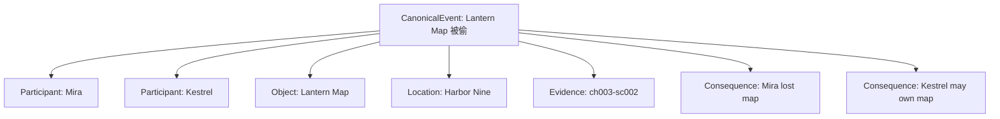
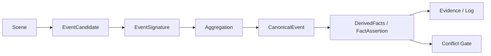
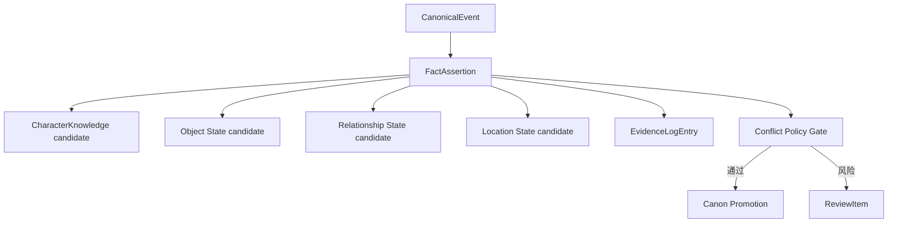
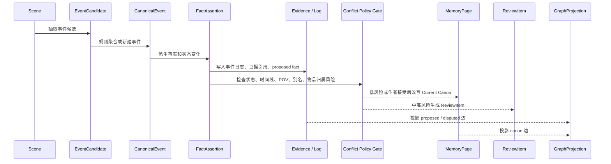

# 15. 事件聚合机制

> 本文档定义 Sextant 如何从原始场景中获得稳定的剧情事件，并从事件派生事实、关系和记忆更新。这里不讨论技术实现，只讨论记忆系统设计。

本文对应 [GOAL.md](../GOAL.md) 中 canonical end-to-end flow 的 `Event Candidate Extraction -> Event Aggregation -> Fact Assertions -> Evidence / Log Writeback -> Conflict Policy Gate -> Canon Promotion` 片段。本文只展开事件候选如何变成 CanonicalEvent 和 DerivedFacts，不定义独立于主流程的事件通道。

## 1. 为什么需要事件聚合

小说记忆不能只保存实体和实体之间的静态关系。小说是事件驱动的：角色相遇、道具转移、秘密揭示、背叛、承诺、死亡、误解、伏笔出现或回收，都会改变后续剧情状态。

事件聚合的目标是：

```text
从多个原文片段中识别同一个叙事事件，形成可追踪、可引用、可派生事实的 CanonicalEvent。
```



关键原则：**事件聚合可以产生事实候选，但不能绕过 Conflict Policy Gate 直接改写 Current Canon。**

## 2. 事件不是普通关系

| 层级 | 作用 | 例子 |
|---|---|---|
| Entity | 稳定对象 | Mira、Lantern Map、Harbor Nine |
| EventCandidate | 从场景中抽出的事件候选 | “地图似乎被 Kestrel 拿走” |
| CanonicalEvent | 聚合后的稳定剧情事件 | Lantern Map 被偷 |
| FactAssertion | 事件造成的状态断言 | Lantern Map 可能由 Kestrel 持有 |
| Relation | 图谱中的连接 | Kestrel owns Lantern Map |

事件是聚合节点。它连接参与者、地点、物品、时间、证据和后果。



## 3. 事件聚合的五步



### Step 1：从 Scene 抽 EventCandidate

事件候选只从 Scene 粒度抽取，不从整本书一次性抽取。

| 字段 | 说明 |
|---|---|
| event_type | 事件类型，必须在 Story Schema Pack 白名单内 |
| summary | 事件摘要 |
| participants | 参与角色或阵营 |
| objects | 涉及物品 |
| location | 发生地点 |
| scene_id | 所属场景 |
| evidence_span_ids | 证据片段 |
| confidence | 置信度 |
| state_change | 事件造成的状态变化 |

### Step 2：生成 EventSignature

EventSignature 用来判断两个候选是否可能是同一事件。

| 组成 | 说明 |
|---|---|
| event_type | 如 object_transfer、revelation、betrayal |
| core_entities | 核心角色或阵营 |
| core_object | 核心物品，可为空 |
| location | 地点，可为空 |
| story_time_or_range | 故事内时间或章节范围 |
| state_change | 关键状态变化 |

示例：

```text
object_transfer | lantern-map | mira/kestrel | harbor-nine | ch003-ch004 | owner_changed
```

### Step 3：规则优先聚合

可以自动聚合：

| 条件 | 说明 |
|---|---|
| 同一 scene 内，同一 event_type，同一核心实体 | 高置信同一事件 |
| 相邻 scene 内，同一物品、同一状态变化 | 可合并为事件进展 |
| 后文明确回忆前文事件 | 合并为同一 CanonicalEvent 的新证据 |
| 新证据只补充细节 | 合并，不新建事件 |

不应自动聚合：

| 条件 | 原因 |
|---|---|
| 只是同一角色出现 | 角色出现不等于同一事件 |
| 只是同一地点出现 | 地点重复很常见 |
| 只是同一物品再次出现 | 物品出现不等于所有权变化 |
| 模型猜测“可能有关” | 只能标记 related，不可强合并 |

### Step 4：模糊情况才使用模型裁决

模型裁决只能输出四类结果：

| 输出 | 含义 |
|---|---|
| same_event | 同一事件 |
| related_but_distinct | 有关但不是同一事件 |
| conflict_version | 是同一事件的冲突版本 |
| uncertain | 无法判断 |

模型不能自由创建事件类型，也不能在没有 SourceSpan 的情况下创建事件。

### Step 5：从 CanonicalEvent 派生事实

CanonicalEvent 是事实和关系的来源之一，但派生结果必须先进入 Evidence / Log 和 Conflict Policy Gate。



## 4. 事件类型白名单

事件类型白名单以 [14-story-schema-packs.md](14-story-schema-packs.md) 的 `Canonical Event Type Whitelist` 为唯一 source-of-truth。本文只列常用示例，完整白名单见 14。

| 常用事件类型 | 说明 |
|---|---|
| first_meeting | 角色第一次相遇 |
| discovery | 发现某物、某地、某线索 |
| revelation | 秘密或身份揭示 |
| knowledge_change | 某角色知道、误解、怀疑某事 |
| object_transfer | 物品获得、丢失、转移 |
| conflict | 冲突、战斗、争吵 |
| promise | 承诺、誓言、交易 |
| betrayal | 背叛、出卖 |
| relationship_change | 关系变化 |
| foreshadowing | 伏笔出现 |
| payoff | 伏笔回收 |
| decision | 关键决定 |
| other | 无法归类但确有叙事后果的事件 |

## 5. 事件粒度标准

应该成为 Event：

- 删除后后续记忆会失真；
- 造成角色、物品、地点、关系、知识状态变化；
- 后续可能被追问或引用；
- 影响伏笔、悬念、矛盾检查。

不应该成为 Event：

- 普通对话中的每句话；
- 无后果的动作描写；
- 纯环境描写；
- 重复说明；
- 普通心理活动碎片。

## 6. CanonicalEvent 的状态

| 状态 | 含义 |
|---|---|
| canon | 已通过 gate 或作者接受，进入当前 canon |
| proposed | 系统认为重要，但证据或风险尚不足以升格 |
| disputed | 存在多个版本或冲突证据 |
| deprecated | 被后续草稿或作者设定替代 |
| external_canon | 来自原著或参考材料 |
| author_note | 来自作者明确设定 |

## 7. 事件聚合与 Canon Promotion



## 8. GraphProjection 状态边

事件聚合产生的图谱边必须带状态。

| 边状态 | 来源 | 是否可作为 canon 使用 |
|---|---|---:|
| canon | 通过 gate 或作者接受 | 是 |
| proposed | 有证据但未通过 gate | 否，只能作为风险/候选上下文 |
| disputed | 有冲突版本 | 否，只能进入 ReviewItem 或风险区 |
| outdated | 曾经有效但被新版本替代 | 否 |

## 9. 与实体关系的区别

| 问题 | 只用实体关系 | 引入事件聚合 |
|---|---|---|
| 谁参与了某次冲突 | 关系分散，不易查 | CanonicalEvent 直接聚合参与者 |
| 物品为什么换主人 | 只看到 owns 改变 | CanonicalEvent 记录转移原因 |
| 角色什么时候知道秘密 | 很难表达 | knowledge_change event 记录 |
| 伏笔从哪里开始 | 图边不足 | foreshadowing event 记录 |
| 多处证据指向同一事件 | 容易重复 | EventSignature 聚合 |

## 10. 结论

事件聚合是小说记忆系统的中间层：

```text
Scene -> EventCandidate -> CanonicalEvent -> FactAssertion -> Evidence / Log -> Conflict Gate -> Canon Promotion
```

它让系统既能保留原文证据，又能获得稳定的剧情状态变化。事件不应完全交给模型自由生成，也不能绕过 canon promotion gate；它应由 schema、SourceSpan、EventSignature、规则聚合和 Conflict Policy 共同约束。
