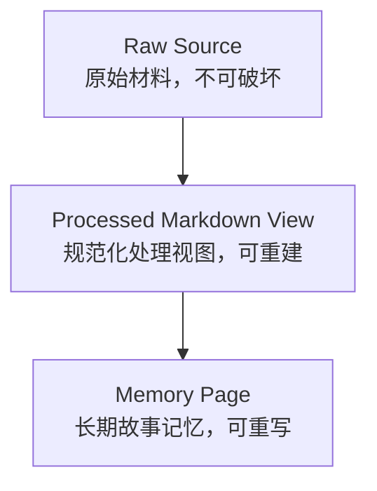
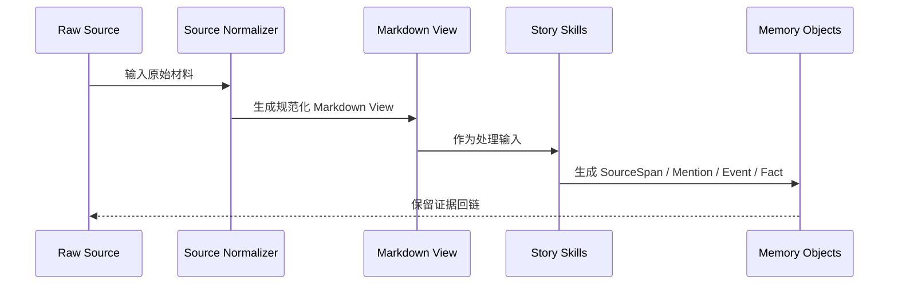
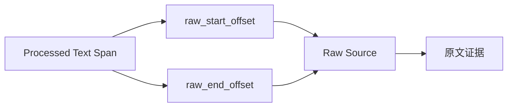
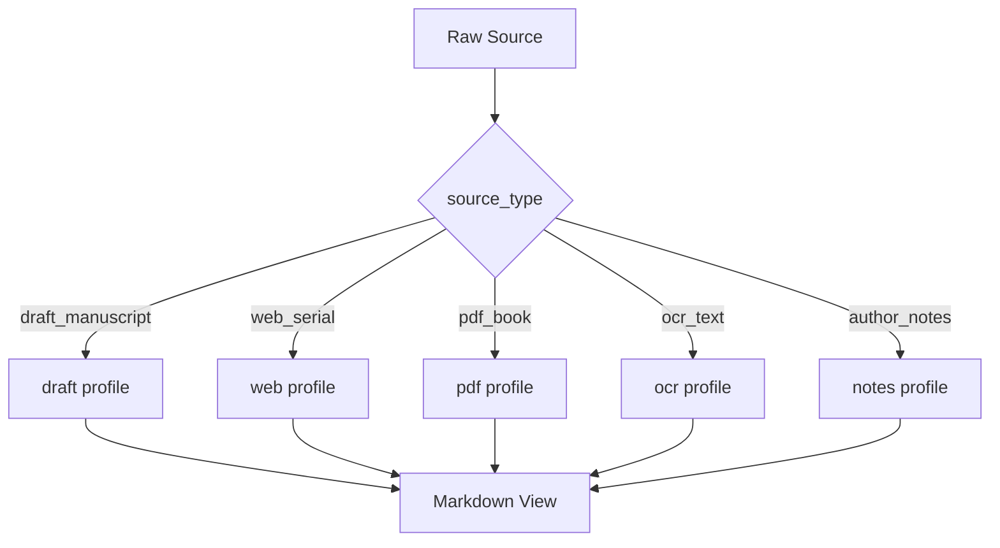
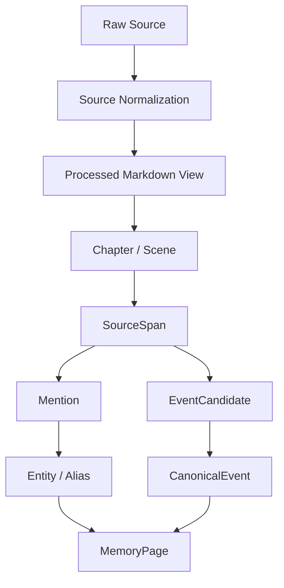

# 16. 原始材料规范化与 Markdown View

> 本文档定义 Raw Source 如何进入记忆系统，如何清洗、去噪、结构化，并生成可处理的 Markdown View。这里不讨论技术实现，只讨论数据流和设计边界。

本文对应 [GOAL.md](../GOAL.md) 中 canonical end-to-end flow 的起始片段：`Raw Source` -> `Source Preservation` -> `Source Normalization` -> `Structure Parsing`。本文中的 Markdown View 图只展开原始材料如何变成可处理视图，不替代后续 Mention、Event、Fact、MemoryPage 流程。

## 1. 核心判断

原始材料不应该被直接覆盖或改写。Sextant 应区分三层：



| 层 | 作用 | 是否可改写 | 是否作为最终证据 |
|---|---|---:|---:|
| Raw Source | 保存原始文本、版本、来源 | 否 | 是 |
| Processed Markdown View | 为记忆系统提供统一处理格式 | 是，可重建 | 间接 |
| Memory Page | 面向作者和 AI 的 Current Canon / Log / Open Threads | 是 | 需引用 Raw Source / SourceSpan |

## 2. 为什么要生成 Markdown View

Markdown View 不是为了替代原文，而是为了让后续处理更稳定：

- 统一章节、场景、SourceSpan 的表示；
- 保留 raw offset 映射；
- 区分正文、对话、作者笔记、脚注、OCR 不确定文本；
- 给后续 Story Skills 提供一致输入；
- 支持重新运行结构解析和记忆抽取。



## 3. 输入材料类型

| Source Type | 说明 | 清洗重点 |
|---|---|---|
| draft_manuscript | 作者正在写的手稿 | 章节、场景、作者临时标记 |
| canon_source | 授权原著或参考 canon | 保真、证据回链、章节结构 |
| web_serial | 网页连载文本 | 去导航、广告、评论、打赏区 |
| pdf_book | PDF 书籍或文档 | 页眉页脚、断行、页码 |
| ocr_text | OCR 文本 | 标记不确定字、断行修复 |
| author_notes | 作者笔记 | 区分设定、todo、灵感、废案 |
| outline | 大纲 | 不作为正文事件，作为作者意图 |
| character_sheet | 角色卡 | 转换成角色设定输入 |
| worldbuilding | 世界观设定集 | 转换成 lore/location/faction memory |

## 4. 三类清洗

### 4.1 安全清洗

不会改变文本语义，可以自动执行。

| 清洗项 | 说明 |
|---|---|
| 编码统一 | 统一文本编码 |
| 去除不可见控制字符 | 不影响正文内容 |
| 修复异常换行 | 只修复明显格式问题 |
| 统一空白 | 保留段落结构 |
| 去除重复 BOM | 文件级清理 |
| 识别章节标题 | 结构化，不删除原文 |
| 识别场景分隔符 | 结构化，不删除原文 |

### 4.2 结构清洗

可以执行，但必须保留 raw offset 映射。

| 清洗项 | 说明 | 约束 |
|---|---|---|
| 章节编号规范化 | 第三章 / Chapter 3 等统一标记 | 不改变原文展示 |
| 段落重排 | OCR 或 PDF 断行修复 | 保留原 offset |
| 说话人标签识别 | 识别“某某：” | 只标注，不改语义 |
| 脚注/尾注分离 | 不混入正文事件 | 仍可引用 |
| 页眉页脚识别 | PDF 场景常见 | 默认标记，不直接丢弃 |
| 网页噪声标记 | 广告、导航、评论 | 可排除出正文处理 |

### 4.3 语义清洗

不能自动删除，只能标记。

| 内容 | 为什么不能删 |
|---|---|
| 重复表达 | 可能是风格、强调或伏笔 |
| 内心独白 | 可能是 POV 和角色认知证据 |
| 环境描写 | 可能是地点、氛围、伏笔 |
| 矛盾说法 | 可能是误导、角色谎言、悬念 |
| 口头禅 | 可能是角色识别特征 |
| 看似废话的对话 | 可能包含关系状态变化 |

## 5. Markdown View 格式

Processed Markdown View 应该让后续系统容易定位结构和证据。

```md
---
source_id: src_001
source_type: draft_manuscript
title: 第三章
version: draft-2026-05-23
raw_hash: sha256:...
cleaning_profile: draft_manuscript_v1
---

# Chapter 3

## Scene ch003-sc001

[raw: 1200-2450]
[pov: unknown]

正文……

## Scene ch003-sc002

[raw: 2451-3900]
[pov: Mira?]

正文……
```

## 6. Raw Offset Mapping

任何 SourceSpan 都必须能追溯到 Raw Source。



这保证：

- 清洗不会破坏引用；
- 作者能看到原始上下文；
- 模型生成的记忆可以被审计；
- 未来重跑清洗规则不会丢失证据链。

## 7. Format Profile

Format Profile 定义不同材料的规范化策略。



| Profile | 主要目标 |
|---|---|
| draft profile | 保留作者草稿语气和结构 |
| canon profile | 最大化原文保真 |
| web profile | 分离正文和网页噪声 |
| pdf profile | 修复页码、页眉页脚、断行 |
| ocr profile | 标记不确定文本，不擅自修正 |
| notes profile | 区分设定、todo、废案、灵感 |

## 8. 不同材料的 canon 权重

Markdown View 还应保留来源权重，防止不同材料互相覆盖。

| Source Scope | 含义 | 默认权重 |
|---|---|---|
| user_draft | 作者当前正文 | 高 |
| author_note | 作者明确设定 | 高 |
| external_canon | 原著或参考材料 | 高，但仅在同人/参考上下文内 |
| outline | 大纲或计划 | 中 |
| discarded_draft | 旧草稿或废案 | 低 |
| model_suggestion | 模型建议 | 低，不能自动成为 canon |

## 9. 规范化后的数据流



## 10. 结论

Sextant 应保留 Raw Source，同时生成可重建的 Processed Markdown View。

原则是：

```text
原文保真；处理视图规范；证据链不断；语义不擅自删除。
```

清洗不是为了让文本“更像摘要”，而是为了让记忆系统能稳定定位章节、场景、证据和来源。
