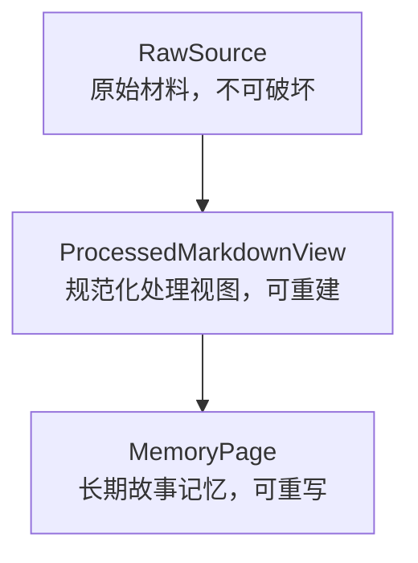
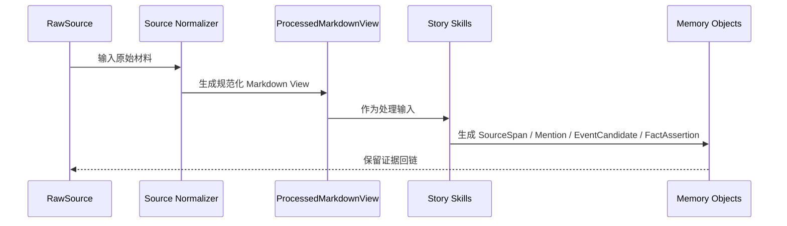
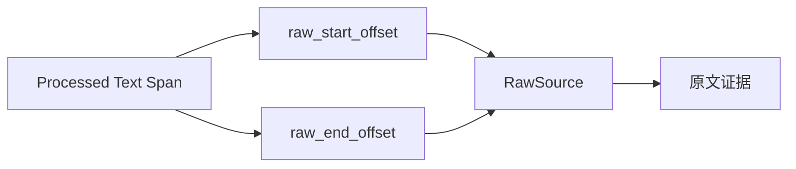
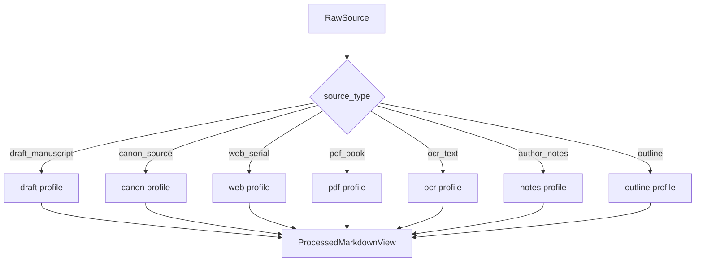
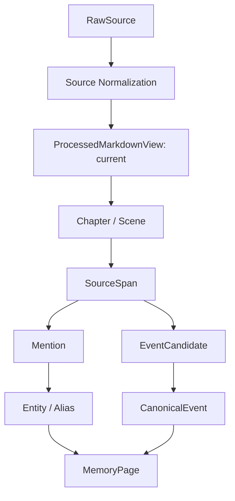

# 16. 原始材料规范化与 Markdown View

> 本文档定义 RawSource 如何进入记忆系统，如何清洗、去噪、结构化，并生成可处理的 ProcessedMarkdownView。这里不讨论技术实现，只讨论数据流和设计边界。

## 1. 核心判断

原始材料不应该被直接覆盖或改写。Sextant 应区分三层：



| 层 | 作用 | 是否可改写 | 是否作为最终证据 |
|---|---|---:|---:|
| RawSource | 保存原始文本、版本、来源 | 否 | 是 |
| ProcessedMarkdownView | 为记忆系统提供统一处理格式 | 是，可重建 | 间接 |
| MemoryPage | 面向作者和 AI 的 Current Canon / Log / Open Threads | 是 | 必须引用 RawSource / SourceSpan |

## 2. source_type 与 source_scope

`source_type` 和 `source_scope` 是两个不同概念，不能混用。

| 字段 | 描述 | 主要用途 |
|---|---|---|
| source_type | 材料格式或来源形态 | 决定 normalization profile |
| source_scope | 材料在作品记忆中的语义地位 | 决定 canon promotion 权重 |

### 2.1 source_type 枚举

| source_type | 说明 | 推荐 Format Profile |
|---|---|---|
| draft_manuscript | 作者当前或历史手稿 | draft profile |
| canon_source | 授权原著或参考 canon | canon profile |
| web_serial | 网页连载文本 | web profile |
| pdf_book | PDF 书籍或文档 | pdf profile |
| ocr_text | OCR 文本 | ocr profile |
| author_notes | 作者笔记 | notes profile |
| outline | 大纲或计划 | outline profile |
| character_sheet | 角色卡 | character profile |
| worldbuilding | 世界观设定集 | worldbuilding profile |
| model_output | 模型生成候选内容 | model-output profile |
| other | 其他 | generic profile |

### 2.2 source_scope 枚举

| source_scope | 含义 | 默认 canon 权重 |
|---|---|---:|
| user_draft | 作者当前正文草稿 | 高 |
| user_published | 作者已确认发布或定稿内容 | 最高 |
| external_canon | 原著或同人参考 canon | 高，但只在参考上下文内 |
| author_note | 作者明确设定或说明 | 高 |
| outline_plan | 大纲、计划、未来剧情意图 | 中 |
| reference_only | 仅供参考，不自动覆盖正文 canon | 中低 |
| discarded_draft | 旧稿、废稿、已废弃版本 | 低 |
| experimental | 试写、实验性材料 | 低 |
| model_suggestion | 模型建议，不能自动成为 canon | 最低 |

## 3. 为什么要生成 ProcessedMarkdownView

ProcessedMarkdownView 不是为了替代原文，而是为了让后续处理更稳定：

- 统一章节、场景、SourceSpan 的表示；
- 保留 raw offset 映射；
- 区分正文、对话、作者笔记、脚注、OCR 不确定文本；
- 给后续 Story Skills 提供一致输入；
- 支持重新运行结构解析和记忆抽取。



### 3.1 current view 约束

同一个 `SourceVersion` 可以因为不同 cleaning profile 被重建出多个 ProcessedMarkdownView，但同一时间最多只能有一个 view 处于 `current` 状态。

```text
SourceVersion
  ├─ ProcessedMarkdownView: current      ← 默认抽取流程只使用这一份
  ├─ ProcessedMarkdownView: stale        ← 旧处理视图
  ├─ ProcessedMarkdownView: rebuilt      ← 重建记录
  └─ ProcessedMarkdownView: deprecated   ← 不再使用
```

如果没有这个约束，同一版本可能同时产生多套章节、SourceSpan offset 和事件候选，导致后续记忆无法对齐。

## 4. 三类清洗

### 4.1 安全清洗

不会改变文本语义，可以自动执行。

| 清洗项 | 说明 |
|---|---|
| 编码统一 | 统一文本编码 |
| 去除不可见控制字符 | 不影响正文内容 |
| 修复异常换行 | 只修复明显格式问题 |
| 统一空白 | 保留段落结构 |
| 去除重复 BOM | 文件级清理 |
| 识别章节标题 | 结构化，不删除原文 |
| 识别场景分隔符 | 结构化，不删除原文 |

### 4.2 结构清洗

可以执行，但必须保留 raw offset 映射。

| 清洗项 | 说明 | 约束 |
|---|---|---|
| 章节编号规范化 | 第三章 / Chapter 3 等统一标记 | 不改变原文展示 |
| 段落重排 | OCR 或 PDF 断行修复 | 保留 raw offset |
| 说话人标签识别 | 识别“某某：” | 只标注，不改语义 |
| 脚注/尾注分离 | 不混入正文事件 | 仍可引用 |
| 页眉页脚识别 | PDF 场景常见 | 默认标记，不直接丢弃 |
| 网页噪声标记 | 广告、导航、评论 | 可排除出正文处理，但不删除 RawSource |

### 4.3 语义清洗

不能自动删除，只能标记。

| 内容 | 为什么不能删 |
|---|---|
| 重复表达 | 可能是风格、强调或伏笔 |
| 内心独白 | 可能是 POV 和角色认知证据 |
| 环境描写 | 可能是地点、氛围、伏笔 |
| 矛盾说法 | 可能是误导、角色谎言、悬念 |
| 口头禅 | 可能是角色识别特征 |
| 看似废话的对话 | 可能包含关系状态变化 |

## 5. ProcessedMarkdownView 格式

ProcessedMarkdownView 应该让后续系统容易定位结构和证据。

```md
---
source_id: src_001
version_id: ver_001
source_type: draft_manuscript
source_scope: user_draft
title: 第三章
raw_hash: sha256:...
cleaning_profile: draft_profile_v1
view_status: current
---

# Chapter 3

## Scene ch003-sc001

[raw: 1200-2450]
[pov: unknown]

正文……

## Scene ch003-sc002

[raw: 2451-3900]
[pov: Mira?]

正文……
```

## 6. Raw Offset Mapping

任何 SourceSpan 都必须能追溯到 RawSource。



这保证：

- 清洗不会破坏引用；
- 作者能看到原始上下文；
- 模型生成的记忆可以被审计；
- 未来重跑清洗规则不会丢失证据链。

## 7. Format Profile

Format Profile 由 `source_type` 决定。



| Profile | 主要目标 |
|---|---|
| draft profile | 保留作者草稿语气和结构 |
| canon profile | 最大化原文保真 |
| web profile | 分离正文和网页噪声 |
| pdf profile | 修复页码、页眉页脚、断行 |
| ocr profile | 标记不确定文本，不擅自修正 |
| notes profile | 区分设定、todo、废案、灵感 |
| outline profile | 作为作者意图，不直接生成正文事件 |
| model-output profile | 保持低权重，不能自动进入 Current Canon |

## 8. source_scope 与 canon promotion

`source_scope` 不参与清洗规则选择，而参与 Conflict Policy Gate 和 Canon Promotion。

| source_scope | 默认处理 |
|---|---|
| user_published | 高优先级，可直接参与 canon promotion，但仍需证据 |
| user_draft | 可参与 canon promotion，但版本变化需记录 |
| author_note | 可参与 canon promotion，需标记来源为作者设定 |
| external_canon | 在同人或参考上下文内权重高，但通常不覆盖用户正文 |
| outline_plan | 记录为未来意图，不自动当作已发生事件 |
| reference_only | 只用于检索和对照 |
| discarded_draft | 保留历史，不影响当前 canon |
| experimental | 保留试写，不自动提升 |
| model_suggestion | 只能作为建议，不能自动提升 |

## 9. 规范化后的数据流



## 10. 结论

Sextant 应保留 RawSource，同时生成可重建的 ProcessedMarkdownView。

原则是：

```text
原文保真；处理视图规范；每个 SourceVersion 只有一个 current view；source_type 管清洗；source_scope 管 canon 权重；证据链不断；语义不擅自删除。
```

清洗不是为了让文本“更像摘要”，而是为了让记忆系统能稳定定位章节、场景、证据和来源。