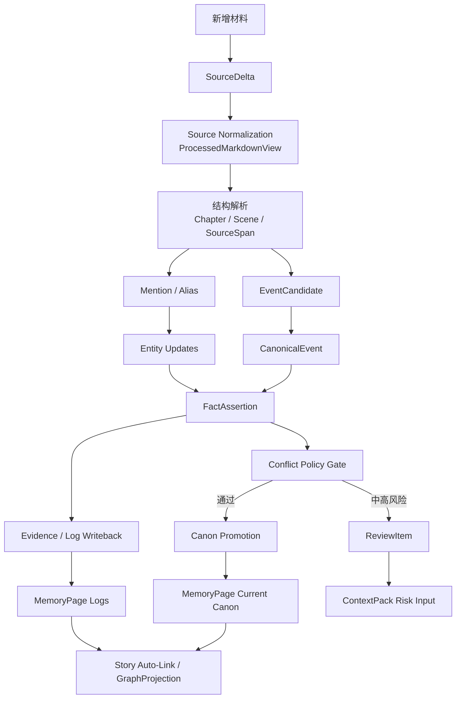
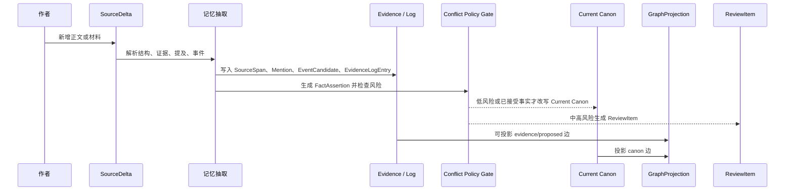
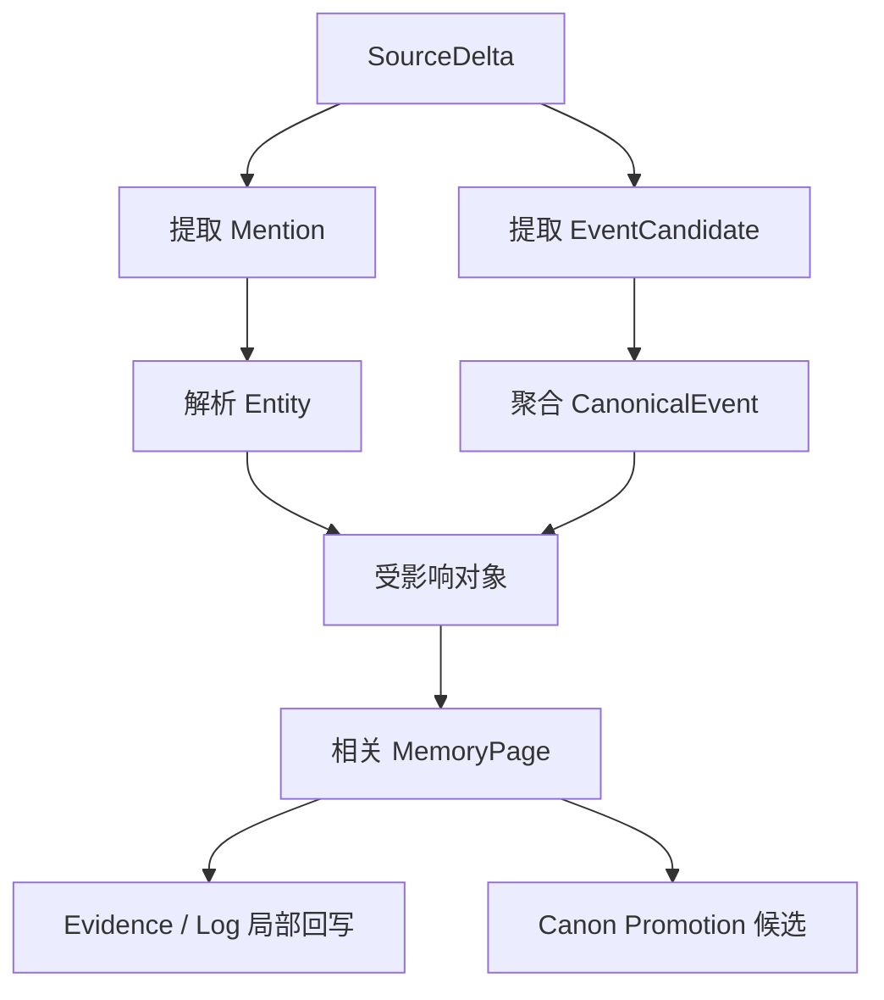
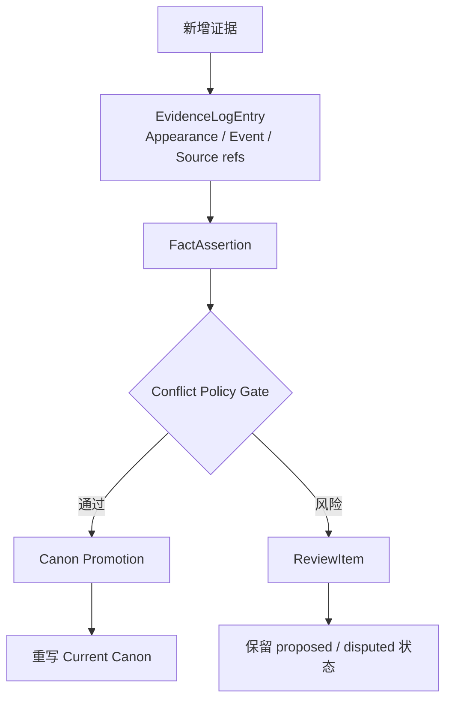
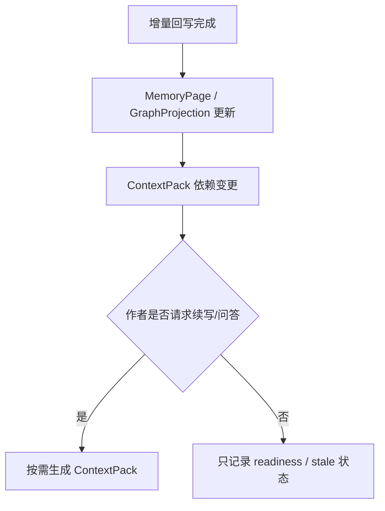

# 17. 增量记忆回写

> 本文档定义当作者新增正文、导入引用材料、修改设定或追加角色卡时，系统如何把新增材料稳定回写到故事记忆。这里不讨论实现，只讨论数据流和记忆更新策略。

本文对应 [GOAL.md](../GOAL.md) 中 canonical end-to-end flow 的增量执行方式：新增 SourceDelta 仍沿用 `Source Normalization`、`Structure Parsing`、`Mention Extraction`、`Event Candidate Extraction`、`Event Aggregation`、`Fact Assertions`、`Evidence / Log Writeback`、`Conflict Policy Gate`、`Canon Promotion`、`Memory Pages`、`Story Auto-Link` 和 `GraphProjection`。

## 1. 目标

Sextant 不是一次性导入整本小说后结束。作者会持续写作、修改、导入参考材料。系统必须支持增量更新。

增量回写的目标是：

- 新材料先保存为证据；
- 只更新受影响的记忆对象；
- 不因用户未确认而阻塞流程；
- 新证据可以先进入 Evidence / Log；
- Current Canon 改写必须经过 Conflict Policy Gate；
- 不静默覆盖高风险 canon；
- 更新 ContextPack 所依赖的记忆输入，但不默认每次生成完整 ContextPack。



## 2. 新增材料类型

| 类型 | source_type | source_scope | 默认处理 |
|---|---|---|---|
| 新正文 | draft_manuscript | user_draft | 可进入证据层，低风险事实可升格为 canon |
| 修改正文 | draft_manuscript | user_draft / user_published | 需要版本对比，旧事实可变 outdated |
| 引用材料 | canon_source / web_serial / pdf_book | external_canon / reference_only | 作为参考或原著 canon，不默认覆盖用户正文 |
| 作者设定 | author_notes / worldbuilding | author_note | 可参与 canon promotion，但仍需保留证据 |
| 大纲 | outline | outline_plan | 记录未来意图，不当作已发生事件 |
| 模型建议 | model_output | model_suggestion | 只能作为建议，不能自动成为 canon |
| 废稿 | draft_manuscript | discarded_draft | 保留历史，不影响当前 canon |

## 3. 标准增量流程



关键点：**Evidence / Log Writeback 在前，Current Canon Promotion 在后。** 这避免了“先污染 Current Canon，再发现冲突”的问题。

## 4. 回写目标

新增材料可能同时影响多个记忆对象。

| 新信息 | 先写入 Evidence / Log | 通过 gate 后可改写 Current Canon |
|---|---|---|
| 新角色出现 | Appearance Log、Mention、SourceSpan | 角色简介、关系摘要 |
| 新地点出现 | Scene Log、Location mention | 地点 Current Canon |
| 物品出现或转移 | Event Log、FactAssertion proposed | Object 当前状态 |
| 角色知道秘密 | CharacterKnowledge proposed | 角色认知状态 |
| 角色关系变化 | Relationship observation | 关系摘要 |
| 新伏笔 | OpenThread / Plotline log | Plotline Current Canon |
| 事件发生 | EventCandidate / CanonicalEvent | Event Memory |
| 作者设定 | Author note log | Lore / Character / Location Canon |

## 5. 受影响对象识别

系统不应全量重写所有记忆页，而应识别受影响对象。



受影响对象包括：

- 新增 scene 的 POV 角色；
- scene 中出现的角色、地点、物品、阵营；
- 事件参与者；
- 事件地点；
- 事件造成状态变化的对象；
- 被揭示或被改变的 plotline / lore；
- 相关 ReviewItem 和未解决风险。

## 6. Current Canon 何时重写

不是每次新增 SourceSpan 都必须重写 Current Canon。

| 情况 | Evidence / Log | Current Canon |
|---|---|---|
| 只是实体出现 | 更新 Appearance Log | 不一定重写 |
| 新事实改变角色状态 | 写入 FactAssertion | 通过 gate 后重写 |
| 新事件改变物品归属 | 写入 CanonicalEvent / FactAssertion | 通过 gate 后重写 |
| 新地点描述补充细节 | 写入 Location log | 低风险可重写 |
| 低置信别名候选 | 记录 AliasRecord proposed | 不重写 |
| 高风险冲突 | 保留新证据 | 不自动升格，生成 ReviewItem |
| 作者明确设定 | 写入 Author Note log | 可升格，但仍保留证据 |

## 7. Timeline / Log 与 Current Canon

Sextant 使用“证据日志 + 当前综合记忆”的结构，但不称为 truth。



## 8. 新增正文 vs 引用材料

| 维度 | 新增正文 | 引用材料 |
|---|---|---|
| 默认地位 | 当前作品草稿或 canon | 外部参考或原著 canon |
| 是否直接影响 Evidence / Log | 是 | 是 |
| 是否直接影响 Current Canon | 通过 gate 后 | 取决于 source_scope |
| 是否允许覆盖作者正文 | 可以，但需版本记录和 gate | 通常不直接覆盖 |
| 主要用途 | 继续写作记忆 | 同人约束、参考、设定索引 |

## 9. 回写后的输出

每次增量回写后，系统应产生：

| 输出 | 说明 |
|---|---|
| Updated Evidence Logs | 新证据、出场、事件、source refs |
| Updated MemoryPages | 被更新的日志区或 Current Canon 区 |
| New SourceSpans | 新证据片段 |
| New Mentions | 新提及 |
| AliasChanges | 自动或 proposed 别名变更 |
| New / Updated CanonicalEvents | 新事件或事件新证据 |
| DerivedFacts | 从事件派生的事实 |
| GraphChanges | 图谱投影变化摘要 |
| ReviewItems | 需要作者注意的风险 |
| ContextPackReadiness | 标记续写上下文依赖已更新，等待按需生成 |

## 10. ContextPack 策略

新增正文后不默认生成完整 ContextPack。



原因：ContextPack 是面向具体请求的输出，不是 ingest 的必然结果。不同请求需要不同范围的上下文。

## 11. 增量回写的非目标

增量回写不应该：

- 每次重建整本书的所有记忆；
- 低置信合并别名后立即改写所有页面；
- 把模型建议自动升格为 canon；
- 因检测到冲突就丢弃新增正文；
- 删除旧证据来“保持一致”；
- 用摘要替代 SourceSpan；
- 每次 ingest 后自动生成完整 ContextPack。

## 12. 结论

增量回写的核心是：

```text
新增材料 -> 新证据 -> Evidence / Log 局部写入 -> Conflict Policy Gate -> Canon Promotion -> 图谱投影更新 -> ReviewItem / ContextPackReadiness
```

原始材料永远先保存；Current Canon 只在有足够证据、低风险或作者明确接受时更新；高风险内容不阻塞 ingest，但会阻断自动 canon promotion。
