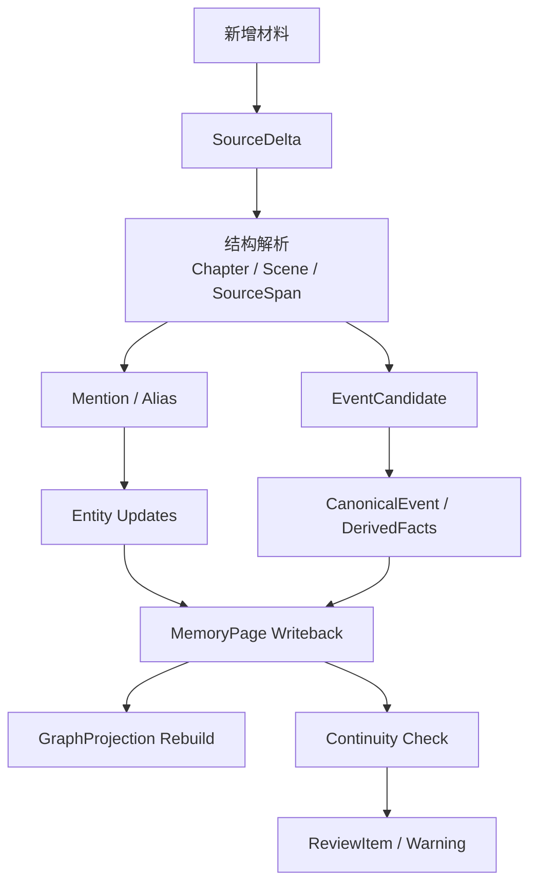
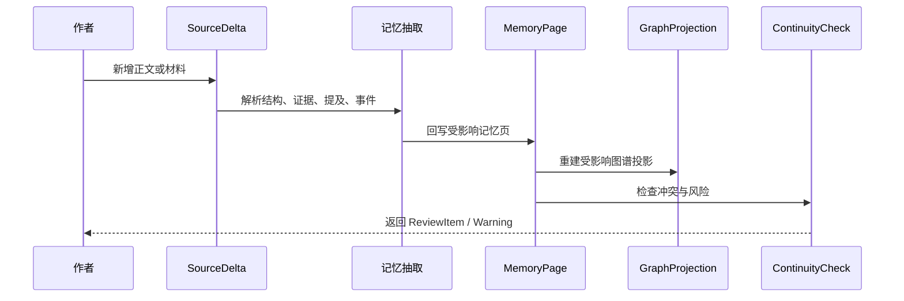
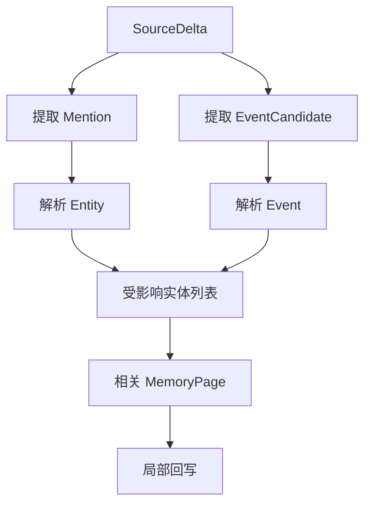
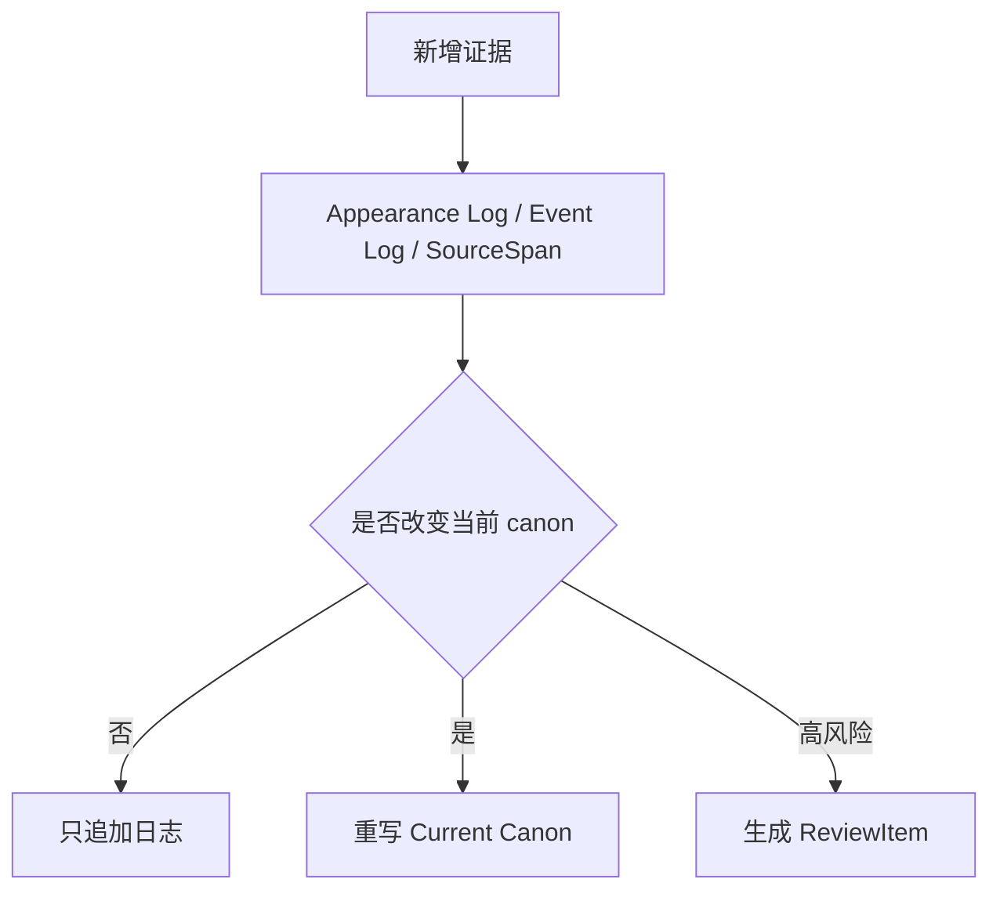

# 17. 增量记忆回写

> 本文档定义当作者新增正文、导入引用材料、修改设定或追加角色卡时，系统如何把新增材料稳定回写到故事记忆。这里不讨论实现，只讨论数据流和记忆更新策略。

## 1. 目标

Sextant 不是一次性导入整本小说后结束。作者会持续写作、修改、导入参考材料。系统必须支持增量更新。

增量回写的目标是：

- 新材料先保存为证据；
- 只更新受影响的记忆对象；
- 不因用户未确认而阻塞流程；
- 不静默覆盖高风险 canon；
- 让 MemoryPage、GraphProjection、ContextPack 能随新增材料更新。



## 2. 新增材料类型

| 类型 | 说明 | 默认 canon 权重 |
|---|---|---:|
| 新正文 | 作者刚写的一页、一场、一章 | 高 |
| 修改正文 | 对已有章节的改写 | 高，但需要版本对比 |
| 引用材料 | 作者导入的原著、参考文本 | 取决于 source_scope |
| 作者设定 | 明确世界观、角色、剧情说明 | 高 |
| 大纲 | 计划、方向、未来剧情 | 中 |
| 模型建议 | AI 生成的候选内容 | 低，不能自动成为 canon |
| 废稿 | 被作者废弃的旧版本 | 低，只作历史参考 |

## 3. 标准增量流程



## 4. 回写目标

新增材料可能同时影响多个记忆对象。

| 新信息 | 回写到哪里 |
|---|---|
| 新角色出现 | Character Memory、Appearance Log、GraphProjection |
| 新地点出现 | Location Memory、Scene Log、GraphProjection |
| 物品出现或转移 | Object Memory、Event、FactAssertion |
| 角色知道秘密 | CharacterKnowledge、Event、FactAssertion |
| 角色关系变化 | Character Memory、Relationship State |
| 新伏笔 | Plotline Memory、OpenThread |
| 事件发生 | Event Memory、DerivedFacts、相关实体页 |
| 作者设定 | Lore / Character / Location / Object Memory |

## 5. 受影响对象识别

系统不应全量重写所有记忆页，而应识别受影响对象。



受影响对象包括：

- 新增 scene 的 POV 角色；
- scene 中出现的角色、地点、物品、阵营；
- 事件参与者；
- 事件地点；
- 事件造成状态变化的对象；
- 被揭示或被改变的 plotline / lore。

## 6. Current Canon 何时重写

不是每次新增 SourceSpan 都必须重写所有 Current Canon。

| 情况 | 处理 |
|---|---|
| 只是实体出现 | 更新 Appearance Log，不一定重写 Current Canon |
| 新事实改变角色状态 | 重写相关角色 Current Canon |
| 新事件改变物品归属 | 重写物品 Current Canon |
| 新地点描述补充细节 | 可更新 Location Memory |
| 低置信别名候选 | 不重写，只记录候选 |
| 高风险冲突 | 不自动提升为 canon，生成 ReviewItem |
| 作者明确设定 | 可直接回写，但仍需保留证据 |

## 7. Timeline / Log 与 Current Canon

Sextant 使用类似“证据日志 + 当前综合记忆”的结构，但不称为 truth。



## 8. 新增正文 vs 引用材料

| 维度 | 新增正文 | 引用材料 |
|---|---|---|
| 默认地位 | 当前作品草稿或 canon | 外部参考或原著 canon |
| 是否直接影响 Current Canon | 通常是 | 取决于项目目标 |
| 是否允许覆盖作者正文 | 可以，但需版本记录 | 通常不直接覆盖 |
| 主要用途 | 继续写作记忆 | 同人约束、参考、设定索引 |

## 9. 回写后的输出

每次增量回写后，系统应产生：

| 输出 | 说明 |
|---|---|
| Updated MemoryPages | 被更新的角色、地点、物品、事件、剧情线 |
| New SourceSpans | 新证据片段 |
| New Mentions | 新提及 |
| AliasChanges | 自动或 proposed 别名变更 |
| New Events | 新事件或事件新证据 |
| DerivedFacts | 从事件派生的事实 |
| GraphChanges | 图谱投影变化摘要 |
| ReviewItems | 需要作者注意的风险 |

## 10. 增量回写的非目标

增量回写不应该：

- 每次重建整本书的所有记忆；
- 低置信合并别名后立即改写所有页面；
- 把模型建议自动升格为 canon；
- 因检测到冲突就丢弃新增正文；
- 删除旧证据来“保持一致”；
- 用摘要替代 SourceSpan。

## 11. 结论

增量回写的核心是：

```text
新增材料 -> 新证据 -> 局部记忆更新 -> 图谱投影重建 -> 风险提示
```

原始材料永远先保存，Current Canon 只在有足够证据或作者明确输入时更新；高风险内容不阻塞 ingest，但会阻断自动 canon promotion。
