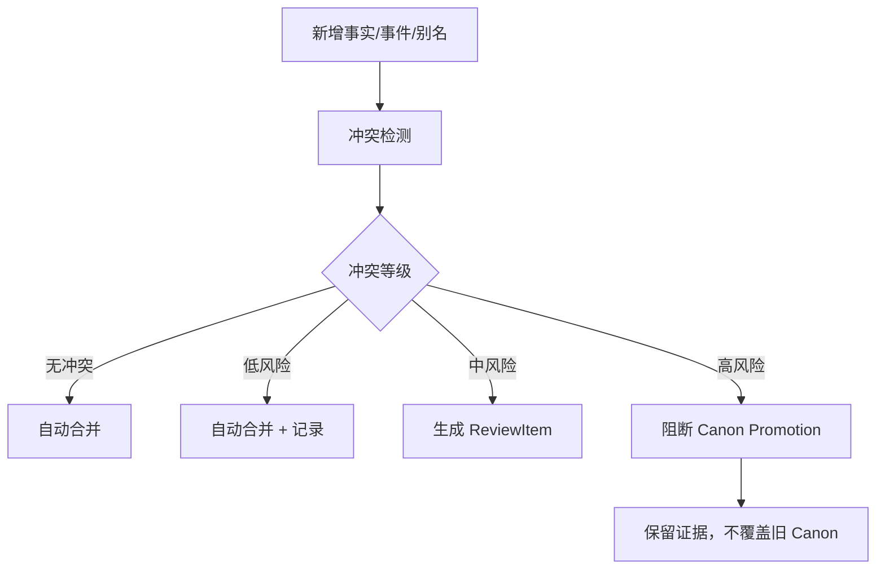
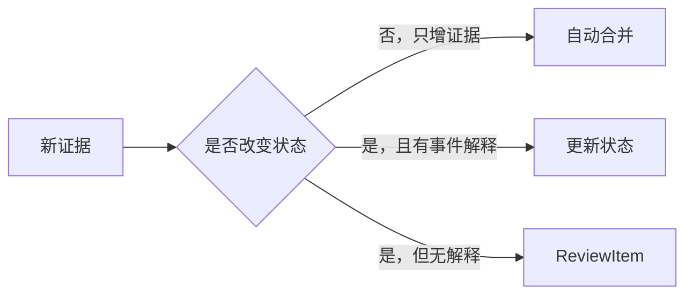
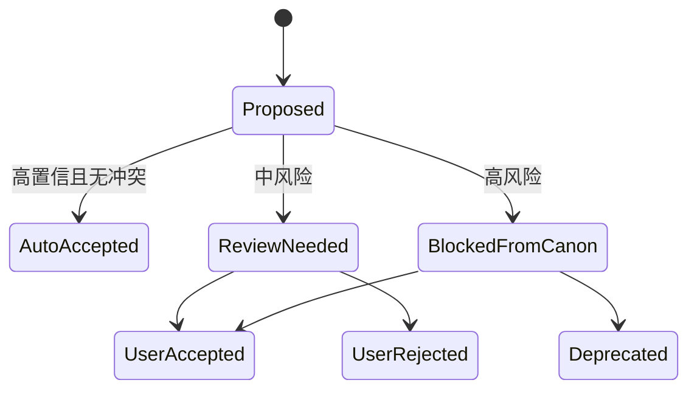
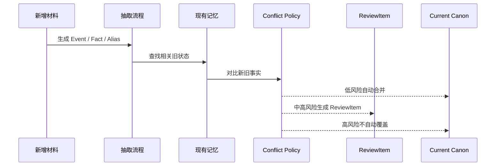
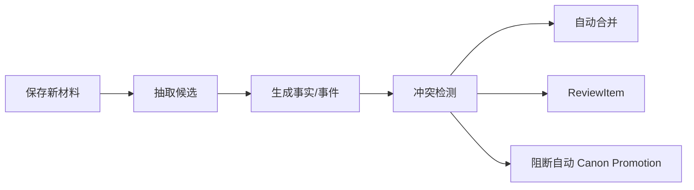

# 18. 冲突策略与 Review Policy

> 本文档定义新增材料与既有记忆冲突时如何处理。这里不讨论实现，只讨论冲突类型、自动合并、提醒、阻断 canon promotion 的规则。

## 1. 核心判断

小说里的“冲突”不一定是错误。它可能是：

- 作者真正写错了；
- 角色撒谎或误解；
- 叙述者误导；
- 草稿版本演化；
- 伏笔或悬念；
- 原著 canon 与同人改写 canon 的差异。

因此，Sextant 不应因为检测到冲突就阻断 ingest。原始材料必须先保存。系统最多阻断高风险事实自动进入 Current Canon，或阻断高风险 alias 强合并。



## 2. 冲突类型

| 类型 | 例子 | 默认处理 |
|---|---|---|
| 时间冲突 | 同一角色同一时间在两个地点 | 高风险提醒 |
| 状态冲突 | 已死亡角色无解释再次出场 | 高风险提醒 |
| 物品归属冲突 | 唯一道具同时属于两人 | ReviewItem |
| 知识冲突 | 角色提前知道未揭示秘密 | 高风险提醒 |
| POV 冲突 | 限制视角突然知道别人内心 | ReviewItem |
| 别名冲突 | 一个称号同时指向两个角色 | 阻断强合并 |
| 设定冲突 | 王都位置前后不一致 | ReviewItem |
| 关系突变 | 敌人无过渡变亲密盟友 | ReviewItem |
| 版本冲突 | 旧草稿和新稿设定不同 | 新版本优先，但保留旧证据 |
| 角色说法冲突 | 两个角色对同一事件说法不同 | 不直接视为错误，记录为 disputed |

## 3. 自动合并条件

以下情况可以自动合并：

| 条件 | 说明 |
|---|---|
| 完全重复事实 | 同一 subject / predicate / object / evidence 增补 |
| 同一事实的新证据 | 只是增加 SourceSpan |
| 非排他关系 | appears_in、mentions、related_to 可累积 |
| 时间自然推进 | 当前地点、物品持有者等状态随事件变化 |
| 高置信别名 | 明确文本或用户确认的 alias |
| 作者明确覆盖 | 用户明确说“以后采用新设定” |



## 4. 需要提醒但不阻断的情况

| 情况 | 处理 |
|---|---|
| 中置信 alias 合并 | 标记 proposed，允许流程继续 |
| 可能的 POV 越界 | 生成 ReviewItem，不阻断原文保存 |
| 关系突变但可解释 | 生成轻提醒 |
| 设定补充与旧描述不完全一致 | 记录为 possible_conflict |
| 同一事件出现新版本 | 标记 conflict_version |
| 伏笔未回收 | 记录 OpenThread，不作为错误 |

## 5. 需要阻断的情况

“阻断”只指阻断自动升格，不指阻断原始材料进入系统。

| 阻断对象 | 条件 |
|---|---|
| Alias 强合并 | 一个 alias 高置信指向多个实体 |
| Current Canon 改写 | 新事实与已有高置信 canon 硬冲突，且没有事件解释 |
| DerivedFact 生效 | 派生事实缺少 SourceSpan 或事件依据 |
| CharacterKnowledge 更新 | 角色知道秘密的证据不足或与 POV 冲突 |



## 6. ReviewItem

ReviewItem 是给作者看的“可处理风险”，不是流程闸门。

| 字段 | 说明 |
|---|---|
| review_id | ReviewItem ID |
| review_type | alias_conflict / state_conflict / pov_conflict / timeline_conflict / canon_conflict |
| severity | low / medium / high |
| summary | 风险摘要 |
| affected_entities | 相关角色、地点、物品、事件 |
| new_evidence | 新 SourceSpan |
| existing_evidence | 旧 SourceSpan |
| suggested_actions | accept / reject / split / mark_intentional / supersede |
| default_action | 系统默认处理 |

## 7. 冲突处理时序



## 8. 作者操作

用户可以对 ReviewItem 做：

| 操作 | 结果 |
|---|---|
| accept | 接受新事实进入 Current Canon |
| reject | 拒绝新推断，但保留原始证据 |
| split | 拆分别名或事件 |
| merge | 合并实体或事件 |
| mark_intentional | 标记为有意矛盾、伏笔、误导 |
| supersede | 用新版本替代旧版本 |
| ignore | 暂时忽略，保持 proposed |

## 9. 与增量回写的关系

冲突策略不应位于 ingest 之前，而应位于记忆回写之后、canon promotion 之前。



## 10. 结论

Sextant 的冲突策略是：

```text
原始材料永远进入系统；低风险自动合并；中风险提醒；高风险阻断自动升格，而不是阻断 ingest。
```

这能保护作者写作流畅性，同时避免系统静默污染 Current Canon。
