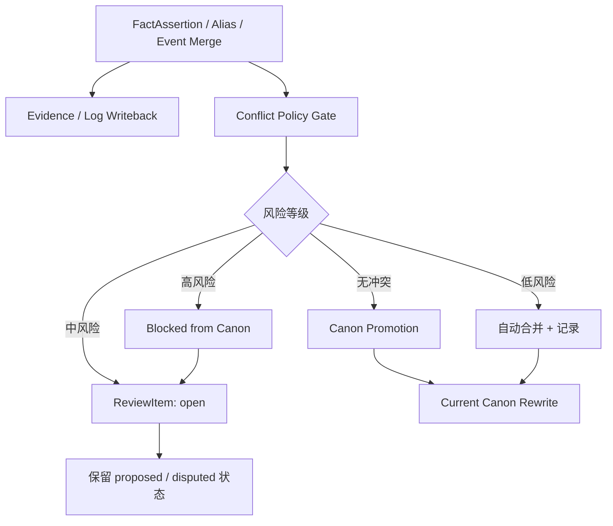
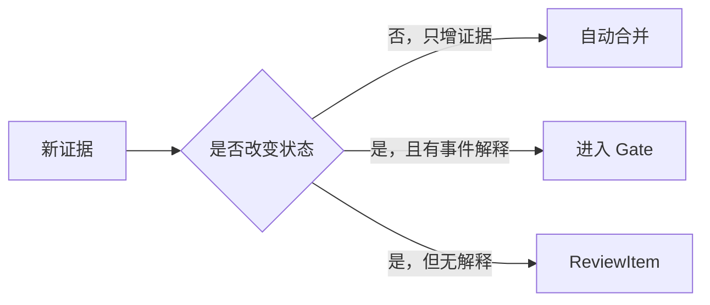
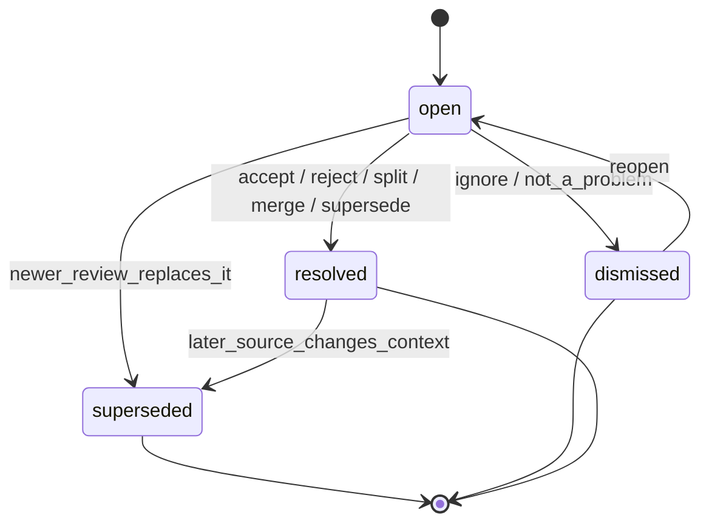
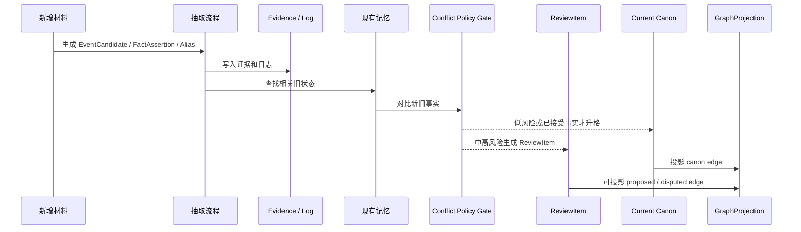
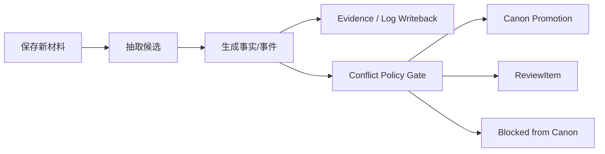

# 18. 冲突策略与 Review Policy

> 本文档定义新增材料与既有记忆冲突时如何处理。这里不讨论实现，只讨论冲突类型、自动合并、ReviewItem 生命周期、以及如何阻断高风险 canon promotion。

本文对应 [GOAL.md](../GOAL.md) 中 canonical end-to-end flow 的 `FactAssertion -> Evidence / Log Writeback -> Conflict Policy Gate -> Canon Promotion / ReviewItem` 片段。Conflict Policy 不阻断 `RawSource` 保存或 `ProcessedMarkdownView` 生成，只管理高风险事实、别名、事件聚合和 Current Canon 改写。

## 1. 核心判断

小说里的“冲突”不一定是错误。它可能是：

- 作者真正写错了；
- 角色撒谎或误解；
- 叙述者误导；
- 草稿版本演化；
- 伏笔或悬念；
- 原著 canon 与同人改写 canon 的差异。

因此，Sextant 不应因为检测到冲突就阻断 ingest。原始材料和证据日志必须先进入系统。系统最多阻断高风险事实自动进入 Current Canon，或阻断高风险 alias / event merge 自动生效。



## 2. 冲突类型

| 类型 | 例子 | 默认处理 |
|---|---|---|
| timeline_conflict | 同一角色同一时间在两个地点 | 高风险 ReviewItem |
| state_conflict | 已死亡角色无解释再次出场 | 高风险 ReviewItem |
| object_state_conflict | 唯一道具同时属于两人 | ReviewItem |
| knowledge_conflict | 角色提前知道未揭示秘密 | 高风险 ReviewItem |
| pov_conflict | 限制视角突然知道别人内心 | ReviewItem |
| alias_conflict | 一个称号同时指向两个角色 | 阻断强合并 |
| canon_conflict | 王都位置前后不一致 | ReviewItem |
| relationship_conflict | 敌人无过渡变亲密盟友 | ReviewItem |
| version_conflict | 旧草稿和新稿设定不同 | 新版本可优先，但保留旧证据 |
| event_merge_conflict | 两个事件可能相同但证据不足 | 阻断自动合并 |
| continuity_warning | 一般连续性风险 | ReviewItem |

## 3. 自动合并条件

以下情况可以自动合并：

| 条件 | 说明 |
|---|---|
| 完全重复事实 | 同一 subject / predicate / object，只是证据增补 |
| 同一事实的新证据 | 增加 SourceSpan，不改变状态 |
| 非排他关系 | appears_in、related_to 等可累积关系 |
| 时间自然推进 | 当前地点、物品持有者等状态随事件变化，并有事件解释 |
| 高置信别名 | 明确文本或用户确认的 alias |
| 作者明确覆盖 | 用户明确说“以后采用新设定” |



## 4. 需要提醒但不阻断的情况

| 情况 | 处理 |
|---|---|
| 中置信 alias 合并 | 标记 proposed，允许流程继续 |
| 可能的 POV 越界 | 生成 ReviewItem，不阻断原文保存 |
| 关系突变但可解释 | 生成轻提醒 |
| 设定补充与旧描述不完全一致 | 记录为 possible_conflict |
| 同一事件出现新版本 | 标记 conflict_version |
| 伏笔未回收 | 记录 OpenThread，不作为错误 |

## 5. 需要阻断的情况

“阻断”只指阻断自动升格，不指阻断原始材料进入系统。

| 阻断对象 | 条件 |
|---|---|
| Alias 强合并 | 一个 alias 高置信指向多个实体 |
| Event 自动合并 | 两个 EventCandidate 可能相同但证据不足 |
| Current Canon 改写 | 新事实与已有高置信 canon 硬冲突，且没有事件解释 |
| DerivedFact 生效 | 派生事实缺少 SourceSpan 或 CanonicalEvent 依据 |
| CharacterKnowledge 更新 | 角色知道秘密的证据不足或与 POV 冲突 |
| Canon edge 投影 | 高风险状态边未通过 gate |

## 6. ReviewItem 是统一风险对象

`ReviewItem` 统一承载以下内容：

- 原 `ContinuityWarning`；
- alias conflict；
- event merge conflict；
- state conflict；
- canon promotion risk；
- source scope conflict。

`ContinuityWarning` 不再维护单独生命周期，而是 `ReviewItem.review_type = continuity_warning` 或更具体的 `pov_conflict`、`timeline_conflict`、`knowledge_conflict`。

## 7. ReviewItem 字段

| 字段 | 说明 |
|---|---|
| review_id | ReviewItem ID |
| review_type | alias_conflict / state_conflict / pov_conflict / timeline_conflict / canon_conflict / continuity_warning / event_merge_conflict |
| severity | low / medium / high |
| status | open / dismissed / resolved / superseded |
| summary | 风险摘要 |
| affected_refs | 相关角色、地点、物品、事件、MemoryPage |
| new_evidence | 新 SourceSpan |
| existing_evidence | 旧 SourceSpan |
| suggested_actions | accept / reject / split / merge / mark_intentional / supersede / needs_memory_update |
| default_action | 系统默认处理 |
| resolution | 最终处理动作，可为空 |
| resolved_by | 处理者，可为空 |
| resolved_at | 处理时间，可为空 |
| side_effects | 对 MemoryPage / GraphProjection / ContextPack 的影响说明 |

## 8. ReviewItem 生命周期



状态含义：

| status | 含义 |
|---|---|
| open | 待处理 |
| dismissed | 作者认为不需要处理 |
| resolved | 已处理并产生明确 resolution |
| superseded | 被更新材料或新的 ReviewItem 替代 |

## 9. 作者操作与副作用

| 操作 | resolution | 副作用 |
|---|---|---|
| accept | accept | fact/alias/event 可升格，Current Canon 可重写，GraphProjection 重建 |
| reject | reject | candidate 标记 rejected，相关 proposed edge 移除或降权 |
| split | split | 拆分 alias/entity/event，重建相关 MemoryPage 与 GraphProjection |
| merge | merge | 合并 alias/entity/event，重建相关 MemoryPage 与 GraphProjection |
| mark_intentional | mark_intentional | 标记为伏笔、误导、角色谎言或有意矛盾，不再作为错误提醒 |
| supersede | supersede | 新版本覆盖旧 canon，旧事实变 outdated |
| needs_memory_update | needs_memory_update | 文本没错，记忆页或事实状态需要更新 |
| fixed_by_text_edit | fixed_by_text_edit | 作者已改正文，等待新 SourceDelta 进入系统 |
| accepted_as_change | accepted_as_change | 作者决定改变 canon，旧设定变 outdated |

## 10. 冲突处理时序



## 11. 与增量回写的关系

冲突策略不应位于 ingest 之前，而应位于 Evidence / Log Writeback 之后、Current Canon Promotion 之前。



## 12. 结论

Sextant 的冲突策略是：

```text
原始材料永远进入系统；证据和日志先写入；低风险自动升格；中风险提醒；高风险阻断自动 canon promotion，而不是阻断 ingest。
```

这能保护作者写作流畅性，同时避免系统静默污染 Current Canon。
