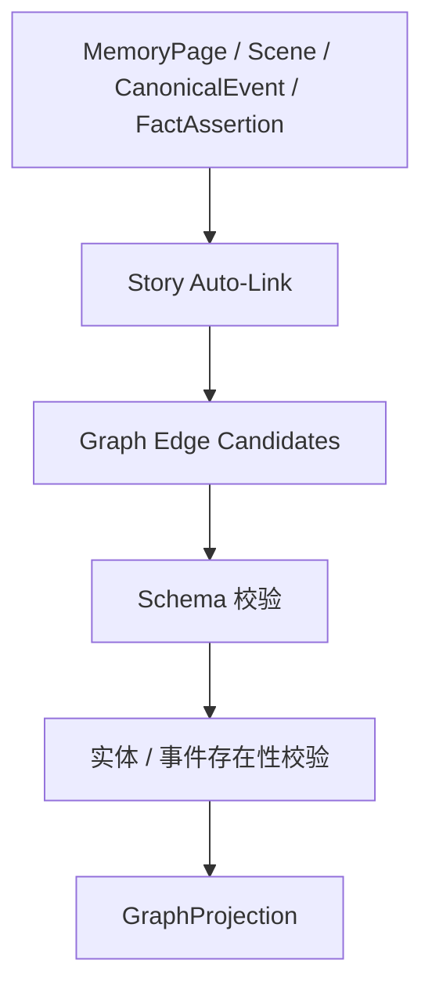
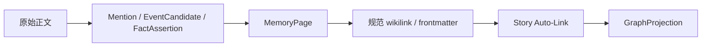
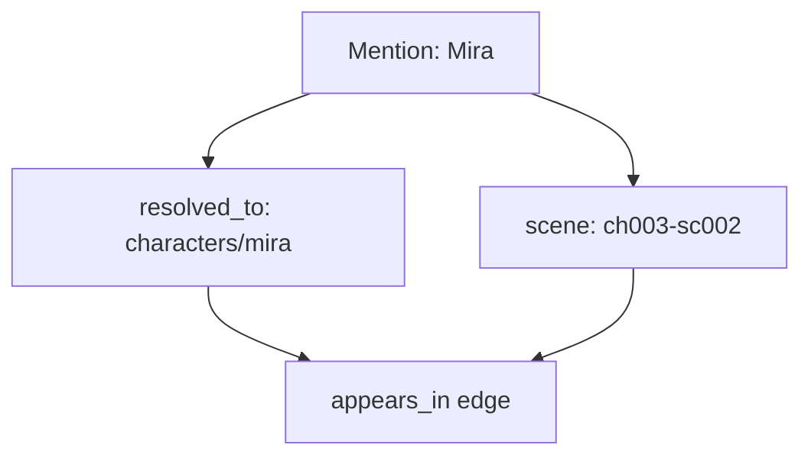
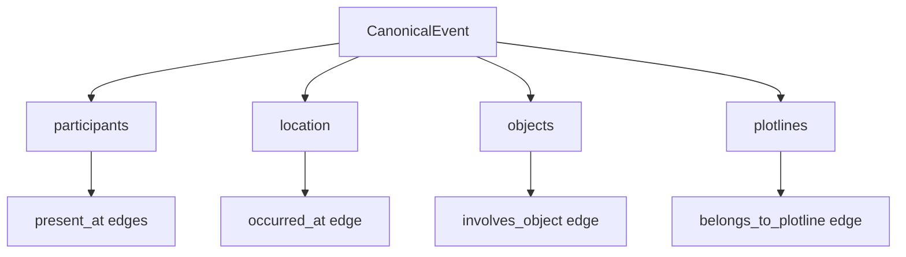
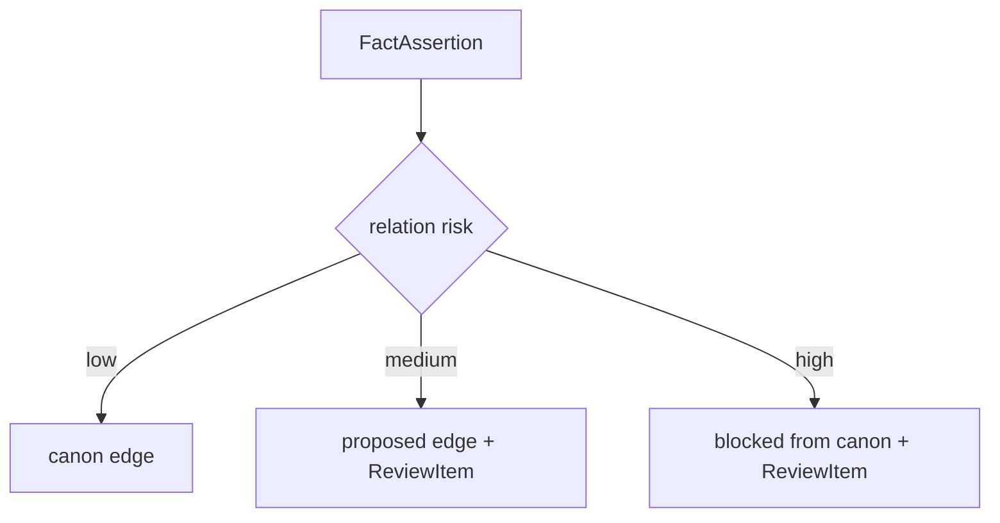
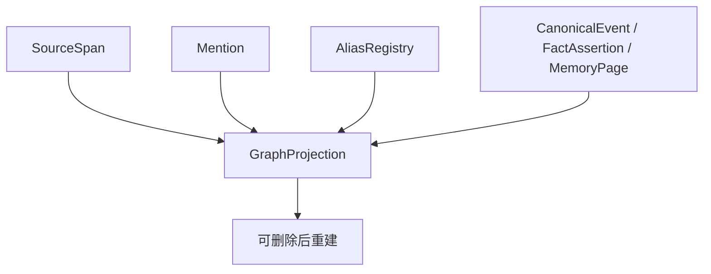

# 19. Story Auto-Link 与确定性建图

> 本文档定义 Sextant 如何从规范化记忆页、frontmatter、场景出场、事件结构和已确认别名中，确定性投影故事图谱。这里不讨论实现，只讨论数据流和规则边界。

## 1. 核心目标

Story Auto-Link 的目标不是从原始正文里直接理解整本小说，而是从已经结构化的记忆对象中稳定生成图谱边。



它负责：

- 把规范链接转成图谱边；
- 把 frontmatter 字段转成 typed edge；
- 把 Scene 中的实体出场转成 `appears_in`；
- 把 CanonicalEvent 的参与者、地点、物品转成事件边；
- 把已确认 alias 的解析结果转成稳定实体连接；
- 保持 GraphProjection 可重建。

## 2. Auto-Link 不做什么

Story Auto-Link 不应该：

- 直接从任意原始长文里抽完整知识图谱；
- 自由创造实体；
- 自由创造关系类型；
- 把低置信 alias 强行合并；
- 把模型推测变成 canon；
- 覆盖 SourceSpan 证据链；
- 绕过 Conflict Policy Gate。

## 3. Auto-Link 的输入来源

| 来源 | 例子 | 生成边 |
|---|---|---|
| MemoryPage wikilink | `[[characters/mira-vale]]` | `related_to` / 页面内引用 |
| Event participants | `participants: [Mira, Orrin]` | `present_at` |
| Event location | `location: Harbor Nine` | `occurred_at` |
| Event objects | `objects: [Lantern Map]` | `involves_object` |
| Object state | `current_owner: Kestrel` | `owns`，但需状态有效期与 gate |
| Scene mentions | character mention in scene | `appears_in` |
| AliasRegistry | `Starling -> Mira Vale` | mention resolves_to entity，不直接等于 canon edge |
| CharacterKnowledge | `knows: secret-x` | `knows` / `does_not_know` |
| Plotline link | event belongs_to plotline | `belongs_to_plotline` |

## 4. 规范链接格式

系统生成的 MemoryPage 可以使用稳定 slug：

```md
[[characters/mira-vale|Mira Vale]]
[[locations/harbor-nine|Harbor Nine]]
[[objects/lantern-map|Lantern Map]]
[[events/lantern-map-stolen|Lantern Map stolen]]
[[plotlines/lantern-map-thread|Lantern Map Thread]]
```

这些链接不是要求作者在正文中手写，而是用于系统生成或作者可编辑的记忆页。



## 5. 实体类型白名单

Auto-Link 只识别当前 Story Schema Pack 允许的类型。基础类型见 [14-story-schema-packs.md](14-story-schema-packs.md)。

Base Story Schema 默认包括：

```text
characters
locations
factions
objects
events
scenes
chapters
plotlines
lore
sources
```

Genre Pack 可以扩展：

```text
sects
artifacts
realms
clues
suspects
ships
planets
technologies
```

## 6. 关系类型白名单

Auto-Link 不维护第二套关系表。所有可生成关系必须来自 [14-story-schema-packs.md](14-story-schema-packs.md) 的 canonical relation whitelist。

常见确定性映射如下：

| 来源 | 生成关系 | 是否需要 Conflict Policy Gate |
|---|---|---:|
| Mention 出现在 Scene | `appears_in` | 否 |
| CanonicalEvent participants | `present_at` | 通常否 |
| CanonicalEvent location | `occurred_at` | 通常否 |
| CanonicalEvent objects | `involves_object` | 通常否 |
| Object current_owner | `owns` | 是 |
| CharacterKnowledge knows | `knows` / `does_not_know` | 是 |
| Event / Scene 揭示事实 | `reveals` | 视风险而定 |
| Plotline membership | `belongs_to_plotline` | 通常否 |
| MemoryPage 弱引用 | `related_to` | 否，但权重低 |
| Conflict Policy 输出 | `contradicts` | 是，来自 ReviewItem |

## 7. frontmatter 到边的映射

MemoryPage 和 EventPage 的 frontmatter 可以直接生成候选边，但候选边仍需 schema 校验。

```yaml
---
type: event
title: Lantern Map stolen
participants:
  - characters/mira-vale
  - characters/kestrel
location: locations/harbor-nine
objects:
  - objects/lantern-map
plotlines:
  - plotlines/lantern-map-thread
---
```

生成：

```text
characters/mira-vale --present_at--> events/lantern-map-stolen
characters/kestrel --present_at--> events/lantern-map-stolen
events/lantern-map-stolen --occurred_at--> locations/harbor-nine
events/lantern-map-stolen --involves_object--> objects/lantern-map
events/lantern-map-stolen --belongs_to_plotline--> plotlines/lantern-map-thread
```

## 8. Scene membership 到边

只要一个 Mention 解析到实体，并且属于某个 Scene，就可以确定生成 `appears_in`。



这条边不需要模型判断。

## 9. Event 到事件边

CanonicalEvent 的结构可以稳定投影为图谱边。



## 10. FactAssertion 到状态边

FactAssertion 可以生成状态边，但高风险状态边必须经过 Conflict Policy Gate。



高风险边包括：

| 边类型 | 风险 | 默认处理 |
|---|---|---|
| alias merge | 可能合并错角色 | 高置信才自动生效 |
| owns | 唯一物品归属冲突 | 检查有效期与事件依据 |
| knows | 影响 POV 与秘密 | 必须有 evidence |
| family_of | 关系重大 | 需要高置信或作者确认 |
| death / irreversible state | 重大状态 | 需要明确证据 |
| contradicts | 需要解释 | 生成 ReviewItem |

## 11. GraphProjection 可重建

Story Auto-Link 的输出不是源数据，而是投影。



如果用户修正 alias、拆分事件、废弃事实，GraphProjection 应该重新生成，而不是手工修补边。

## 12. 避免原始正文污染图谱

原始正文中可能出现类似路径或误导性文本，不应直接被 Auto-Link 当成图边来源。

安全规则：

| 来源 | 是否可直接建图 |
|---|---:|
| RawSource 原文 | 否，必须经过 Mention / EventCandidate / FactAssertion |
| ProcessedMarkdownView | 只用于结构和证据，不直接信任 wikilink |
| MemoryPage | 是，受 schema 校验 |
| Event frontmatter | 是，受 schema 校验 |
| 用户手动 MemoryPage 编辑 | 是，但需要保留变更来源 |
| 低置信模型输出 | 否，只能 proposed |

## 13. 结论

Story Auto-Link 的核心是：

```text
不是从原文自由抽图，而是从已结构化记忆对象中确定性投影故事图谱。
```

这能让小说记忆系统获得稳定、可回放、可调试的图谱，同时保留 SourceSpan 证据、Conflict Policy Gate 和用户校正权。
