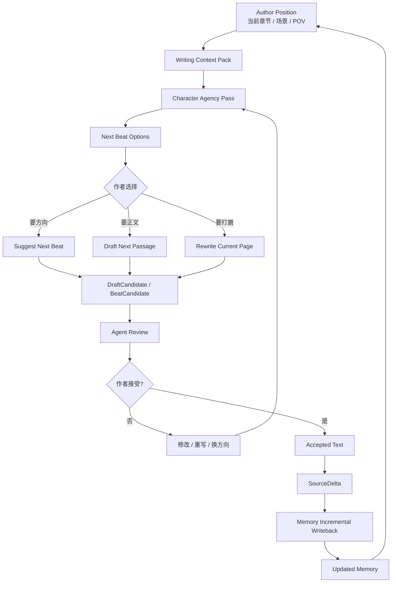
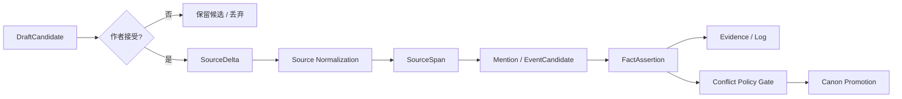

# 20. Agent 总览

> 本文档定义 Sextant 第一版写作 Agent 的总体定位、边界和主循环。它只讨论设计，不讨论技术栈、模型选型或实现细节。

## 1. 定位

Sextant Agent 是一个 **Memory-grounded、Character-driven、Page-by-page** 的写作副驾驶。

它的目标不是替作者一次性生成完整小说，而是帮助作者在当前场景、当前 POV、当前 canon 和角色状态约束下，推进下一小步。

```text
Agent proposes.
Author accepts.
Memory records.
```

## 2. 为什么不是大纲 Agent

Sextant 第一版不把“生成完整大纲”作为核心能力。

| 大纲优先写法 | Sextant Agent 写法 |
|---|---|
| 先规划全书，再按章节填充 | 从当前场景顺序向前推进 |
| plot 驱动角色行动 | 角色状态驱动下一步动作 |
| 容易提前锁死剧情 | 允许角色在约束内带来意外 |
| 容易生成“剧情摘要感”文本 | 关注当前页的语言、动作、情绪和转折 |
| 需要强全局规划 | 需要稳定 Memory 和局部推演 |

Sextant 更接近逐页写作：写当前页，打磨当前页，接受当前页，再让它成为下一页的记忆基础。

## 3. 第一版 Agent 能力

| 能力 | 输入 | 输出 | 说明 |
|---|---|---|---|
| Build Writing Context Pack | 当前章节、场景、POV、作者意图 | WritingContextPack | 整理当前写作所需记忆 |
| Character Agency Pass | ContextPack、角色记忆 | 角色下一步动因 | 不直接写正文，只推演角色行为 |
| Suggest Next Beat | Agency Pass | 1-5 个下一步方向 | 给作者选择方向 |
| Draft Next Passage | 选定 beat、ContextPack | DraftCandidate | 生成下一小段正文 |
| Rewrite Current Page | 当前文本、ContextPack | DraftCandidate | 打磨当前页，不推进剧情 |
| Agent Review | DraftCandidate、Memory | ReviewItem / Revision Notes | 检查 POV、canon、角色、风险 |
| Accept to Memory | 作者接受的文本 | SourceDelta | 进入 Memory 增量回写 |

## 4. 主循环



## 5. Agent 与 Memory 的边界

| 动作 | Agent 是否可做 | 说明 |
|---|---:|---|
| 读取 Memory | 是 | 通过 Writing Context Pack 获取必要上下文 |
| 生成候选文本 | 是 | 生成 DraftCandidate，不是 canon |
| 自检风险 | 是 | 产生 ReviewItem 或 Revision Notes |
| 直接改 Current Canon | 否 | 必须走 Memory 的 Conflict Policy Gate |
| 直接把草稿入库为正文 | 否 | 需要作者接受 |
| 把 proposed 边当 canon 写作 | 否 | proposed / disputed 只能作为风险提示 |
| 生成下一步建议 | 是 | 但作者决定是否采用 |

## 6. 第一版不做什么

Sextant Agent 第一版不做：

- 自动生成整本书；
- 自动生成完整大纲；
- 自动生成整章并直接入 canon；
- 自动决定角色命运；
- 自动解决所有 ReviewItem；
- 自动把模型自创设定写入 Memory；
- 把写作过程变成无作者确认的闭环。

## 7. Agent 工作单元

第一版建议以 **小步写作** 为单位。

| 单元 | 建议用途 |
|---|---|
| Beat | 只决定下一步动作或情绪转折 |
| Passage | 约一小段到一页文字 |
| Page Rewrite | 只打磨当前页，不推进新剧情 |
| Scene Continuation | 当前场景内继续推进，不跨大段时间 |

不建议第一版以整章为默认生成单位。

## 8. 核心原则

```text
Memory grounds the Agent.
Characters drive the movement.
Author controls canon.
```

中文：

```text
Memory 提供约束。
角色推动行动。
作者决定 canon。
```

## 9. 与 Memory 主流程的衔接

Agent 不新增一套独立记忆通道。被接受的文本仍然走 Memory 的 canonical flow：



这保证 Agent 不会自己生成、自己相信、自己污染 Current Canon。
