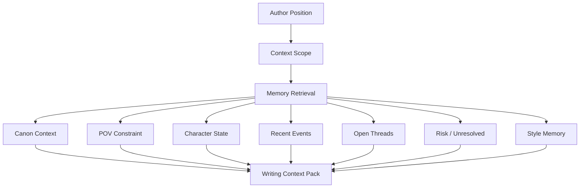
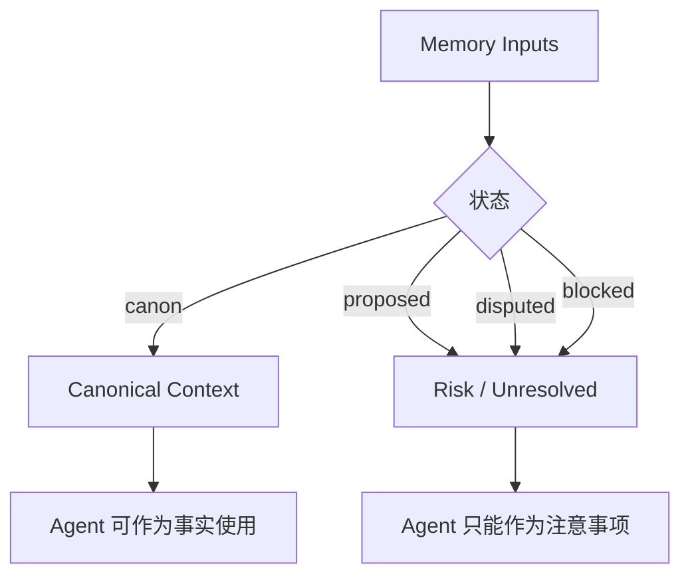
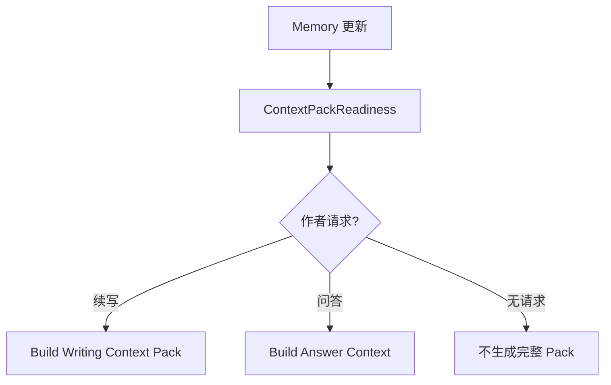

# 21. Writing Context Pack

> 本文档定义写作 Agent 在生成下一步候选前，应该从 Memory 中组织哪些上下文。这里不讨论实现方式，只讨论数据流、结构和边界。

## 1. 定位

Writing Context Pack 是 Agent 写作前的工作上下文。它不是普通摘要，也不是越多越好的资料堆叠，而是把当前写作位置所需的 canon、POV、角色状态、风险和风格约束组织成可用输入。



## 2. 输入

| 输入 | 说明 |
|---|---|
| current_source | 当前作品或手稿 |
| current_chapter | 当前章节 |
| current_scene | 当前场景，可为空 |
| current_pov | 当前 POV 角色，可为空 |
| author_intent | 作者这次请求的意图，如继续、改写、找方向 |
| mode | suggest_next_beat / draft_next_passage / rewrite_current_page / review |
| current_text_window | 当前页或当前段落的近邻文本 |

## 3. 输出结构

| 区域 | 内容 | 是否可作为 canon 使用 |
|---|---|---:|
| Current Position | 当前章节、场景、地点、故事时间 | 是 |
| Canonical Context | 已通过 gate 的 Current Canon、canon facts、canon edges | 是 |
| POV Constraint | 当前 POV 角色、视角模式、禁止信息 | 是 |
| Active Characters | 当前在场角色及已确认状态 | 是 |
| Character Agency State | 角色欲望、恐惧、边界、当前压力 | 是，若来自 canon 或作者设定 |
| Recent Events | 最近 CanonicalEvent，按状态标注 | 仅 canon 部分 |
| Character Knowledge | 当前角色知道、误解、不知道什么 | 是，若状态为 canon |
| Object / Location State | 关键物品、地点状态 | 是，若通过 gate |
| Open Threads | 相关伏笔、悬念、未解决问题 | 视状态而定 |
| Risk / Unresolved | open ReviewItem、proposed edge、disputed edge、低置信 alias | 否 |
| Style Memory | 近期语言节奏、叙述距离、意象、对话密度 | 辅助，不是事实 |
| Evidence Refs | SourceSpan 引用 | 是 |

## 4. Canon 与 Risk 分层

Writing Context Pack 必须区分可用事实和风险信息。



规则：

- `canon` 信息可以作为正文依据；
- `proposed` / `disputed` / `blocked` 信息只能进入风险区；
- Agent 不能把风险区内容当作已经成立的剧情事实；
- 如果用户明确要求探索某个 proposed 方向，Agent 仍应标注它尚未入 canon。

## 5. POV Constraint

POV 是 Writing Context Pack 的硬约束。

| 字段 | 说明 |
|---|---|
| pov_character | 当前视角角色 |
| pov_mode | first_person / third_limited / omniscient / multiple / unknown |
| allowed_knowledge | POV 角色可以知道的信息 |
| forbidden_knowledge | POV 角色不能知道的信息 |
| sensory_limits | 角色能看到、听到、感受到的范围 |
| inner_access | 是否允许进入该角色内心 |

示例：

```text
Forbidden Knowledge:
- Mira 不知道 Orrin 的真实身份。
- Mira 不知道地图已经被 Kestrel 转交给旧王。
- 读者尚未知道 “Starling” 称号来源。
```

## 6. Character Agency State

Writing Context Pack 不只告诉 Agent “谁在场”，还要告诉它角色为什么会行动。

| 字段 | 说明 |
|---|---|
| core_desire | 角色长期真正想要什么 |
| immediate_want | 当前场景想要什么 |
| fear_or_wound | 当前回避或害怕什么 |
| moral_boundary | 不会轻易做什么 |
| secret | 正在隐藏什么 |
| pressure | 当前事件对他的压力 |
| natural_next_action | 当前最自然的下一步 |

## 7. Style Memory

Style Memory 是为了让 Agent 续写当前作品，而不是只写出“正确剧情”。

| 维度 | 内容 |
|---|---|
| narrative_distance | 叙述距离，贴近内心还是外部观察 |
| sentence_rhythm | 句长、停顿、段落节奏 |
| imagery | 常用意象和感官偏好 |
| dialogue_density | 对话密度 |
| emotional_expression | 情绪如何表达，是直说还是压在动作里 |
| pov_voice | 当前 POV 的语言和观察方式 |
| recent_samples | 最近可参考的短文本片段 |

## 8. Context Pack 生成时机

Context Pack 按需生成。



增量回写后只更新 Memory、GraphProjection、ReviewItem 和 readiness 状态，不默认生成完整 Context Pack。

## 9. 结论

Writing Context Pack 是 Agent 的写作环境。

```text
它把 Memory 转换为当前写作可用的局部上下文，
同时严格区分 canon、risk、POV、style 和 character agency。
```
