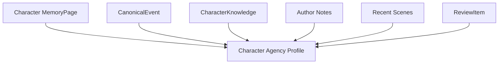
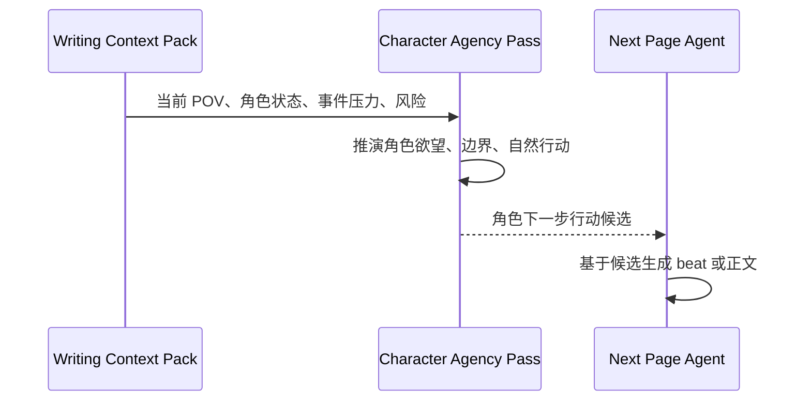
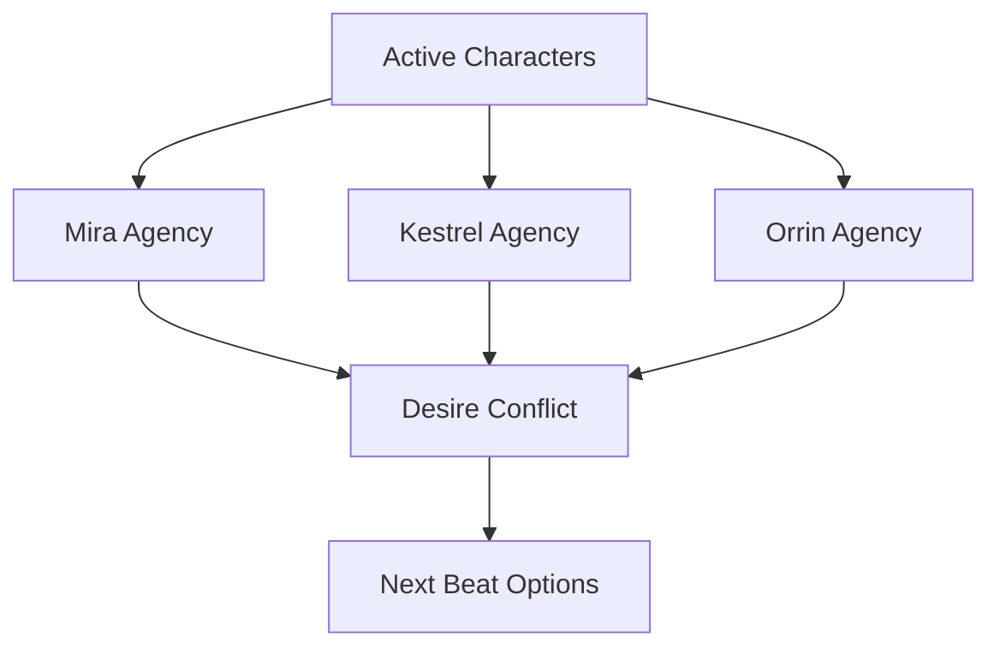

# 22. Character Agency Profile

> 本文档定义 Sextant 如何把“角色像活人一样行动”转化为可被 Agent 使用的记忆结构。这里不讨论实现方式，只讨论角色状态、行动约束和写作数据流。

## 1. 目标

Character Agency Profile 不是角色小传，也不是静态百科。它是 Agent 在写下一小步前理解角色“为什么会这样行动”的结构化记忆。

它服务三个问题：

```text
这个角色想要什么？
这个角色不会轻易做什么？
在当前压力下，这个角色自然会怎么反应？
```

## 2. 与普通角色设定的区别

| 普通角色设定 | Character Agency Profile |
|---|---|
| 描述角色是谁 | 描述角色如何行动 |
| 偏静态 | 会随事件变化 |
| 常用于百科查询 | 直接服务下一步写作 |
| 可能堆很多背景 | 只保留对当前行为有用的约束 |
| 容易变成标签 | 必须能推导角色选择 |

## 3. Profile 结构

| 模块 | 作用 |
|---|---|
| Core Desire | 角色长期真正想要什么 |
| Immediate Want | 当前场景中想要什么 |
| Fear / Wound | 角色害怕、回避或被刺痛的东西 |
| Moral Boundary | 角色不会轻易做什么 |
| Contradiction | 角色内在矛盾 |
| Secret | 角色隐藏的信息 |
| Knowledge State | 角色知道、误解、不知道什么 |
| Relationship Stance | 对其他角色的当前态度 |
| Voice Fingerprint | 语言节奏、词汇、观察方式 |
| Agency Rule | 在压力下倾向于如何行动 |
| Change Pressure | 当前事件如何逼迫角色改变 |

## 4. 数据来源

Character Agency Profile 不应凭空生成。它来自 Memory 中已有证据和作者设定。



来源优先级：

| 来源 | 权重 |
|---|---:|
| 作者明确设定 | 高 |
| 已通过 gate 的 Current Canon | 高 |
| CanonicalEvent 和 FactAssertion | 高 |
| CharacterKnowledge | 高 |
| 最近场景中的行为模式 | 中 |
| proposed / disputed 记忆 | 低，只进入风险区 |
| 模型推测 | 低，不能自动进入 canon |

## 5. 示例结构

```text
Character: Mira

Core Desire:
证明自己不是被命运摆布的人。

Immediate Want:
当前场景想拿回 Lantern Map，但不能暴露她已经怀疑 Kestrel。

Fear / Wound:
害怕自己其实依赖 Orrin，无法独立完成任务。

Moral Boundary:
不会牺牲无辜者换取线索。

Knowledge State:
知道地图被偷；不知道 Kestrel 已经转交给旧王。

Relationship Stance:
对 Kestrel 表面保持合作，实际开始怀疑。

Voice Fingerprint:
短句多，观察细节敏锐，情绪压在动作里，不直接说软弱。

Agency Rule:
被逼问时先反击，再转移话题；真正害怕时会关注物体细节。
```

## 6. Character Agency Pass

Agent 不应该一上来就写正文。它应先进行 Character Agency Pass。



Character Agency Pass 输出：

| 输出 | 说明 |
|---|---|
| natural_action | 角色自然会做的动作 |
| likely_dialogue_move | 角色自然会说什么或回避什么 |
| hidden_pressure | 角色此刻被什么压力驱动 |
| forbidden_action | 角色不应突然做什么 |
| agency_rationale | 为什么这个动作符合角色 |
| conflict_opportunity | 哪个动作能制造真实冲突 |

## 7. 多角色场景

多角色场景中，Agent 应先分别推演，再寻找冲突。



不要让所有角色都为剧情服务。每个主要角色都应有自己的欲望、隐藏信息和边界。

## 8. 与 POV 的关系

POV 角色可以有完整内心访问；非 POV 角色只能通过可观察行为表现。

| 角色类型 | Agent 可使用的信息 | 正文中可呈现的信息 |
|---|---|---|
| POV 角色 | 欲望、恐惧、误解、内心想法 | 可进入内心 |
| 非 POV 角色 | 目标、秘密、行动倾向 | 只能通过动作、台词、表情、沉默呈现 |
| 未在场角色 | 仅作为背景或记忆 | 不应突然影响当前场景，除非有媒介 |

## 9. 角色灵魂不是 canon 的替代品

Character Agency Profile 是行为模型，不是事实源。

- 它必须引用 Memory 或作者设定；
- 它可以随新事件更新；
- 它不能替代 SourceSpan；
- 它不能让 Agent 违背 Current Canon；
- 它可以保留矛盾，但必须标注为 open / disputed。

## 10. 结论

Character Agency Profile 是 Sextant Agent 的核心。

```text
不是 plot 推着角色走，
而是角色在 Memory 约束下自然行动，
从而推动下一页。
```
