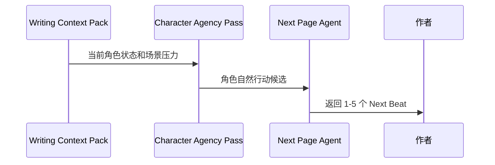
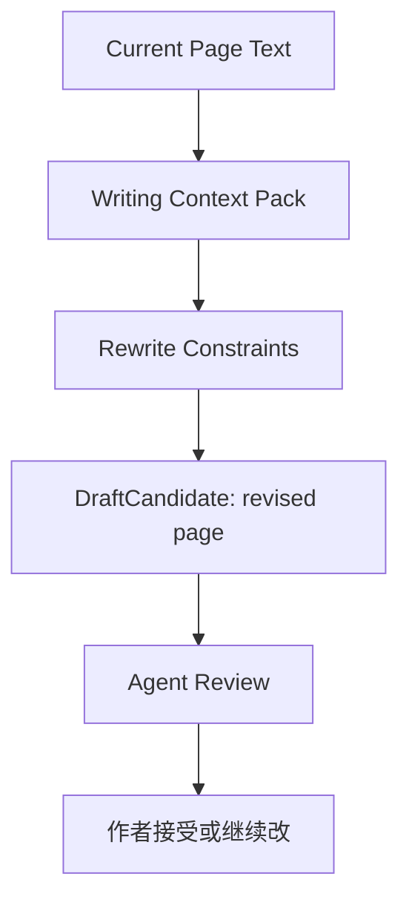
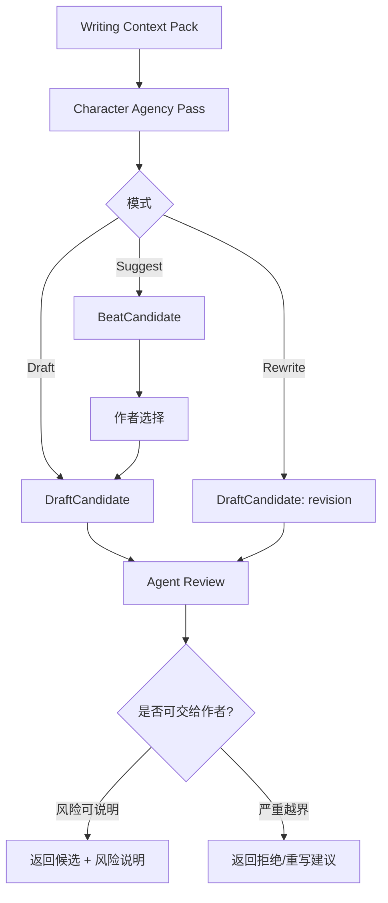

# 23. Next Page Agent

> 本文档定义 Sextant 第一版写作 Agent 如何逐页、逐段推进写作。这里不讨论实现方式，只讨论输入、输出、模式和数据流。

## 1. 定位

Next Page Agent 是 Sextant 第一版 Agent 的核心。它不负责写完整小说，也不负责规划全书。它只负责在当前 Memory、当前 POV、当前角色状态约束下，帮助作者推进下一小步。

```text
当前场景 + 当前 POV + 当前角色压力
  ↓
角色自然行动
  ↓
下一步候选
  ↓
候选正文
  ↓
作者接受后进入 Memory
```

## 2. 三种工作模式

| 模式 | 目标 | 输出 |
|---|---|---|
| Suggest Next Beat | 只给下一步方向，不写正文 | BeatCandidate 列表 |
| Draft Next Passage | 写下一小段正文 | DraftCandidate |
| Rewrite Current Page | 打磨当前页，不推进剧情 | DraftCandidate |

## 3. Suggest Next Beat

Suggest Next Beat 只回答：角色自然会做什么、故事下一小步有哪些可能。



BeatCandidate 结构：

| 字段 | 说明 |
|---|---|
| beat_id | 候选方向 ID |
| summary | 下一步发生什么 |
| driver_character | 主要推动角色 |
| agency_rationale | 为什么这个角色会这么做 |
| tension | 该 beat 制造的张力 |
| risk | 是否可能冲突、泄露或偏离 POV |
| memory_refs | 相关 MemoryPage / CanonicalEvent / SourceSpan |

## 4. Draft Next Passage

Draft Next Passage 生成下一小段正文。它必须遵守 Writing Context Pack。

输入：

| 输入 | 说明 |
|---|---|
| Writing Context Pack | 当前 canon、POV、角色、风险、风格 |
| Selected Beat | 作者选定或 Agent 推荐的下一步方向 |
| Passage Length | 建议一小段到一页 |
| Style Constraint | 近期风格和当前 POV 声音 |

输出：

| 输出 | 说明 |
|---|---|
| DraftCandidate | 候选正文 |
| rationale | 为什么这样写 |
| used_context | 使用了哪些记忆 |
| risk_notes | 可能风险 |
| revision_options | 可选修改方向 |

## 5. Rewrite Current Page

Rewrite Current Page 不推进剧情，只打磨已有文本。

它可以处理：

- 语言节奏；
- 叙述距离；
- POV 漂移；
- 角色声音；
- 过度解释；
- 情绪表达；
- 对话自然度；
- 意象和场景氛围。



Rewrite 不应：

- 偷偷改变已发生事件；
- 引入新 canon；
- 修复矛盾时不提示作者；
- 把未确认 proposed 信息写成事实。

## 6. Next Page Agent 主流程



## 7. Agent 输出要求

所有输出都应带有：

| 字段 | 说明 |
|---|---|
| candidate_text | 候选正文或候选方向 |
| mode | suggest / draft / rewrite |
| memory_used | 使用了哪些 Memory 对象 |
| evidence_refs | 关键证据引用 |
| risk_summary | 风险摘要 |
| author_options | 作者可以接受、修改、重写或换方向 |

## 8. 生成约束

Next Page Agent 必须遵守：

- 不使用 POV 角色不知道的信息；
- 不把 proposed / disputed 当作 canon；
- 不强行解决 ReviewItem；
- 不违背 Character Agency Profile；
- 不绕过作者接受；
- 不自动写入 Memory；
- 不生成过长文本作为第一版默认行为。

## 9. 失败模式

| 失败模式 | 说明 | 应对 |
|---|---|---|
| Plot forcing | 为剧情强迫角色做不自然的事 | 回到 Character Agency Pass |
| Canon leak | 使用未确认或 POV 不知道的信息 | 生成 ReviewItem / 修改候选 |
| Style drift | 写得不像当前作品 | 重新读取 Style Memory |
| Over-generation | 一次写太多，越过作者控制 | 缩短为 passage / beat |
| Self-canonization | Agent 生成后自己当事实使用 | 只允许作者接受后进入 SourceDelta |

## 10. 结论

Next Page Agent 的核心不是“写得多”，而是“在正确约束下写下一小步”。

```text
小步推进，比一次生成整章更适合长期小说写作。
```
