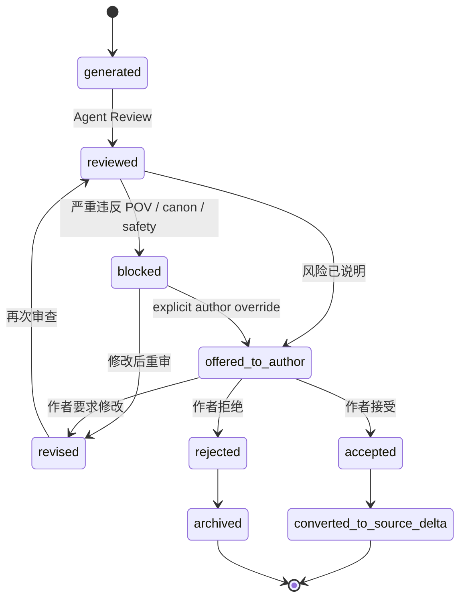
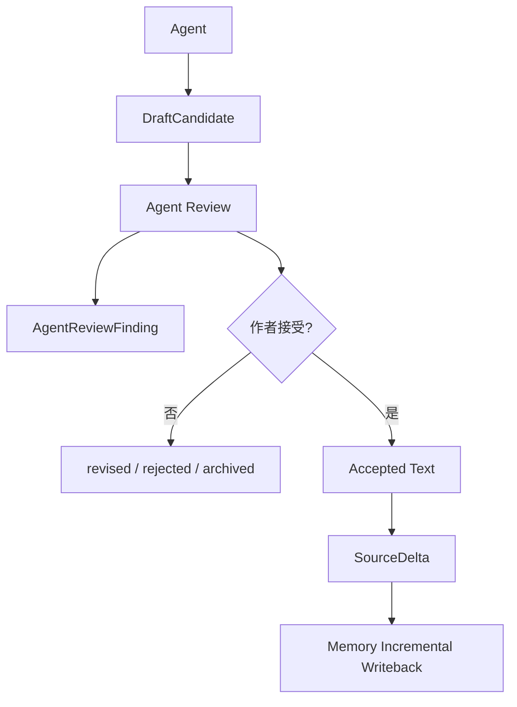
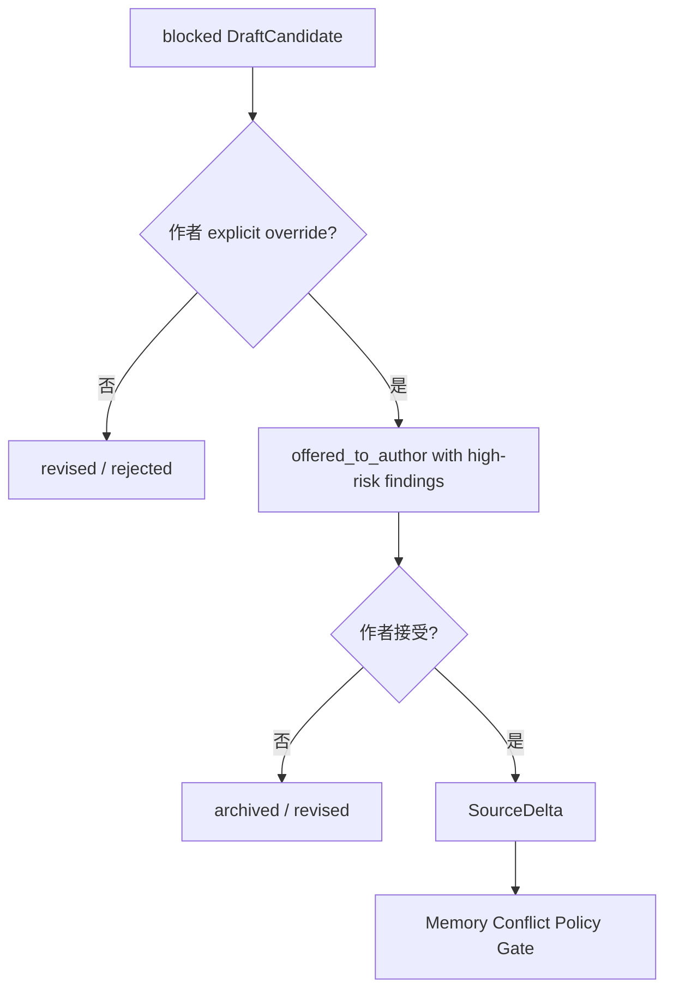
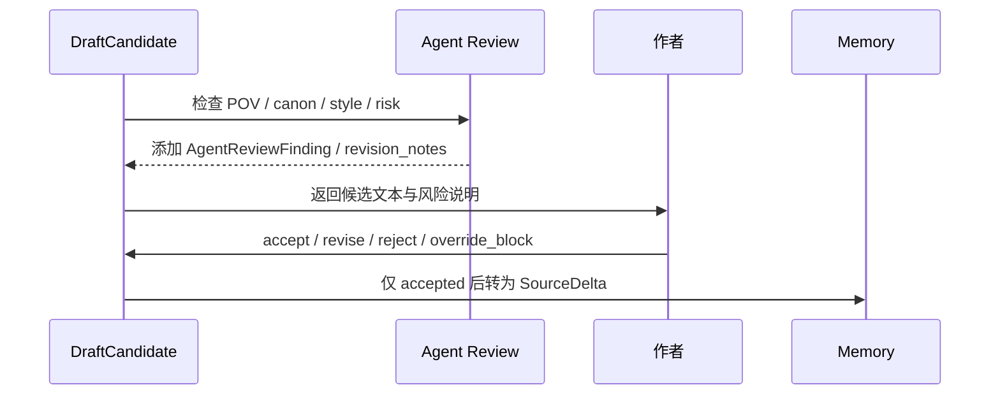
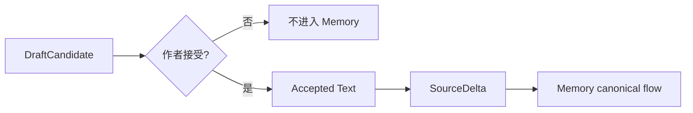

# 24. Draft Candidate 生命周期

> 本文档定义 Agent 生成的候选文本如何从草稿、审查、修改、接受，最终进入 Memory。这里不讨论实现方式，只讨论状态、边界和数据流。

## 1. 核心原则

DraftCandidate 不是 canon。它只是 Agent 提出的候选文本。

```text
DraftCandidate ≠ RawSource
DraftCandidate ≠ Current Canon
DraftCandidate ≠ FactAssertion
DraftCandidate risk ≠ ReviewItem
```

只有作者接受之后，DraftCandidate 才能变成 Accepted Text，并通过 SourceDelta 进入 Memory 的 canonical flow。

## 2. 生命周期总览



## 3. DraftCandidate 结构

DraftCandidate 必须知道自己针对哪一段文本生成。否则在 `Rewrite Current Page`、部分接受、多个候选并发时，系统无法安全生成 SourceDelta。

| 字段 | 说明 |
|---|---|
| draft_candidate_id | 候选文本 ID |
| mode | suggest_next_beat / draft_next_passage / rewrite_current_page |
| candidate_text | 候选文本或候选方向 |
| context_pack_id | 使用的 Writing Context Pack |
| selected_beat_id | 使用的 BeatCandidate，可为空 |
| target_source_id | 目标 RawSource，可为空，新作品或新材料时为空 |
| target_version_id | 候选基于哪个 SourceVersion |
| target_scene_id | 候选针对的场景，可为空 |
| affected_range | append / replace 的目标范围，可为空 |
| base_hash | 候选生成时目标文本的基线 hash，用于避免覆盖过期文本 |
| memory_refs | 使用到的 MemoryPage、CanonicalEvent、FactAssertion |
| evidence_refs | 关键 SourceSpan 引用 |
| agent_review_findings | AgentReviewFinding 列表 |
| status | generated / reviewed / offered_to_author / accepted / revised / rejected / blocked / archived |
| author_action | accept / reject / revise / regenerate / change_direction / override_block，可为空 |
| accepted_text_ref | 作者接受后的文本引用，可为空 |
| override_reason | 作者 override blocked 候选的原因，可为空 |

## 4. DraftCandidate 与 Memory 的边界



边界规则：

| 规则 | 说明 |
|---|---|
| Agent 不能直接写 RawSource | 只有作者接受的文本才进入 SourceDelta |
| DraftCandidate 不参与 canon promotion | 它不是事实源 |
| AgentReviewFinding 不是正式 ReviewItem | pre-acceptance 风险没有新 SourceSpan，不进入 Memory Review 生命周期 |
| DraftCandidate 可被保存作工作历史 | 但不能污染 Current Canon |
| 被拒绝候选不能用于后续 canon 推理 | 除非作者重新引用或恢复 |
| 被接受候选仍要走 Memory ingest | 不跳过 SourceSpan、EventCandidate、Conflict Gate |

## 5. 作者操作

| 操作 | 含义 | 后续状态 |
|---|---|---|
| accept_as_draft_text | 接受候选文本进入作品正文草稿 | accepted -> SourceDelta |
| accept_as_published_text | 接受候选文本进入已确认正文 | accepted -> SourceDelta |
| accept_as_note | 不作为正文，作为作者笔记 | accepted -> SourceDelta |
| accept_partial | 只接受候选的一部分 | accepted partial -> SourceDelta |
| override_block | 作者明确要求查看或使用 blocked 候选 | blocked -> offered_to_author，必须保留 high-risk findings |
| reject | 拒绝候选 | rejected / archived |
| revise | 要求按指令修改 | revised -> reviewed |
| regenerate | 换一种写法 | generated -> reviewed |
| change_direction | 换下一步方向 | 回到 Character Agency Pass |

## 6. Blocked candidate override

`blocked` 表示候选存在严重风险，不建议直接交付为正文。它不是绝对禁止作者使用，而是要求作者明确 override。

允许 override 的情况：

| 情况 | 说明 |
|---|---|
| unreliable narrator | 作者明确想制造不可靠叙述者效果 |
| intentional POV break | 作者明确要求打破既有 POV 约束 |
| deliberate canon change | 作者决定改变 canon，旧设定后续会变 outdated |
| major character introduction | 作者明确想引入新的 major character |
| experimental draft | 作者只想试写，不立即进入 canon |

Override 规则：

- blocked 候选必须保留 high-risk AgentReviewFinding；
- override 后可以进入 `offered_to_author`，但不能静默变成安全候选；
- 如果作者接受，仍必须走 SourceDelta 和 Memory Conflict Policy Gate；
- Memory gate 可以继续阻断 canon promotion，生成正式 ReviewItem；
- override_reason 应记录在 DraftCandidate provenance 中。



## 7. Accepted Text 到 SourceDelta 的映射

作者接受时必须明确这段文本进入 Memory 的语义地位。模型来源可以作为 provenance 保留，但不能让已接受正文继续使用 `model_suggestion` 的低权重 scope。

| 作者接受方式 | source_type | source_scope | 说明 |
|---|---|---|---|
| accept_as_draft_text | draft_manuscript | user_draft | 默认正文草稿；可参与 canon promotion，但仍走 gate |
| accept_as_published_text | draft_manuscript | user_published | 作者确认的正文；权重高，仍需证据和 gate |
| accept_as_note | author_notes | author_note / outline_plan | 作者设定、计划或灵感，不当作已发生正文事件 |
| accept_partial | 取决于接受目标 | 取决于接受目标 | 只把被接受部分转成 SourceDelta |
| reject / archived | 不生成 SourceDelta | 不生成 SourceDelta | 未接受候选永不进入 Memory |

推荐保留 provenance：

| provenance 字段 | 说明 |
|---|---|
| generated_by_agent | 候选最初由 Agent 生成 |
| draft_candidate_id | 来源 DraftCandidate |
| author_edited | 作者是否编辑过 |
| accepted_by | 接受者 |
| accepted_at | 接受时间 |
| override_reason | 如果来自 blocked override，记录作者 override 原因 |

## 8. Review before acceptance

DraftCandidate 在交给作者前应先经过 Agent Review。



## 9. DraftCandidate 的状态含义

| 状态 | 含义 |
|---|---|
| generated | Agent 已生成，但尚未审查 |
| reviewed | 已完成 Agent Review |
| offered_to_author | 可交给作者选择，可能带风险说明 |
| accepted | 作者接受为正文或明确设定 |
| revised | 作者要求修改或 Agent 自我修订 |
| rejected | 作者拒绝 |
| blocked | 存在严重风险，不建议直接提供为正文，除非作者 explicit override |
| archived | 仅保留历史，不参与后续 canon |

## 10. AgentReviewFinding

Agent Review 风险标注不等于正式 ReviewItem。它用于帮助作者判断是否接受。

| 常见风险 | 说明 | 是否通常进入 Memory ReviewItem |
|---|---|---:|
| pov_risk | 可能使用了 POV 不该知道的信息 | 接受后可能映射 |
| knowledge_risk | 可能使用角色不该知道的信息 | 接受后可能映射 |
| canon_risk | 可能违背 Current Canon | 接受后可能映射 |
| character_risk | 角色行动不符合 Agency Profile | 通常不映射，作为草稿修订建议 |
| style_risk | 风格偏离当前作品 | 否，draft-local |
| unresolved_risk | 使用了 proposed / disputed 信息 | 接受后可能映射 |
| continuity_risk | 可能引入连续性问题 | 接受后可能映射 |
| control_risk | 一次推进太多，替作者决定大方向 | 通常不映射，作为草稿修订建议 |

完整 `risk_type` 白名单见 [26-agent-review-policy.md](26-agent-review-policy.md) 第 4 节；本文只列常见示例。

## 11. 进入 Memory 的条件

DraftCandidate 进入 Memory 的条件只有一个：作者接受。



进入 Memory 后，Accepted Text 不享有特殊通道。它和作者手写文本一样，走：

```text
SourceDelta -> RawSource / SourceVersion -> ProcessedMarkdownView -> SourceSpan -> Mention / EventCandidate -> FactAssertion -> Evidence / Log -> Conflict Gate -> Canon Promotion
```

## 12. 安全生成 SourceDelta

生成 SourceDelta 时必须使用 DraftCandidate 的目标位置字段。`base_hash` 是生成前校验条件，不是 SourceDelta 持久字段：

| 生成 SourceDelta 所需输入 / 校验 | 来自 DraftCandidate |
|---|---|
| change_type | append / replace / new_source，由 mode 和作者操作决定 |
| source_id | target_source_id |
| version_id | target_version_id |
| affected_range | affected_range |
| submitted_text_ref | accepted_text_ref |
| precondition: target text unchanged | base_hash，用于确认目标文本未过期 |
| source_type / source_scope | 作者接受方式决定 |

如果 `base_hash` 与当前目标版本不一致，系统不应静默生成 replace 型 SourceDelta，应要求作者重新确认或重新生成候选。

## 13. 结论

DraftCandidate 生命周期保护了作者主权和 Memory 可信度。

```text
Agent 可以大胆提出；
作者决定是否接受；
Memory 只记录被接受的作品事实；
pre-acceptance 风险留在 DraftCandidate 层，正式 ReviewItem 只由 Memory gate 生成。
```
