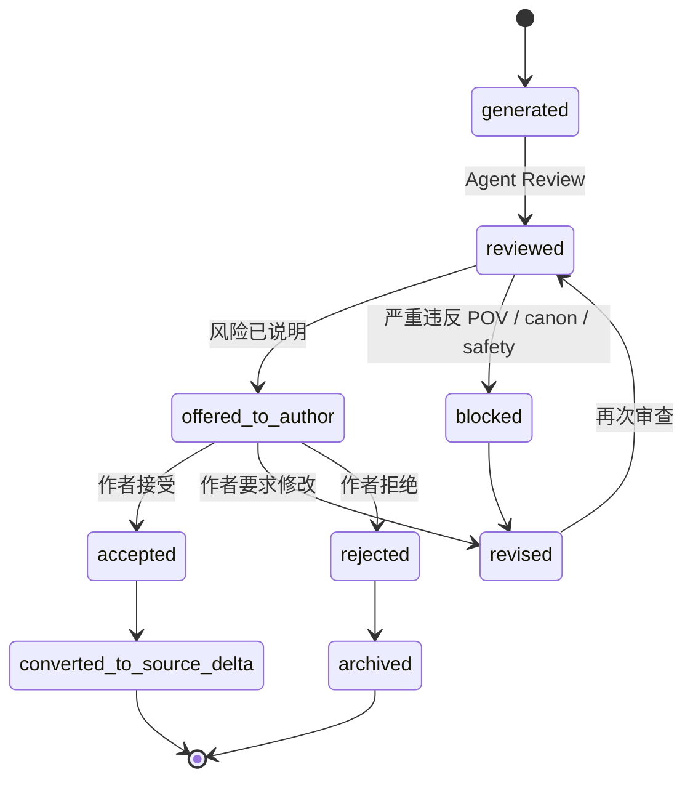
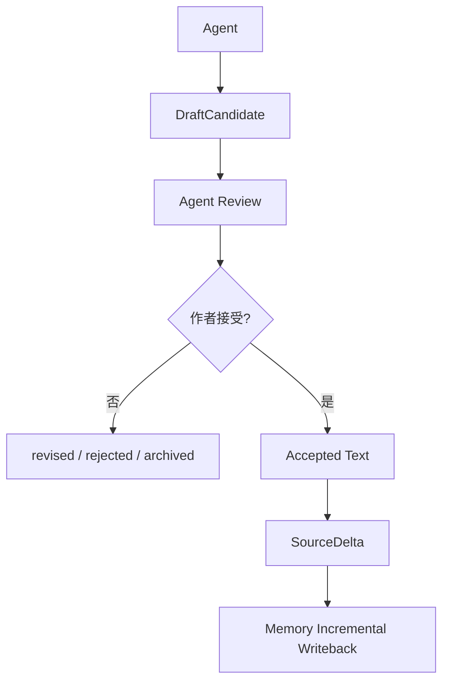
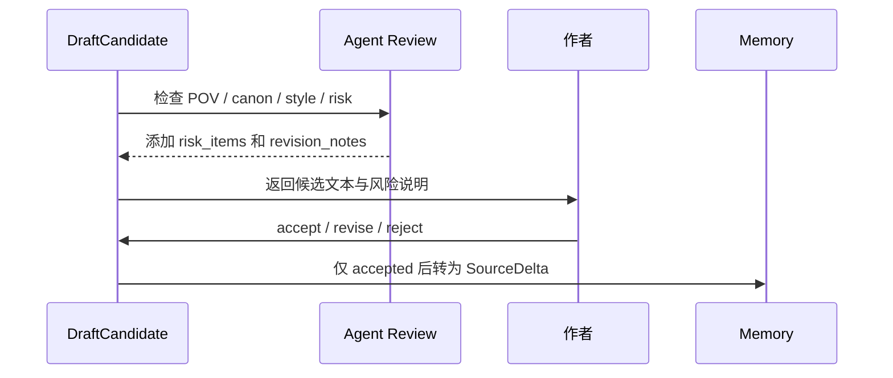
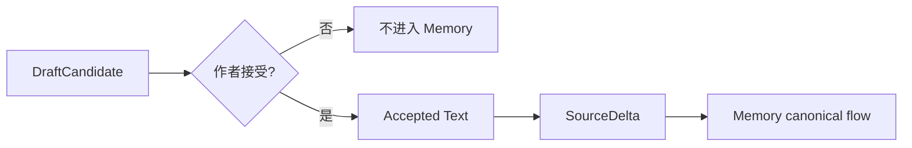

# 24. Draft Candidate 生命周期

> 本文档定义 Agent 生成的候选文本如何从草稿、审查、修改、接受，最终进入 Memory。这里不讨论实现方式，只讨论状态、边界和数据流。

## 1. 核心原则

DraftCandidate 不是 canon。它只是 Agent 提出的候选文本。

```text
DraftCandidate ≠ RawSource
DraftCandidate ≠ Current Canon
DraftCandidate ≠ FactAssertion
```

只有作者接受之后，DraftCandidate 才能变成 Accepted Text，并通过 SourceDelta 进入 Memory 的 canonical flow。

## 2. 生命周期总览



## 3. DraftCandidate 结构

| 字段 | 说明 |
|---|---|
| draft_candidate_id | 候选文本 ID |
| mode | suggest_next_beat / draft_next_passage / rewrite_current_page |
| candidate_text | 候选文本或候选方向 |
| context_pack_id | 使用的 Writing Context Pack |
| selected_beat_id | 使用的 BeatCandidate，可为空 |
| memory_refs | 使用到的 MemoryPage、CanonicalEvent、FactAssertion |
| evidence_refs | 关键 SourceSpan 引用 |
| risk_items | 相关 ReviewItem 或风险说明 |
| status | generated / reviewed / offered_to_author / accepted / revised / rejected / blocked / archived |
| author_action | accept / reject / revise / regenerate / change_direction，可为空 |
| accepted_text_ref | 作者接受后的文本引用，可为空 |

## 4. DraftCandidate 与 Memory 的边界



边界规则：

| 规则 | 说明 |
|---|---|
| Agent 不能直接写 RawSource | 只有作者接受的文本才进入 SourceDelta |
| DraftCandidate 不参与 canon promotion | 它不是事实源 |
| DraftCandidate 可被保存作工作历史 | 但不能污染 Current Canon |
| 被拒绝候选不能用于后续 canon 推理 | 除非作者重新引用或恢复 |
| 被接受候选仍要走 Memory ingest | 不跳过 SourceSpan、EventCandidate、Conflict Gate |

## 5. 作者操作

| 操作 | 含义 | 后续状态 |
|---|---|---|
| accept | 接受候选文本进入作品 | accepted -> SourceDelta |
| reject | 拒绝候选 | rejected / archived |
| revise | 要求按指令修改 | revised -> reviewed |
| regenerate | 换一种写法 | generated -> reviewed |
| change_direction | 换下一步方向 | 回到 Character Agency Pass |
| use_as_note | 不作为正文，作为作者笔记 | SourceDelta with source_scope = author_note |

## 6. Review before acceptance

DraftCandidate 在交给作者前应先经过 Agent Review。



## 7. DraftCandidate 的状态含义

| 状态 | 含义 |
|---|---|
| generated | Agent 已生成，但尚未审查 |
| reviewed | 已完成 Agent Review |
| offered_to_author | 可交给作者选择 |
| accepted | 作者接受为正文或明确设定 |
| revised | 作者要求修改或 Agent 自我修订 |
| rejected | 作者拒绝 |
| blocked | 存在严重风险，不建议直接提供为正文 |
| archived | 仅保留历史，不参与后续 canon |

## 8. DraftCandidate 的风险标注

风险标注不等于拒绝。它用于帮助作者判断是否接受。

| 风险 | 说明 |
|---|---|
| pov_risk | 可能使用了 POV 不该知道的信息 |
| canon_risk | 可能违背 Current Canon |
| character_risk | 角色行动不符合 Agency Profile |
| style_risk | 风格偏离当前作品 |
| unresolved_risk | 使用了 proposed / disputed 信息 |
| continuity_risk | 可能引入连续性问题 |

## 9. 进入 Memory 的条件

DraftCandidate 进入 Memory 的条件只有一个：作者接受。



进入 Memory 后，Accepted Text 不享有特殊通道。它和作者手写文本一样，走：

```text
SourceDelta -> RawSource / SourceVersion -> ProcessedMarkdownView -> SourceSpan -> Mention / EventCandidate -> FactAssertion -> Evidence / Log -> Conflict Gate -> Canon Promotion
```

## 10. 结论

DraftCandidate 生命周期保护了作者主权和 Memory 可信度。

```text
Agent 可以大胆提出；
作者决定是否接受；
Memory 只记录被接受的作品事实。
```
