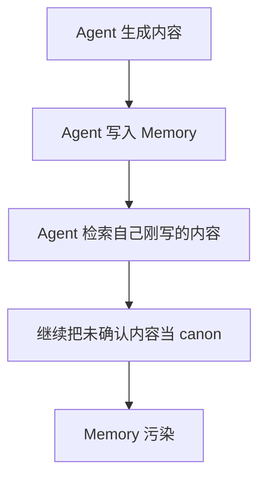
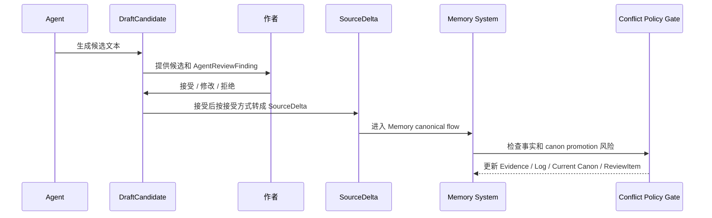
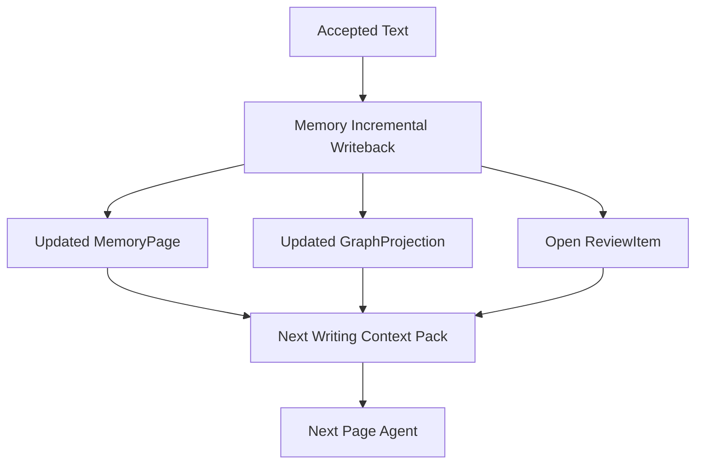

# 25. Agent 与 Memory 回写

> 本文档定义 Agent 生成内容如何进入 Memory，以及 Memory 如何反过来服务下一轮 Agent 写作。这里不讨论实现方式，只讨论数据流和边界。

## 1. 核心原则

Agent 不能直接写 Current Canon。Agent 只能生成 DraftCandidate。只有作者接受后的文本，才能作为 SourceDelta 进入 Memory。

```text
Agent -> DraftCandidate -> Author Accept -> SourceDelta -> Memory canonical flow
```

## 2. 为什么不能让 Agent 直接写 Memory

如果 Agent 可以直接把自己生成的内容写进 Memory，会产生自证循环：



因此必须保留作者接受这一道边界。

## 3. 回写流程



## 4. Accepted Text 到 SourceDelta 的 source 语义

作者接受 Agent 文本后，source_type / source_scope 由作者接受意图决定，而不是由“最初由模型生成”决定。

| 作者接受方式 | source_type | source_scope | 说明 |
|---|---|---|---|
| 接受为正文草稿 | draft_manuscript | user_draft | 默认正文草稿；可参与 canon promotion，但仍走 gate |
| 接受为已确认正文 | draft_manuscript | user_published | 作者确认的正文；权重高，仍需证据和 gate |
| 接受为作者笔记 | author_notes | author_note | 作者设定或说明 |
| 接受为大纲/未来计划 | outline / author_notes | outline_plan | 未来意图，不当作已发生事件 |
| 未接受 | 不生成 SourceDelta | 不生成 SourceDelta | 永不进入 Memory |

模型来源应保存在 provenance 中，而不是把已接受正文降权为 `model_suggestion`。

| provenance 字段 | 说明 |
|---|---|
| generated_by_agent | 候选最初由 Agent 生成 |
| draft_candidate_id | 来源 DraftCandidate |
| author_edited | 作者是否编辑过 |
| accepted_by | 接受者 |
| accepted_at | 接受时间 |

## 5. 回写后的 Memory 更新

Accepted Text 进入 Memory 后，与普通作者文本相同。

| 阶段 | 说明 |
|---|---|
| SourceDelta | 一次新增或修改的输入 envelope |
| RawSource / SourceVersion | 保存被接受文本和版本 |
| ProcessedMarkdownView | 生成规范化处理视图 |
| SourceSpan | 建立证据片段 |
| Mention / EventCandidate | 抽取提及和事件候选 |
| CanonicalEvent / FactAssertion | 聚合事件、派生事实 |
| Evidence / Log | 先写证据日志 |
| Conflict Policy Gate | 决定是否进入 Current Canon |
| MemoryPage / GraphProjection | 更新记忆页与图谱投影 |

## 6. 回写状态

| 状态 | 含义 |
|---|---|
| accepted_pending_ingest | 作者接受，但尚未进入 Memory flow |
| ingested_as_source_delta | 已作为 SourceDelta 进入 Memory |
| evidence_logged | SourceSpan、Mention、EventCandidate 已保存 |
| canon_promoted | 低风险或作者接受后进入 Current Canon |
| review_required | 有风险，生成正式 ReviewItem |
| rejected_from_canon | 保留证据，但不进入 Current Canon |

## 7. AgentReviewFinding 与 ReviewItem

Agent Review 和 Memory Conflict Policy 都会发现风险，但它们的输出对象不同。

| 来源 | 输出 | 作用 |
|---|---|---|
| Agent Review | AgentReviewFinding | 在作者接受前提示候选文本风险 |
| Memory Conflict Policy | ReviewItem | 在接受文本进入 Memory 后检查 canon promotion 风险 |

二者不矛盾：

```text
Agent Review 保护作者选择。
Memory Conflict Policy 保护 canon。
```

AgentReviewFinding 只有在作者接受候选、候选进入 SourceDelta，并且 Memory ingest 后风险仍成立时，才可能由 Conflict Policy Gate 转化为正式 ReviewItem。

## 8. 回写后如何服务下一轮 Agent

Memory 更新后，下一轮 Agent 不直接读取上一次 DraftCandidate，而是读取 Memory 处理后的结果。



这保证下一轮写作基于被接受和被处理过的记忆，而不是模型候选历史。

## 9. 特殊情况

### 9.1 作者接受为“笔记”而非正文

作者可以选择把 DraftCandidate 作为作者笔记，而不是正文。

```text
DraftCandidate -> source_type = author_notes -> source_scope = author_note / outline_plan
```

这类内容可以影响未来方向，但不应被当作已经发生的事件。

### 9.2 作者部分接受

如果作者只接受候选文本的一部分，应只把被接受部分转成 SourceDelta。未接受部分保留为 archived DraftCandidate。

部分接受必须使用 DraftCandidate 的 `affected_range`、`base_hash` 和作者实际接受的文本范围，避免覆盖错误版本。

### 9.3 作者修改后接受

如果作者编辑了候选文本，应以作者修改后的版本为 SourceDelta。原 DraftCandidate 只能作为工作历史。

## 10. 不允许的回写

- Agent 自己把 DraftCandidate 写成 RawSource；
- Agent 自己把 DraftCandidate 标记为 accepted；
- Agent 自己解决 ReviewItem 并改写 Current Canon；
- Agent 把 rejected DraftCandidate 当作后续事实依据；
- Agent 把 proposed / disputed 记忆写成正文事实而不提示；
- 把已接受正文继续标记为 `model_suggestion`，导致它无法正常参与 canon promotion。

## 11. 结论

Agent 与 Memory 的关系应保持清晰：

```text
Agent 负责提出。
作者负责接受。
Memory 负责记录、审查和回写。
```

这条边界是 Sextant 长期稳定的基础。
