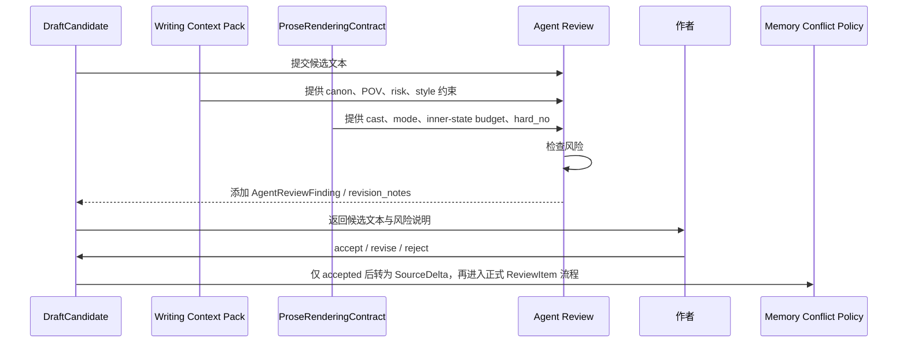
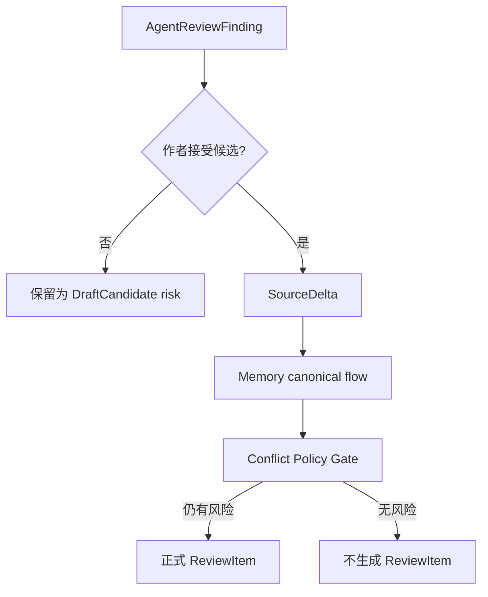

# 26. Agent Review Policy

> 本文档定义 Agent 在把候选文本交给作者前应检查什么，以及这些检查如何与 Memory 的 ReviewItem / Conflict Policy 配合。这里不讨论实现方式，只讨论设计边界。

## 1. 目标

Agent Review 的目标不是替作者审美，也不是强行阻止作者写作，而是在候选文本进入作者决策前，提示它可能带来的风险。

```text
Agent Review protects the author’s choice.
Memory Conflict Policy protects canon.
```

## 2. AgentReviewFinding 与 ReviewItem 的边界

Agent Review 发生在作者接受候选文本之前。此时还没有正式 SourceDelta，也没有新 SourceSpan。因此它不能直接产生正式 `ReviewItem`。

本阶段输出统一称为：

```text
AgentReviewFinding
```

`ReviewItem` 只属于 Memory 系统：Accepted Text 进入 `SourceDelta`，经过 SourceSpan / FactAssertion / Conflict Policy Gate 后，才可能产生正式 `ReviewItem`。

| 对象 | 所属阶段 | 是否需要 SourceSpan | 是否进入 Memory Review 生命周期 |
|---|---|---:|---:|
| AgentReviewFinding | 作者接受前 | 不要求新 SourceSpan，可引用旧 Memory 证据 | 否 |
| ReviewItem | Accepted Text 进入 Memory 后 | 是 | 是 |

## 3. Agent Review 与 Memory Conflict Policy 的区别

| 项目 | Agent Review | Memory Conflict Policy |
|---|---|---|
| 发生时间 | DraftCandidate 交给作者前 | Accepted Text 进入 Memory 后 |
| 检查对象 | 候选文本 | SourceDelta / FactAssertion / Canon Promotion |
| 目标 | 帮作者判断是否接受候选 | 保护 Current Canon |
| 输出 | AgentReviewFinding / revision notes | ReviewItem / canon promotion decision |
| 是否能改 canon | 否 | 可以在 gate 通过后改写 Current Canon |

## 4. AgentReviewFinding risk_type 白名单

所有草稿层风险都必须使用本节的 `risk_type`。其他文档可以列局部示例，但不应维护第二套风险类型。

### 4.1 Memory / Canon 风险

这些风险接受后可能映射成正式 ReviewItem。

| risk_type | 说明 |
|---|---|
| pov_risk | 使用了当前 POV 不该知道、看见或感受到的信息 |
| knowledge_risk | 角色知道、误解或泄露了不该知道的信息 |
| canon_risk | 候选文本可能违反 Current Canon |
| unresolved_risk | 把 proposed / disputed / blocked 记忆当成事实使用 |
| continuity_risk | 可能引入时间线、物品、关系或状态连续性问题 |
| forbidden_knowledge_leak | 泄露 Writing Context Pack 明确禁止的信息 |
| non_pov_mind_reading | 直接写了非 POV 角色内心 |
| target_range_risk | rewrite 或 replace 可能覆盖错误文本范围或过期版本 |

### 4.2 Character / Agency 风险

这些风险通常是草稿层修订建议，只有接受后造成事实冲突时才进入正式 ReviewItem。

| risk_type | 说明 |
|---|---|
| character_risk | 角色行为不符合 Character Agency Profile |
| agency_break_risk | 角色突然违背核心欲望、恐惧、边界且缺少场景压力解释 |
| control_risk | Agent 一次推进太多，替作者决定大方向 |

### 4.3 Cast / Storytelling 风险

这些风险来自 Storytelling Control Layer，默认是草稿层风险。

| risk_type | 说明 |
|---|---|
| cast_reuse_risk | 过度复用已有角色，导致巧合或世界变小 |
| cast_creation_risk | 新角色承担过重 canon 功能或像 major character |
| cast_focus_risk | 新角色抢走当前场景焦点 |
| cast_complexity_risk | cast 扩展过快，读者负担上升 |
| cast_policy_violation | 创建或复用角色不符合 ProseRenderingContract 中的 cast policy |

### 4.4 Dramatization / Prose 风险

这些风险通常不进入正式 ReviewItem，除非同时触发 POV / canon / source conflict。

| risk_type | 说明 |
|---|---|
| style_risk | 风格偏离当前作品 |
| exposition_risk | 直接解释太多，缺少场景行为 |
| dramatization_risk | 缺少可观察行动、冲突、选择或 turn |
| inner_state_overload | 一段内心状态过多，导致流水账 |
| telling_over_action | 应该通过行动表现，却写成解释 |
| subtext_missing | 台词只在说明信息，缺少潜台词 |
| choice_missing | 角色没有做选择，只是在想 |
| scene_mode_risk | action scene 缺少 goal / opposition / turn |
| sequel_mode_risk | reaction scene 缺少 dilemma / decision |
| mode_mixing_risk | 动作、反应、解释混乱，节奏不清 |
| no_turn_risk | 段落没有任何变化、决定、阻力或推进 |
| prose_contract_violation | 违反 ProseRenderingContract 的硬约束或中等约束 |
| inner_state_budget_violation | 直接内心说明超过合同预算 |

## 5. 检查类型

| 检查 | 说明 | 常见 AgentReviewFinding risk_type |
|---|---|---|
| POV Check | 是否使用当前 POV 不该知道的信息 | pov_risk / knowledge_risk / forbidden_knowledge_leak / non_pov_mind_reading |
| Canon Check | 是否违反 Current Canon | canon_risk / unresolved_risk |
| Character Agency Check | 角色行为是否违背欲望、恐惧、边界、认知 | character_risk / agency_break_risk |
| Cast Check | 是否过度复用旧角色或创建过重角色 | cast_reuse_risk / cast_creation_risk / cast_policy_violation |
| Dramatization Check | 内心状态是否转成动作、对话、选择、沉默 | dramatization_risk / exposition_risk / inner_state_overload |
| Scene / Sequel Check | 段落是否有 goal、opposition、turn 或 dilemma、decision | scene_mode_risk / sequel_mode_risk / no_turn_risk |
| Prose Contract Check | 是否违反 ProseRenderingContract | prose_contract_violation / inner_state_budget_violation |
| Style Check | 是否偏离当前作品语言和节奏 | style_risk |
| Overreach Check | 是否一次推进太多、替作者决定大方向 | control_risk |

## 6. Review 流程



## 7. 风险等级

| 等级 | 含义 | 默认处理 |
|---|---|---|
| low | 轻微风格、节奏或表达风险 | 可交给作者 |
| medium | 可能影响角色、POV、canon 或故事形态 | 交给作者，但显式提示 |
| high | 明显违反 POV、canon、作者主权或 ProseRenderingContract hard constraint | 不建议作为正文，建议重写 |

## 8. 高风险情况

以下情况应标记为 high risk：

- 使用 POV 角色明确不知道的信息；
- 把 proposed / disputed 边写成已发生事实；
- 让角色做出明显违背 Agency Profile 的行为，且没有事件压力解释；
- 引入新的重大设定但没有作者要求；
- 自动解决重大 open ReviewItem；
- 一次跨越太多剧情，替作者决定大方向；
- 新建角色明显是 major character，却没有提示作者；
- 违反 ProseRenderingContract 的 hard_no；
- 让 Agent 自己生成的内容成为后文依据。

## 9. AgentReviewFinding 结构

| 字段 | 说明 |
|---|---|
| finding_id | 草稿风险 ID |
| draft_candidate_id | 所属 DraftCandidate |
| risk_level | low / medium / high |
| risk_type | 使用本文第 4 节的 AgentReviewFinding risk_type 白名单 |
| summary | 风险摘要 |
| affected_text | 候选文本中的相关片段 |
| memory_refs | 相关 MemoryPage / SourceSpan / GraphProjection edge / open ReviewItem |
| storytelling_refs | 相关 RoleSlot / CharacterCastingDecision / DramaticBehaviorPlan / ProseRenderingContract |
| suggested_revision | 推荐修订方向 |
| can_offer_to_author | 是否可交给作者选择 |
| maps_to_review_type_if_accepted | 如果作者接受后可能映射到哪个正式 ReviewItem.review_type，可为空 |
| draft_local_only | 是否仅属于草稿层风险，不应提升为 Memory ReviewItem |

## 10. Agent risk 到正式 ReviewItem 的映射

不是所有 AgentReviewFinding 都应该进入 Memory ReviewItem。只有当作者接受候选文本，并且该风险在 Memory ingest 后仍然成立，才由 Conflict Policy Gate 生成正式 ReviewItem。

| Agent risk_type | 是否通常提升为 ReviewItem | 可能映射到的 ReviewItem.review_type |
|---|---:|---|
| pov_risk | 是 | pov_conflict |
| knowledge_risk | 是 | knowledge_conflict |
| forbidden_knowledge_leak | 是 | pov_conflict / knowledge_conflict |
| non_pov_mind_reading | 是 | pov_conflict |
| canon_risk | 是 | canon_conflict |
| unresolved_risk | 是 | source_scope_conflict / canon_conflict / continuity_warning |
| continuity_risk | 是 | timeline_conflict / object_state_conflict / relationship_conflict / continuity_warning |
| target_range_risk | 有条件 | version_conflict |
| prose_contract_violation | 有条件 | 若涉及 POV / canon / source，则映射到对应 ReviewItem |
| cast_creation_risk | 有条件 | 若接受后引入 source_scope / canon conflict，映射到 source_scope_conflict / canon_conflict |
| cast_policy_violation | 有条件 | 若接受后造成 canon 或 source conflict，映射到对应 ReviewItem |
| character_risk | 通常否 | draft-local revision note；只有造成事实冲突时才映射 |
| agency_break_risk | 通常否 | draft-local revision note；只有造成 continuity conflict 时才映射 |
| cast_reuse_risk | 否 | draft-local revision note |
| cast_focus_risk | 否 | draft-local revision note |
| cast_complexity_risk | 否 | draft-local revision note |
| style_risk | 否 | draft-local revision note |
| exposition_risk | 否 | draft-local revision note |
| dramatization_risk | 否 | draft-local revision note |
| inner_state_overload | 否 | draft-local revision note |
| telling_over_action | 否 | draft-local revision note |
| subtext_missing | 否 | draft-local revision note |
| choice_missing | 否 | draft-local revision note |
| scene_mode_risk | 否 | draft-local revision note |
| sequel_mode_risk | 否 | draft-local revision note |
| mode_mixing_risk | 否 | draft-local revision note |
| no_turn_risk | 否 | draft-local revision note |
| inner_state_budget_violation | 否 | draft-local revision note |
| control_risk | 通常否 | draft-local revision note；若越权改 canon，可映射到 canon_conflict |

## 11. ReviewItem 关系

Agent Review 不能直接创建正式 ReviewItem。



这能避免在没有 SourceDelta / SourceSpan 的情况下，提前持久化正式 ReviewItem。

## 12. Style Review

Style Review 不应把审美绝对化。它只检查候选文本是否明显偏离当前作品。

| 维度 | 检查 |
|---|---|
| narrative_distance | 是否突然改变叙述距离 |
| sentence_rhythm | 是否明显偏离近期节奏 |
| imagery | 意象是否突兀 |
| dialogue_voice | 角色说话是否像自己 |
| exposition | 是否解释过多 |
| emotional_expression | 情绪表达是否符合当前 POV |

Style risk 是 draft-local finding，不应自动提升为正式 ReviewItem。

## 13. Review 不应做什么

Agent Review 不应该：

- 替作者决定最终文本；
- 因风格偏好拒绝作者方向；
- 把低风险写法问题升级为 canon 冲突；
- 自动修复并接受自己的修复；
- 绕过作者接受；
- 把候选文本的风险直接写入 Current Canon；
- 在没有 SourceDelta / SourceSpan 的情况下创建正式 ReviewItem。

## 14. 结论

Agent Review 是作者决策前的安全带。

```text
它不阻断创作，
也不写入正式 ReviewItem 生命周期，
只提醒候选文本可能破坏 POV、canon、角色、cast、戏剧化表达或 prose contract。
```