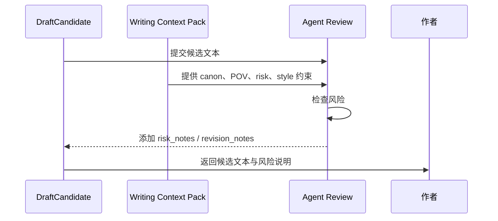
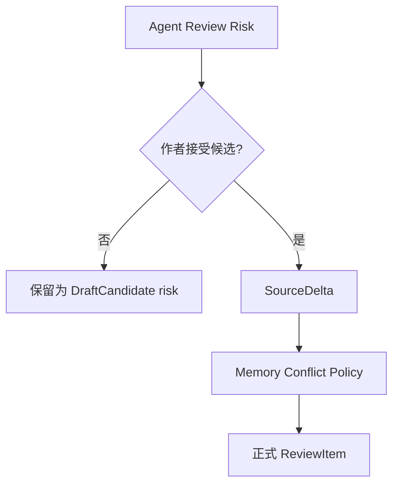

# 26. Agent Review Policy

> 本文档定义 Agent 在把候选文本交给作者前应检查什么，以及这些检查如何与 Memory 的 ReviewItem / Conflict Policy 配合。这里不讨论实现方式，只讨论设计边界。

## 1. 目标

Agent Review 的目标不是替作者审美，也不是强行阻止作者写作，而是在候选文本进入作者决策前，提示它可能带来的风险。

```text
Agent Review protects the author’s choice.
Memory Conflict Policy protects canon.
```

## 2. Agent Review 与 Memory Conflict Policy 的区别

| 项目 | Agent Review | Memory Conflict Policy |
|---|---|---|
| 发生时间 | DraftCandidate 交给作者前 | Accepted Text 进入 Memory 后 |
| 检查对象 | 候选文本 | SourceDelta / FactAssertion / Canon Promotion |
| 目标 | 帮作者判断是否接受候选 | 保护 Current Canon |
| 输出 | risk_notes / ReviewItem candidate / revision notes | ReviewItem / canon promotion decision |
| 是否能改 canon | 否 | 可以在 gate 通过后改写 Current Canon |

## 3. 检查类型

| 检查 | 说明 | 输出 |
|---|---|---|
| POV Check | 是否使用当前 POV 不该知道的信息 | pov_risk / knowledge_risk |
| Canon Check | 是否违反 Current Canon | canon_risk |
| Character Agency Check | 角色行为是否违背欲望、恐惧、边界、认知 | character_risk |
| Proposed/Disputed Check | 是否把 proposed / disputed 当 canon 使用 | unresolved_risk |
| Continuity Check | 是否可能引入时间线、物品、关系冲突 | continuity_risk |
| Style Check | 是否偏离当前作品语言和节奏 | style_risk |
| Overreach Check | 是否一次推进太多、替作者决定大方向 | control_risk |

## 4. Review 流程



## 5. 风险等级

| 等级 | 含义 | 默认处理 |
|---|---|---|
| low | 轻微风格或表达风险 | 可交给作者 |
| medium | 可能影响角色、POV 或 canon | 交给作者，但显式提示 |
| high | 明显违反 POV、canon 或作者主权 | 不建议作为正文，建议重写 |

## 6. 高风险情况

以下情况应标记为 high risk：

- 使用 POV 角色明确不知道的信息；
- 把 proposed / disputed 边写成已发生事实；
- 让角色做出明显违背 Agency Profile 的行为，且没有事件压力解释；
- 引入新的重大设定但没有作者要求；
- 自动解决重大 ReviewItem；
- 一次跨越太多剧情，替作者决定大方向；
- 让 Agent 自己生成的内容成为后文依据。

## 7. Review 输出结构

| 字段 | 说明 |
|---|---|
| risk_level | low / medium / high |
| risk_type | pov_risk / canon_risk / character_risk / unresolved_risk / continuity_risk / style_risk / control_risk |
| summary | 风险摘要 |
| affected_text | 候选文本中的相关片段 |
| memory_refs | 相关 MemoryPage / SourceSpan / ReviewItem |
| suggested_revision | 推荐修订方向 |
| can_offer_to_author | 是否可交给作者选择 |

## 8. ReviewItem 关系

Agent Review 可以产生 ReviewItem candidate，但不一定马上进入 Memory 的正式 ReviewItem。



也就是说，Agent Review 的风险可以先作为候选文本的风险说明；只有作者接受并进入 Memory 后，相关风险才需要由 Memory 系统正式处理。

## 9. Style Review

Style Review 不应把审美绝对化。它只检查候选文本是否明显偏离当前作品。

| 维度 | 检查 |
|---|---|
| narrative_distance | 是否突然改变叙述距离 |
| sentence_rhythm | 是否明显偏离近期节奏 |
| imagery | 意象是否突兀 |
| dialogue_voice | 角色说话是否像自己 |
| exposition | 是否解释过多 |
| emotional_expression | 情绪表达是否符合当前 POV |

## 10. Review 不应做什么

Agent Review 不应该：

- 替作者决定最终文本；
- 因风格偏好拒绝作者方向；
- 把低风险写法问题升级为 canon 冲突；
- 自动修复并接受自己的修复；
- 绕过作者接受；
- 把候选文本的风险直接写入 Current Canon。

## 11. 结论

Agent Review 是作者决策前的安全带。

```text
它不阻断创作，
但提醒候选文本可能破坏 POV、canon、角色或风格。
```
