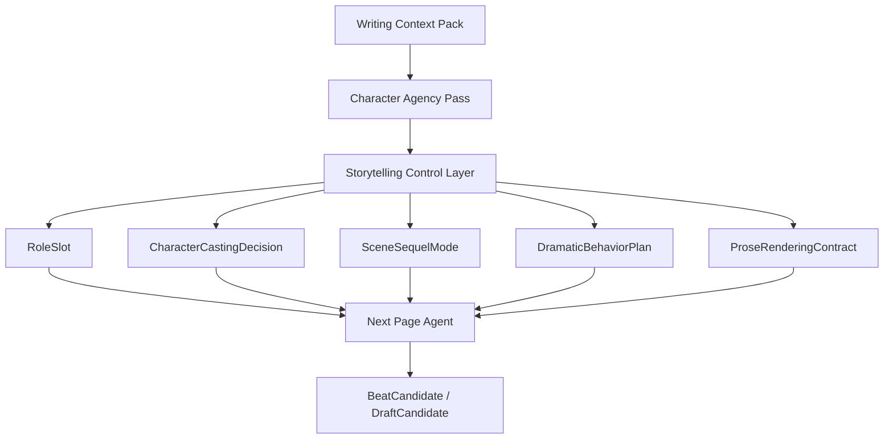
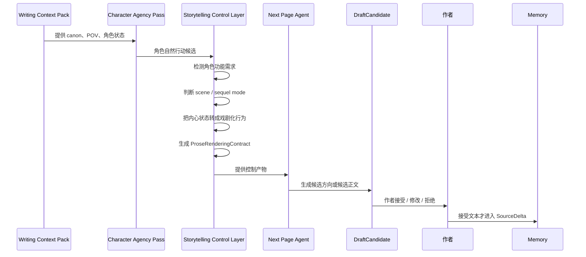
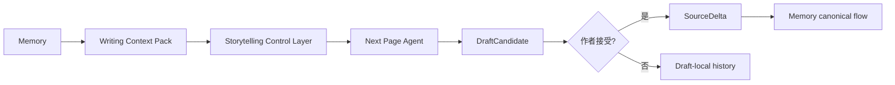

# 27. Storytelling Control Layer 总览

> 本文档定义 Sextant 写作 Agent 中的 **Storytelling Control Layer**。它不讨论技术实现，只讨论如何在 Memory 与最终 prose draft 之间增加故事讲述控制，解决“总是复用旧角色”和“内心戏流水账”两个问题。

## 1. 定位

Storytelling Control Layer 位于 `Character Agency Pass` 与 `Next Page Agent` 之间。

它不直接生成 `BeatCandidate` 或 `DraftCandidate`。它只生成控制产物：`RoleSlot`、`CharacterCastingDecision`、`SceneSequelMode`、`DramaticBehaviorPlan`、`ProseRenderingContract`。`Next Page Agent` 才是候选方向和候选正文的生产者。



## 2. 要解决的问题

| 问题 | 表现 | 根因 | 对应机制 |
|---|---|---|---|
| 只复用已有角色 | 所有功能都让主角团、旧配角承担 | Memory 中已有角色 salience 太高，模型害怕创造新 canon | Role Need Detector / Cast Expansion |
| 内心戏流水账 | 角色想法被平铺说明，缺少行动、冲突、转折 | 把 Character Agency Profile 直接喂给 prose model | Dramatization Layer / Inner State Rendering |
| 场景缺少故事感 | 只有信息说明，没有 goal、opposition、turn | 没有段落级叙事模式 | Scene / Sequel Mode |
| prose 失控 | 写太多、解释太多、偷用非 POV 信息 | 最终写作缺少 contract | Prose Rendering Contract |

## 3. Canonical Terminology

PR #3 引入的对象和风险必须使用统一名称。

| 概念 | 统一名称 | 说明 |
|---|---|---|
| 草稿层风险 | `AgentReviewFinding` | 所有 pre-acceptance 风险统一进入该对象 |
| 风险类型 | `AgentReviewFinding.risk_type` | 不使用 `StorytellingFinding`、`cast_risk`、`draft_local_risk` 作为对象名 |
| Cast 决策 | `CharacterCastingDecision` | 不使用 `CastingDecision` 简写 |
| 段落模式对象 | `SceneSequelMode` | `passage_mode` 是其字段 |
| Prose 约束对象 | `ProseRenderingContract` | 不使用 `ProseContract` 简写 |
| 内心戏剧化计划 | `DramaticBehaviorPlan` | 将 inner state 转成可写行为 |
| 新角色草稿种子 | `NewCharacterSeed` | 只存在于草稿层，接受后由 Memory ingest 决定落点 |

## 4. Owner Table

| 阶段 | 负责者 | 产出 | 是否写 Memory |
|---|---|---|---:|
| 组织写作上下文 | Writing Context Pack Builder | `WritingContextPack` | 否 |
| 推演角色动因 | Character Agency Pass | 角色动机、压力、自然行动候选 | 否 |
| 检测角色功能 | Storytelling Control Layer | `RoleSlot` | 否 |
| 决定复用或创建角色 | Storytelling Control Layer | `CharacterCastingDecision` / `NewCharacterSeed` | 否 |
| 判断段落模式 | Storytelling Control Layer | `SceneSequelMode` | 否 |
| 转译内心状态 | Storytelling Control Layer | `DramaticBehaviorPlan` | 否 |
| 生成 prose 约束 | Storytelling Control Layer | `ProseRenderingContract` | 否 |
| 生成下一步方向 | Next Page Agent | `BeatCandidate` | 否 |
| 生成候选正文 | Next Page Agent | `DraftCandidate` | 否 |
| 草稿风险检查 | Agent Review | `AgentReviewFinding` | 否 |
| 作者接受后回写 | Memory ingest | `SourceDelta`、`ReviewItem`、Memory updates | 是 |

## 5. Storytelling Control Layer 的输入

| 输入 | 来源 | 用途 |
|---|---|---|
| Writing Context Pack | Memory | 当前 canon、POV、风险、风格、证据 |
| Character Agency Pass | Agent | 角色欲望、压力、自然行动、边界 |
| Current Text Window | 作者文本 | 当前页语言节奏和场景位置 |
| Author Intent | 作者请求 | 继续、改写、找方向、探索某个 beat |
| Open ReviewItem | Memory | 避免扩大已知风险 |
| Proposed / Disputed Context | Memory Risk 区 | 只能作为注意事项，不能当作 canon |

## 6. Storytelling Control Layer 的输出

| 输出 | 说明 | 下游用途 |
|---|---|---|
| RoleSlot | 当前场景需要的角色功能 | 判断复用旧角色还是创建新角色 |
| CharacterCastingDecision | reuse / create / avoid 的选择 | 控制 cast 使用 |
| NewCharacterSeed | 低风险新角色种子 | 供 Next Page Agent 在 DraftCandidate 中使用，接受后再进入 Memory |
| SceneSequelMode | scene / sequel / mixed | 控制段落节奏 |
| DramaticBehaviorPlan | 把内心状态转成动作、对话、选择、沉默 | 防止流水账 |
| ProseRenderingContract | 最终写作约束 | 控制 prose 输出 |

## 7. 总体流程



## 8. 它不是什么

Storytelling Control Layer 不是：

- 大纲生成器；
- 世界模拟器；
- 自动剧情规划器；
- 文学理论百科；
- 替作者决定角色命运的系统；
- 让模型无限发挥的新通道；
- 直接生成 `BeatCandidate` 或 `DraftCandidate` 的文本生成器；
- 绕过 Memory canon gate 的捷径。

它只是当前写作小步的中间控制层。

## 9. 与 Memory 的关系

Storytelling Control Layer 消费 Memory，但不写 Memory。



它可以提出 `NewCharacterSeed`，但不能直接创建正式 Character MemoryPage。只有当作者接受包含新角色的文本后，Memory ingest 才能决定如何记录该角色。

## 10. AgentReviewFinding 的新增风险类型

Storytelling Control Layer 产生的风险仍属于草稿层，不是正式 ReviewItem。所有 risk_type 以 [26-agent-review-policy.md](26-agent-review-policy.md) 第 4 节为唯一 source-of-truth。

常见 storytelling 风险包括：

| risk_type | 含义 | 是否默认进入正式 ReviewItem |
|---|---|---:|
| cast_reuse_risk | 过度复用已有角色导致巧合或世界变小 | 否 |
| cast_creation_risk | 新角色引入过多复杂度或像 major character | 否，除非接受后造成 canon 冲突 |
| exposition_risk | 内心或设定说明过多 | 否 |
| dramatization_risk | 缺少可观察行动、冲突或 turn | 否 |
| scene_mode_risk | scene / sequel 节奏混乱 | 否 |
| prose_contract_violation | 违反当前 ProseRenderingContract | 否，除非涉及 POV / canon |

## 11. 核心原则

```text
Memory gives facts.
Agency gives motives.
Storytelling Control gives dramatic form.
Next Page Agent writes candidates from that form.
```

中文：

```text
Memory 给事实。
Agency 给动机。
Storytelling Control 给戏剧形式。
Next Page Agent 根据戏剧形式写候选。
```

## 12. 结论

Storytelling Control Layer 是 Sextant Agent 从“知道角色想什么”走向“能写成故事”的关键层。

```text
它让 Agent 不只是忠实于 Memory，
还能够判断何时扩展 cast，
以及如何把内心状态戏剧化成动作、对话、选择和转折。
```